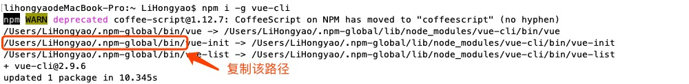

官网地址：https://cn.vuejs.org/

# 一、概述

vue 是一套构建用户界面的渐进式框架。与其他重量级框架不同的是，Vue 采用自底向上增量开发的设计。Vue 的核心库只关注视图层，它不仅易于上手，还便于与第三方库或既有项目整合。另一方面，当与[单文件组件](https://cn.vuejs.org/v2/guide/single-file-components.html)和 [Vue 生态系统支持的库](https://github.com/vuejs/awesome-vue#libraries--plugins)结合使用时，Vue 也完全能够为复杂的单页应用程序提供驱动。

# 二、兼容性

Vue.js 不支持 IE8 及其以下版本，因为 Vue.js 使用了 IE8 不能模拟的 ECMAScript 5 特性。Vue.js 支持所有[兼容 ECMAScript 5 的浏览器](http://caniuse.com/#feat=es5)。

# 三、安装

## 1、直接引入

点击 [下载](https://cn.vuejs.org/v2/guide/installation.html)  vue 文件，在 html 文件中引入即可。

## 2、CDN

```html
<script src="https://cdn.jsdelivr.net/npm/vue@2.6.0"></script>
<script src="https://cdn.jsdelivr.net/npm/vue/dist/vue.js"></script>
```

## 3、包管理工具

```shell
$ npm i -S vue
$ yarn add vue
```

## 4、脚手架安装

### # vue-cli 3.x 之前

vue-cli 提供一个官方命令行工具，可用于快速搭建大型单页应用。该工具提供开箱即用的构建工具配置，带来现代化的前端开发流程。只需几分钟即可创建并启动一个带热重载、保存时静态检查以及可用于生产环境的构建配置的项目。

```shell
# 1. install vue-cli
$ npm install -g vue-cli  
# 2. where install project
$ cd desktop
# 3. create project
$ vue init webpack project_name
# 4. enter project
$ cd project_name
# 5. run project
$ npm run dev
```

> 注意：
>
> windows 系统下，如果提示 ‘vue’ 不是内部变量，则你需要去设置环境变量，将 vue 安装路径添加至环境变量的path路径中。

脚手架构建项目配置项：

```shell
# 项目名称
? Project name vue-test  
# 项目描述
? Project description 脚手架示例 
# 开发者信息
? Author Li-HONGYAO <lihy_online@163.com>
# 模板信息
? Vue build standalone
# 是否安装路由
? Install vue-router? No
# 是否使用代码检测
? Use ESLint to lint your code? No
# 是否启用单元测试
? Set up unit tests No
? Setup e2e tests with Nightwatch? No
? Should we run `npm install` for you after the project has been created? (recom
mended) npm
```

### # vue-cli 3.x 之后

如果你已经安装3.x之前的版本，请通过如下指令卸载：

```shell
$ npm un -g vue-cli
```

全局安装（3.x 以后vue-cli被重新命名为@vue/cli）：

```shell
$ npm i -g @vue/cli 
```

查看版本：

```shell
$ vue --version
@vue/cli 4.0.3
```

创建项目：

```shell
$ vue create project_name
```

配置选择：

```shell
? Please pick a preset: (Use arrow keys)
❯ default (babel, eslint)    # 默认配置
  Manually select features   # 自定义配置
```
选择自定义配置，通过按“空格”选择要安装的项：
```shell
Vue CLI v4.0.3
? Please pick a preset: Manually select features
? Check the features needed for your project: 
 ◉ Babel
 ◯ TypeScript
 ◯ Progressive Web App (PWA) Support # 支持渐进式网页应用程序
 ◉ Router # 路由管理器
 ◉ Vuex # 状态管理模式（构建一个中大型单页应用时）
 ◉ CSS Pre-processors # css预处理
❯◉ Linter / Formatter # 代码风格、格式校验
 ◯ Unit Testing # 单元测试
 ◯ E2E Testing # （End To End）即端对端测试

```

选择CSS预编译，这里我选择使用Less：

```shell
? Pick a CSS pre-processor (PostCSS, Autoprefixer and CSS Modules 
are supported by default): 
  Sass/SCSS (with dart-sass) 
  Sass/SCSS (with node-sass) 
❯ Less 
  Stylus 
```

语法检测工具，这里我选择ESLint + Prettier

```shell
? Pick a linter / formatter config: 
  ESLint with error prevention only  # 仅错误预防
  ESLint + Airbnb config  # Airbnb配置
  ESLint + Standard config  # 标准配置
❯ ESLint + Prettier 
? Pick additional lint features: (Press <space> to select, <a> to 
toggle all, <i> to invert selection)
❯◉ Lint on save # 保存时检查
 ◯ Lint and fix on commit # 提交时检查
```

选择Babel、PostCSS、ESLint等配置文件的放置位置：

```shell
? Where do you prefer placing config for Babel, PostCSS, ESLint, etc.? (Use arrow keys)
❯ In dedicated config files  # 在专用的配置文件中
  In package.json  # package.json
```

是否保存预设：

```shell
? Save this as a preset for future projects? (y/N) 
```

启动项目：

```shell
$ cd project_name
$ npm run serve
 App running at:
  - Local:   http://localhost:8080/ 
  - Network: http://10.2.1.2:8080/
```

**重点提示**

vue-cli 从3.x起 *webpack* 的配置已经被脚手架默认了，并不会显示。如果我们需要手动配置webpack的一些配置，可以手动创建配置文件。文件名为vue.config.js，此文件应该和package.json同级（创建之后会自动加载）,此文件需要按照JSON格式来撰写。

```js
// vue.config.js
module.exports = {
  // 选项...
}
```

比如：有时候我们前后端是分离情况下，在开发模式下，我们需要在vue.config.js中配置了。

```js
// vue config.js
module.exports = {
    devServer: {
        port: 8080,
        host: 'localhost',
        open: true,
        proxy: {
            '/api': {
                target: 'http://127.0.0.1:2019',
                secure: false,
                changeOrigin: true,
                pathRewrite: { '^/api': '' }
            }
        }
    }
}
```

###  # 包管理工具变

```
$ open ~/.vuerc
```

```js
{
  "useTaobaoRegistry": true,
  "packageManager":"yarn"
}
```

# 四、在线练习

在线练习：https://jsfiddle.net/chrisvfritz/50wL7mdz/

# 五、问题

**\> 1. Windows 系统提示不是内部指令**

解决方案：添加系统环境变量

**\> 2. MacOS 系统提示 ”-bash: vue: command not found“**

解决方案：添加系统环境变量

steps 01：获取安装路径



steps 02：切换至终端编辑 '.bash_profile' 文件

```shell
$ vim .bash_profile
```

steps 03：按 `i` 进行编辑，添加如下代码：

```tex
export PATH=$PATH:/Users/LiHongyao/.npm-blobal/bin/
```

> 注意：请把路径更换为自己的路径

steps 04：按`ESC`，输入`wq!` 保存并退出

steps 05：通过如下指令运行刚刚编辑的文件

```shell
$ source .bash_profile
```

steps 06：执行如下指令，如果出现版本号，表示正确

```shell
$ vue --version
2.9.6
```


