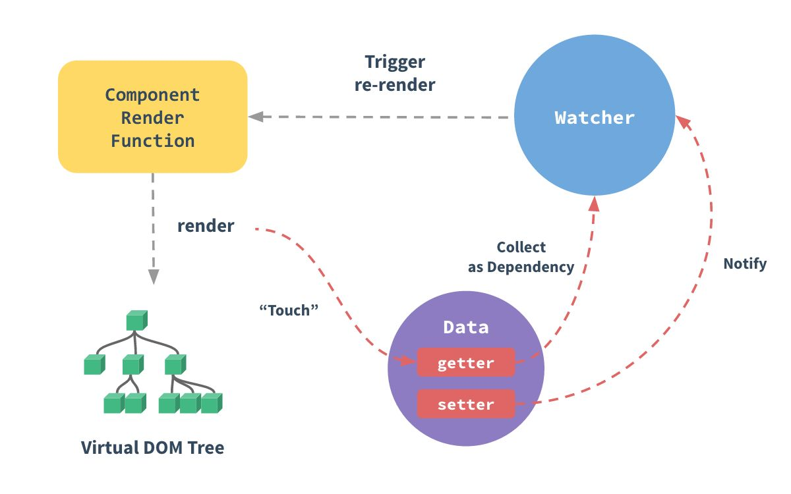

# 一、MVVM

Vue 的设计主要受到MVVM模型的启发，因此在官方文档中经常会使用 `vm` 这个变量名表示组件实例。

接下来给大家介绍一下MVVM，不过，在开始之前可以先给大家简单介绍下MVC设计模式，在MVC设计模式中：

- `M（Mode，模型）`：用于封装与应用程序的业务逻辑相关的数据以及对数据的处理方法，“ Model ” 有对数据直接访问的权力，例如对数据库的访问，“Model” 不依赖 “View” 和 “Controller”，也就是说， Model 不关心它会被如何显示或是如何被操作。但是 Model 中数据的变化一般会通过一种刷新机制被公布。为了实现这种机制，那些用于监视此 Model 的 View 必须事先在此 Model 上注册，从而，View 可以了解在数据 Model 上发生的改变。（比如：[观察者模式](https://zh.wikipedia.org/wiki/观察者模式)）

- `V（View，视图）`：能够实现数据有目的的显示（理论上，这不是必需的）。在 View 中一般没有程序上的逻辑。为了实现 View 上的刷新功能，View 需要访问它监视的数据模型（Model），因此应该事先在被它监视的数据那里注册。

- `C（Controller，控制器）`：负责转发请求，对请求进行处理。作为 “Modal” 和 “View”交互的桥梁，它处理事件并作出响应，“事件”包括用户的行为和数据 Model 上的改变。

简单理解就是，当数据发生变化，发送通知给控制器刷新视图，同理控制器监听用户操作，当需要修改数据时控制器会通知数据模型刷新数据，这里可以看出，视图和模型不直接交互，而是通过控制器实现对接的，那MVVM和MVC类似。

MVVM（ **Model-View-ViewModel** ） 为一种设计模式。


其中：

- `Model` 表示数据模型；

- `View` 表示视图；

- `ViewModel` 负责监听Model中的数据改变并且控制视图的更新，处理用户交互操作，类似于MVC设计模式中的控制器，其本质为一个Vue的实例。

> 提示：**Model** 和 **View** 并无直接关联，而是通过 **ViewModel** 来进行联系的，**Model** 和 **ViewModel** 之间有着双向数据绑定的联系。因此当 **Model** 中的数据改变时会触发 **View** 层的刷新，**View** 中由于用户交互操作而改变的数据也会在 **Model** 中同步。

这种模式实现了 **Model** 和 **View** 的数据自动同步，因此开发者只需要专注对数据的维护操作即可，而不需要自己操作 **DOM**。

# 二、Vue 响应式

## 1. 响应式属性

在 vue 中，可以通过双花括号来将数据绑定在视图上，比如：

```vue
<script setup lang="ts">
    
// -- 定义变量
let count = 0;
    
</script>

<template>
  <!-- 绑定数据 -->
  <div>count：{{ count }}</div>
</template>
```

页面输出：`count：0`，接下来我们在模板（`template`）中定义一个按钮尝试修改 `count` 的值，看看视图是否发生变化：

```vue
<script setup lang="ts">
// -- 定义变量
let count = 0;

// -- 事件处理函数
const increment = () => {
  count++;
};
</script>

<template>
  <!-- 绑定数据 -->
  <div>count：{{ count }}</div>
  <button type="button" @click="increment">increment</button>
</template>
```

上述示例中，`@click` 表示为按钮 `button` 添加一个点击事件，事件处理函数为：`increment`，在事件处理函数中，我们让 `count` 变量自增，点击按钮，可以发现，视图并没有更新。这是因为我们定义的变量 `count` 并非是响应式的（尽管你可以将其呈现在视图上，但变量 `count` 并没有加入响应式系统中）。

接下来，我们看看在 vue3.x 中将变量加入响应式系统中的几种形式：

### 1.1. `ref()`

接受一个内部值并返回一个响应式且可变的 `ref` 对象。`ref` 对象具有指向内部值的单个 property `.value`。

接下来我们改造一下示例，将 `count` 值通过 `ref` 包裹：

```vue
<script setup lang="ts">
import { ref } from 'vue';
// -- 定义变量
let count = ref(0);

// -- 事件处理函数
const increment = () => {
  count.value++;
};
</script>

<template>
  <!-- 绑定数据 -->
  <div>count：{{ count }}</div>
  <button type="button" @click="increment">increment</button>
</template>
```

点击按钮，可以发现，`count` 值成功更新。

> 提示：`ref` 一般包裹基本数据类型，如 字符串、数值、布尔类型等。如果你要将一个对象加入响应式，请使用 `reactive`。

`ref()` 也可以用于获取单个 DOM元素，如下：

```vue
<script setup lang="ts">
import { onMounted, ref } from 'vue';
const domRef = ref(null);
onMounted(() => {
  console.log(domRef.value); //  <div>Hello</div>
})
</script>

<template>
  <!-- ref -->
  <div ref="domRef">Hello</div>
</template>
```

### 1.2. `reactive()`

返回对象的响应式副本。

```vue
<script setup lang="ts">
import { reactive } from 'vue';
// -- 定义变量
let obj = reactive({
  count: 0,
});

// -- 事件处理函数
const increment = () => {
  obj.count++;
};
</script>

<template>
  <!-- 绑定数据 -->
  <div>obj.count：{{ obj.count }}</div>
  <button type="button" @click="increment">increment</button>
</template>
```

> 提示：`reactive` 一般包裹对象类型。

### 1.3. `toRefs()`

将响应式对象转换为普通对象，其中结果对象的每个 `property` 都是指向原始对象相应 `property` 的  [`ref`](https://v3.cn.vuejs.org/api/refs-api.html#ref)。

```vue
<script setup lang="ts">
import { reactive, toRefs } from 'vue';
    
const state = reactive({
  name: 'Li-HONGYAO',
  age: 18,
});
const stateAsRefs = toRefs(state);

/**
stateAsRefs 的类型:
{
  name: Ref<string>,
  age: Ref<number>
}*/
// ref 和原始 property 已经“链接”起来了
state.age++;
console.log(stateAsRefs.age.value); // 19

stateAsRefs.age.value++;
console.log(state.age); // 20

</script>


```

小妙招：在一个页面中，通常会有多个状态（`state`），比如用户信息、登录状态等等，你可能会定义多个 `ref` 或者 `reactive` 变量来保存这些信息，在 vue2.x，属性一般统一定义在 `data` 属性中集中管理，如果你也想将一个页面的状态统定义在一个 `state` 变量中，可以这么做：

```typescript
const state = reactive({
  loginStatus: 0,
  user: {
    name: 'Li-HONGYAO',
    job: '前端工程师',
    address: '成都市高新区',
  },
});
```

然后在模板中访问：

```vue
<div>loginStatus：{{ state.loginStatus ? '已登录' : '未登录' }}</div>
<div>Name：{{ state.user.name }}</div>
<div>job：{{ state.user.job }}</div>
<div>address：{{ state.user.job }}</div>
```

但是你可能会觉得，每次访问属性都需要通过 `state.xxx`，是否可以通过某种形式直接访问属性呢？答案是肯定有的，我们可以通过 `toRefs` 来改造。

```typescript
const { loginStatus, user } = toRefs(state);
```

然后就可以在模板中直接访问 `loginStatus` 和 `user` 了。

## 2. 响应式原理

Vue 数据双向绑定主要是指：**数据变化更新视图，视图变化更新数据**

### 2.1. @2.x

当一个Vue实例创建时，你可以把一个普通的 JavaScript 对象传入 Vue 实例作为 data 选项，vue会遍历 data 选项的属性，并使用 `Object.defineProperty` 将它们全部转为 `getter/setter` 并且在内部追踪相关依赖，在属性被访问和修改时通知变化。每个组件实例都有相应的 `watcher`  程序实例，它会在组件渲染的过程中把属性记录为依赖，之后当依赖项的 `setter` 被调用时，会通知 `watcher` 重新计算，从而致使它关联的组件得以更新。



深入理解：

- **监听器 Observer**：对数据对象进行遍历，包括子属性对象的属性，利用 `Object.defineProperty()` 对属性都加上 setter 和 getter。这样的话，给这个对象的某个值赋值，就会触发 setter，那么就能监听到了数据变化。
- **解析器 Compile**：解析 Vue 模板指令，将模板中的变量都替换成数据，然后初始化渲染页面视图，并将每个指令对应的节点绑定更新函数，添加监听数据的订阅者，一旦数据有变动，收到通知，调用更新函数进行数据更新。
- **订阅者 Watcher**：Watcher 订阅者是 Observer 和 Compile 之间通信的桥梁 ，主要的任务是订阅 Observer 中的属性值变化的消息，当收到属性值变化的消息时，触发解析器 Compile 中对应的更新函数。每个组件实例都有相应的 watcher 实例对象，它会在组件渲染的过程中把属性记录为依赖，之后当依赖项的 setter 被调用时，会通知 watcher 重新计算，从而致使它关联的组件得以更新——这是一个典型的观察者模式
- **订阅器 Dep**：订阅器采用 发布-订阅 设计模式，用来收集订阅者 Watcher，对监听器 Observer 和 订阅者 Watcher 进行统一管理。

### 2.2. @3.x

Vue3.x 改用 `Proxy` 替代`Object.defineProperty`，因为Proxy可以直接监听对象和数组的变化，并且有多达13种拦截方法。并且作为新标准将受到浏览器厂商重点持续的性能优化。

**Proxy 只会代理对象的第一层，Vue3是怎样处理这个问题的呢?**

判断当前 `Reflect.ge`t 的返回值是否为Object，如果是则再通过 `reactive` 方法做代理， 这样就实现了深度观测。

**监测数组的时候可能触发多次get/set，那么如何防止触发多次呢？**

我们可以判断 `key` 是否为当前被代理对象 `target` 自身属性，也可以判断旧值与新值是否相等，只有满足以上两个条件之一时，才有可能执行 `trigger`。

# 三、生命周期

每个 Vue 实例在被创建之前都要经过一系列的初始化过程，在这个过程中也会运行一些叫做 **生命周期钩子** 的函数，给予用户机会在一些特定的场景下添加他们自己的代码。

##　@2.ｘ


## @3. x

**被替换**

1. `beforeCreate` -> setup()
2. `created` -> `setup()`

**重命名**

1. `beforeMount` -> `onBeforeMount`
2. `mounted` -> `onMounted`
3. `beforeUpdate` -> `onBeforeUpdate`
4. `updated` -> `onUpdated`
5. `beforeDestroy` -> `onBeforeUnmount`
6. `destroyed` -> `onUnmounted`
7. `errorCaptured` -> `onErrorCaptured`

**新增的**

新增的以下2个方便调试 `debug` 的回调钩子：

1. `onRenderTracked`
2. `onRenderTriggered`

## @代码示例

> `app.vue`

```vue
<!-- 脚本 -->
<script setup lang="ts">

import { onBeforeMount, onBeforeUnmount, onBeforeUpdate, onMounted, onUnmounted, onUpdated } from 'vue';

console.log('__setup__');

onBeforeMount(() => {
  console.log('__onBeforeMount__');
});
onMounted(() => {
  console.log('__onMounted__');
});
onBeforeUpdate(() => {
  console.log('__onBeforeUpdate__');
});
onUpdated(() => {
  console.log('__onUpdated__');
});
onBeforeUnmount(() => {
  console.log('__onBeforeUnmount__');
});
onUnmounted(() => {
  console.log('__onUnmounted__');
});


</script>

<!-- 模板 -->
<template>
  <div class="app">Hello, Vue3.x!</div>
</template>

<!-- 样式 -->
<style scoped></style>
```