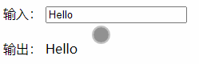

# 一、设计模式

Vue 的设计主要受到 MVVM（**M**odel-**V**iew-**V**iew**M**odel） 模型的启发，因此在官方文档中经常会使用 `vm` 这个变量名表示组件实例。

## 1. MVC

在MVC设计模式中：

- `M（Model，模型）`：模型代表应用程序的数据和业务逻辑。它负责处理数据的获取、存储、处理和验证等操作。模型通常包含数据结构、方法和与数据相关的逻辑。模型并不关心如何展示数据，它独立于用户界面。

- `V（View，视图）`：视图负责将数据显示给用户。它是用户界面的可视部分，通常是通过模板、页面或UI控件来展示数据。视图从模型中获取数据，并根据需要将其呈现给用户。视图不应包含业务逻辑，只关注如何显示数据。

- `C（Controller，控制器）`：控制器充当模型和视图之间的协调者。它接收用户的输入并相应地更新模型和视图。控制器负责处理用户的操作，解析输入并决定采取什么行动。它可以更新模型的状态，执行业务逻辑，并将更新后的数据传递给视图进行更新。

MVC 的目标是实现模块化、可维护和可测试的应用程序。通过将应用程序的不同职责分离开来，MVC 提供了更好的代码组织和可重用性。它也使得应用程序的不同部分能够独立地进行开发和修改，而不会相互干扰。

需要注意的是，虽然 MVC 设计模式在传统的 Web 开发中很常见，但在前端开发中，通常使用更轻量级的架构模式，如 MVVM（Model-View-ViewModel）或是更加组件化的方式，如在 Vue.js 中使用的组合式 API。这些模式根据具体框架和需求的不同，对 MVC 进行了一些调整和改进。

## 2. MVVM

那什么是MVVM呢？

MVVM是一种用于构建用户界面的软件设计模式，它在传统的 MVC（Model-View-Controller）模式的基础上进行了改进，更加适用于现代的前端开发。


MVVM 将应用程序分为三个核心组件：

1. 模型（Model）：模型代表应用程序的数据和业务逻辑。它负责处理数据的获取、存储、处理和验证等操作。模型不关心用户界面，是独立于视图和视图模型的。
2. 视图（View）：视图是用户界面的可视部分，负责将数据呈现给用户。它通常是由 HTML、CSS 和 UI 组件构成的，用于展示数据和响应用户的交互操作。视图不包含业务逻辑，只关注数据的展示。
3. 视图模型（ViewModel）：视图模型是模型和视图之间的连接层，负责将模型的数据适配和转换为视图可以使用的形式。它提供了视图所需的数据和操作，同时监听和响应视图的变化。视图模型与特定的视图紧密关联，为视图提供数据绑定、命令绑定、事件处理等功能。

MVVM 的关键特性是 **数据绑定** 和命令绑定。数据绑定允许视图和视图模型之间的数据自动同步，当模型数据发生变化时，视图会自动更新；而当用户在视图上进行操作时，视图模型可以处理并响应相应的事件。

通过 MVVM，开发者可以更好地分离关注点，实现视图和业务逻辑的解耦。视图模型作为中间层，使得开发者可以专注于业务逻辑的实现，而视图负责展示和用户交互。这样的分离提高了代码的可维护性和可测试性，同时也支持更好的团队协作。

# 二、响应式

在 vue 中，可以通过双花括号来将数据绑定在视图上，比如：

```vue
<script setup lang="ts">
    
// -- 定义变量
let count = 0;
    
</script>

<template>
  <!-- 绑定数据 -->
  <div>count：{{ count }}</div>
</template>
```

页面输出：`count：0`，接下来我们在模板（`template`）中定义一个按钮尝试修改 `count` 的值，看看视图是否发生变化：

```vue
<script setup lang="ts">
// -- 定义变量
let count = 0;

// -- 事件处理函数
const increment = () => {
  count++;
};
</script>

<template>
  <!-- 绑定数据 -->
  <div>count：{{ count }}</div>
  <button type="button" @click="increment">increment</button>
</template>
```

上述示例中，`@click` 表示为按钮 `button` 添加一个点击事件，事件处理函数为：`increment`，在事件处理函数中，我们让 `count` 变量自增，点击按钮，可以发现，视图并没有更新。这是因为我们定义的变量 `count` 并非是响应式的（尽管你可以将其呈现在视图上，但变量 `count` 并没有加入响应式系统中）。

接下来，我们看看在 vue 中响应式相关的 API：

## 1. 响应式基础API

### 1.1. `reactive()`

我们可以使用 [`reactive()`](https://cn.vuejs.org/api/reactivity-core.html#reactive) 函数创建一个响应式对象或数组，响应式对象其实是 [JavaScript Proxy](https://developer.mozilla.org/zh-CN/docs/Web/JavaScript/Reference/Global_Objects/Proxy)，其行为表现与一般对象相似。不同之处在于 Vue 能够跟踪对响应式对象属性的访问与更改操作。

```vue
<script setup lang="ts">
// -- imports
import { reactive } from 'vue';

// -- Define State Props
interface IState {
  count: number;
}
// -- State
const state = reactive<IState>({
  count: 0,
});

// -- events
const onIncrement = () => {
  state.count++;
};
</script>

<template>
  <button @click="onIncrement">{{ state.count }}</button>
</template>

<style lang="less"></style>
```

[在演练场中尝试一下 >>](https://play.vuejs.org/#eNpNjkEKgzAURK8yZFNF0K5FS3uPbGyIEKo/If64Cbl7fxWky2HePCarVwjtnqzq1bCZ6AJjs5zCQ5Nbg4+MjGgnw263KJijX3ET/qZJk/G0Cc8TW4wXVmUYn4h73FHqHzcnksYTHJloV0tc1ciacG7bA28aTUXT0J035IAEtmtYBJEEDO/ELJanWZz5jFpdOq0OAMj5X4kiQtl151CYobuMqnwBBoFaVA==)

**`reactive()`** 的局限性：

1. 仅对对象类型有效，而对 `string`、`number` 和 `boolean` 这样的 [原始类型](https://developer.mozilla.org/zh-CN/docs/Glossary/Primitive) 无效。
2. 解构响应式对象成员时，结构出来的成员将失去响应式连接。

### 1.2. `ref()`

`reactive()` 的局限归根结底是因为 JavaScript 没有可以作用于所有值类型的 “引用” 机制。为此，Vue 提供了一个 [`ref()`](https://cn.vuejs.org/api/reactivity-core.html#ref) 方法来允许我们创建可以使用任何值类型的响应式 **ref**。

`ref()` 将传入参数的值包装为一个带 `.value` 属性的 ref 对象

接下来我们改造一下示例，将 `count` 值通过 `ref` 包裹：

```vue
<script setup lang="ts">
// -- imports
import { ref } from 'vue';
// -- refs
let count = ref<number>(0);

// -- events
const onIncrement = () => {
  count.value++;
};
</script>

<template>
  <button type="button" @click="onIncrement">{{ count }}</button>
</template>
```

点击按钮，可以发现，`count` 值成功更新。

[在演练场中尝试一下](https://play.vuejs.org/#eNo9jUEKgzAQRa8yZKMiaNclSnuP2dgwQqiZhDhxE3L3Riwu//DmvazeIQxHIvVUejfRBoGdJIUZ2brgo0CGSCsUWKN30FS0QUY2nncB4xMLTCfRPrrzviY2Yj2DZRPJEUvbQUaGix2OZUvU98gFWY9XsbbqEHJhW4TqAtCfJFItL7NZ851Q3TpUc87/cCl6vMD6pMfboMoPvd1Nzg==)

`ref()` 也可以用于获取单个 DOM元素，如下：

```vue
<script setup lang="ts">
// -- imports
import { onMounted, ref } from 'vue';

// -- refs
const dom = ref<HTMLDivElement>();
// -- life circles
onMounted(() => {
 
  console.log(dom.value);  // <div>Hello, Vue.js!</div>
});
</script>

<template>
  <div ref="dom">Hello, Vue.js!</div>
</template>
```

### 1.3. `toRefs()`

将响应式对象转换为普通对象，其中结果对象的每个属性都是指向原始对象相应属性的  [`ref`](https://v3.cn.vuejs.org/api/refs-api.html#ref)。

```vue
<script setup lang="ts">
// -- imports
import { reactive, toRefs } from 'vue';

// -- Define State Props
interface IState {
  name: string;
  age: number;
}
// -- state
const state = reactive<IState>({
  name: 'Li-HONGYAO',
  age: 18,
});

/**
stateAsRefs: {
  name: Ref<string>,
  age: Ref<number>
}*/
const stateAsRefs = toRefs(state);

// ref 和原始 property 已经连接起来了
state.age++;
console.log(stateAsRefs.age.value); // 19

stateAsRefs.age.value++;
console.log(state.age); // 20
</script>

<template></template>
```

小妙招：在一个页面中，通常会有多个状态（`state`），比如用户信息、登录状态等等，你可能会定义多个 `ref` 或者 `reactive` 变量来保存这些信息，在 vue2.x，属性一般统一定义在 `data` 选项中集中管理，如果你也想将一个页面的状态统一定义在一个 `state` 变量中，可以这么做：

```typescript
const state = reactive({
  loginStatus: 0,
  user: {
    name: '张三',
    job: '前端工程师',
    address: '成都市高新区',
  },
});
```

然后在模板中访问：

```vue
<div>loginStatus：{{ state.loginStatus ? '已登录' : '未登录' }}</div>
<div>Name：{{ state.user.name }}</div>
<div>job：{{ state.user.job }}</div>
<div>address：{{ state.user.job }}</div>
```

但是你可能会觉得，每次访问属性都需要通过 `state.xxx`，是否可以通过某种形式直接访问属性呢？答案是肯定有的，我们可以通过 `toRefs` 来改造。

```typescript
const { loginStatus, user } = toRefs(state);
```

然后就可以在模板中直接访问 `loginStatus` 和 `user` 了。

## 2. 响应式原理

### @2.x

Vue2 的响应式实现原理主要是通过 **数据劫持** 和 **观察者模式** 来实现的。

首先，当创建 Vue 实例时，Vue 会遍历 data 对象的所有属性，使用 Object.defineProperty 方法将这些属性转换为 getter 和 setter。这样一来，当访问或修改这些属性时，Vue 就能够捕捉到这些操作。

在 getter 中，Vue 会将当前的 Watcher 对象添加到依赖列表中，建立起属性和 Watcher 之间的关系。这样，当属性被访问时，Watcher 对象就能够收集到这个依赖。

而在 setter 中，当属性被修改时，Vue 会触发依赖列表中所有 Watcher 对象的更新方法，从而实现视图的自动更新。

Watcher 对象是 Vue 中的观察者，它负责收集依赖和触发更新。每个响应式数据属性都有一个对应的 Watcher 对象，用于存储与该属性相关的依赖。当数据发生变化时，Watcher 对象会被通知，并执行相应的更新操作。

通过数据劫持和观察者模式的结合，Vue2 实现了响应式的数据绑定，使得当数据发生变化时，相关的视图会自动更新，提供了更好的开发体验和更高的可维护

### @3.x

 `Object.defineProperty()` 缺点

- 深度监听时，需要 **递归** 到底，一次性计算量大；
- 无法监听新增属性/删除属性（所以开发中需要使用 `Vue.set` 和 `Vue.delete` 这两个 API 来增删 data 的属性）；
- 无法原生监听数组，需要特殊处理；

Vue 3.x 中的响应式原理使用了 Proxy 对象和依赖跟踪机制。

Vue 3.x 的响应式原理可以概括为以下几个步骤：

1. 在组件初始化阶段，Vue 3.x 使用 `reactive` 函数将组件的数据对象转换为响应式对象。`reactive` 函数使用了 JavaScript 的 Proxy 对象来代理目标对象，并在访问和修改属性时拦截对应的操作。
2. 当组件渲染时，访问响应式对象的属性会触发 Proxy 的 `get` 拦截器。在 `get` 拦截器中，Vue 3.x 会收集当前组件正在访问的响应式属性，并建立与该属性的依赖关系。
3. 当组件重新渲染时，访问的响应式属性发生变化，Proxy 的 `get` 拦截器会被触发，Vue 3.x 会根据之前建立的依赖关系重新执行组件的渲染逻辑。
4. 在组件渲染过程中，如果发生属性的修改操作，Proxy 的 `set` 拦截器会被触发。在 `set` 拦截器中，Vue 3.x 会通知相关的依赖项进行更新，以及触发组件的重新渲染。
5. Vue 3.x 通过跟踪依赖项的方式，实现了更精确的依赖追踪和更新控制。这意味着在组件渲染时，只会重新执行与实际使用的响应式属性相关的逻辑，提高了性能和效率。

总结来说，Vue 3.x 的响应式原理使用了 Proxy 对象来拦截对响应式对象的访问和修改，实现了更高效和精确的依赖追踪和更新控制。这为开发者提供了更好的性能和开发体验。

## 3. 数据双向绑定

`Vue.js` 最核心的功能有两个：

- 响应式的数据绑定系统
- 组件系统

> 什么是数据双向绑定？

`Vue` 是一个 `MVVM` 框架，即数据双向绑定。当数据发生变化的时候，触发视图更新；当视图发生变化的时候，触发数据更新。

> 为什么要实现数据的双向绑定？

在 Vue 中，如果使用 VueX，实际上数据还是单向的，之所以说是数据双向绑定，这是从使用UI控件来说，对于我们处理表单，Vue的双向数据绑定用起来就特别舒服了。

即两者并不互斥， 在全局性数据流使用单向，方便跟踪； 局部性数据流使用双向，简单易操作。

### 3.1. 访问器属性

`Object.defineProperty()` 函数可以定义对象的属性相关描述符， 其中的 `set` 和 `get` 函数对于完成数据双向绑定起到了至关重要的作用，下面，我们看看这个函数的基本使用方式。

```javascript
var obj = {
  foo: 'foo',
};

Object.defineProperty(obj, 'foo', {
  get: function () {
    console.log('将要读取obj.foo属性');
  },
  set: function (newVal) {
    console.log('当前值为', newVal);
  },
});

obj.foo; // 将要读取obj.foo属性
obj.foo = 'name'; // 当前值为 name
```

可以看到，`get` 即为我们访问属性时调用，`set` 为我们设置属性值时调用。

### 3.2. 简单的数据双向绑定实现方法

```html
<!DOCTYPE html>
<html lang="zh-CN">
  <head>
    <meta charset="UTF-8" />
    <meta http-equiv="X-UA-Compatible" content="IE=edge" />
    <meta name="viewport" content="width=device-width, initial-scale=1.0" />
    <title>数据双向绑定</title>
  </head>
  <body>
    <form autocomplete="off">
      <label>输入：</label>
      <input type="text" id="textInput" style="outline: none" />
      <br /><br />
      <label>输出：</label>
      <span id="textSpan"></span>
    </form>
    <script>
      // -- 获取DOM元素
      const textInput = document.getElementById('textInput');
      const textSpan = document.getElementById('textSpan');
      // -- 定义数据模型
      const data = { value: 'Hello' };
      textInput.value = data.value;
      textSpan.textContent = data.value;
      // -- 数据劫持
      Object.defineProperty(data, 'value', {
        set: function (newValue) {
          textInput.value = newValue;
          textSpan.textContent = newValue;
        },
        get: function () {},
      });
      // -- 监听用户操作
      textInput.addEventListener('input', function ({ target: { value } }) {
        data.value = value;
      });
    </script>
  </body>
</html>
```




可以看到，实现一个简单的数据双向绑定还是不难的： 使用 `Object.defineProperty()` 来定义属性的 `set` 函数，属性被赋值的时候，修改 `input` 的 `value` 值以及 `span` 标签的 `textContent`；然后监听 `input` 的 `input` 事件，修改对象的属性值，即可实现这样的一个简单的数据双向绑定。

### 3.3. 实现任务的思路

上面我们只是实现了一个最简单的数据双向绑定，而我们真正希望实现的是下面这种方式：

```vue
<div id="app">
  <input type="text" v-model="message" />
  {{ text }}
</div>

<script>
  var vm = new Vue({
    el: '#app',
    data: {
      message: 'Hello，Vue.js',
    },
  });
</script>
```

即和 `Vue` 一样的方式来实现数据的双向绑定。那么，**我们可以把整个实现过程分为下面几步： **

- 输入框以及文本节点与 `data` 中的数据 **绑定**；
- 输入框内容变化时，data 中的数据同步变化，即 `view` → `model` 的变化；
- `data` 中的数据变化时，文本节点的内容同步变化，即 `model` → `view` 的变化；

### 3.4. DocumentFragment

如果希望实现任务一，我们还需要使用到 `DocumentFragment` 文档片段，可以把它看做一个容器，如下所示：

```html
<div id="app"></div>
<script>
  const flag = document.createDocumentFragment();
  const span = document.createElement('span');
  const textNode = document.createTextNode('Hello, Vue.js!');
  span.appendChild(textNode);
  flag.append(span);
  document.getElementById('app').appendChild(flag);
</script>
```

这样，我们就可以得到下面的DOM树：


使用文档片段的好处在于：在文档片段上进行操作DOM，而不会影响到真实的DOM，操作完成之后，我们就可以添加到真实DOM上，这样的效率比直接在正式DOM上修改要高很多 。

> Tips：`Vue` 进行编译时，就是将挂载目标的所有子节点劫持到 `DocumentFragment` 中，经过一番处理之后，再将 `DocumentFragment` 整体返回插入挂载目标。

```html
<!DOCTYPE html>
<html lang="zh-CN">
  <head>
    <meta charset="UTF-8" />
    <meta http-equiv="X-UA-Compatible" content="IE=edge" />
    <meta name="viewport" content="width=device-width, initial-scale=1.0" />
    <title>Document</title>
  </head>
  <body>
    <div id="app">
      <input type="text" id="a" />
      <span id="b"></span>
    </div>
    <script>
      var dom = nodeToFragment(document.getElementById('app'));
      console.log(dom);
      function nodeToFragment(node) {
        var flag = document.createDocumentFragment();
        var child; 
        while ((child = node.firstChild)) {
          flag.appendChild(child);
        }
        return flag;
      }
      document.getElementById('app').appendChild(dom);
    </script>
  </body>
</html>
```

即首先获取到 `div`，然后通过 `documentFragment` 劫持，接着再把这个文档片段添加到 `div` 上去。

### 3.5. 初始化数据绑定

# 三、生命周期

## @概述

每个 Vue 实例在被创建之前都要经过一系列的初始化过程，在这个过程中也会运行一些叫做 [**生命周期钩子**](https://cn.vuejs.org/api/composition-api-lifecycle.html) 的函数，给予用户机会在一些特定的场景下添加他们自己的代码。

下面是实例生命周期的图表。你现在并不需要完全理解图中的所有内容，但以后它将是一个有用的参考


1. 组合式API：生命周期钩子，参考 [这里 >>](https://cn.vuejs.org/api/composition-api-lifecycle.html)
2. 选项式API：生命周期钩子，参考 [这里 >>](https://cn.vuejs.org/api/options-lifecycle.html)

## @代码示例

> `app.vue`

```vue
<script setup lang="ts">
import {
  onBeforeMount,
  onBeforeUnmount,
  onBeforeUpdate,
  onMounted,
  onUnmounted,
  onUpdated,
  ref,
} from 'vue';

// -- refs
const count = ref(0);

// -- life circles
console.log('__setup__');

onBeforeMount(() => {
  console.log('__onBeforeMount__');
});
onMounted(() => {
  console.log('__onMounted__');
});
onBeforeUpdate(() => {
  console.log('__onBeforeUpdate__');
});
onUpdated(() => {
  console.log('__onUpdated__');
});
onBeforeUnmount(() => {
  console.log('__onBeforeUnmount__');
});
onUnmounted(() => {
  console.log('__onUnmounted__');
});
</script>

<template>
  <button @click="++count">{{ count }}</button>
</template>
```