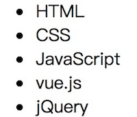

VUE API：https://cn.vuejs.org/v2/api/

# \# 简介

vue 是一套构建用户界面的渐进式框架。与其他重量级框架不同的是，Vue 采用自底向上增量开发的设计。Vue 的核心库只关注视图层，它不仅易于上手，还便于与第三方库或既有项目整合。另一方面，当与[单文件组件](https://cn.vuejs.org/v2/guide/single-file-components.html)和 [Vue 生态系统支持的库](https://github.com/vuejs/awesome-vue#libraries--plugins)结合使用时，Vue 也完全能够为复杂的单页应用程序提供驱动。

# \# 兼容性

Vue.js 不支持 IE8 及其以下版本，因为 Vue.js 使用了 IE8 不能模拟的 ECMAScript 5 特性。Vue.js 支持所有[兼容 ECMAScript 5 的浏览器](http://caniuse.com/#feat=es5)。

# \# 安装

## 1、独立版本

[【点击前往官网下载】](https://cn.vuejs.org/v2/guide/installation.html)

## 2、CDN

BootCDN（国内） : [https://cdn.bootcss.com/vue/2.2.2/vue.min.js](https://cdn.bootcss.com/vue/2.2.2/vue.min.js)

unpkg：[https://unpkg.com/vue/dist/vue.js](https://unpkg.com/vue/dist/vue.js)

cdnjs : [https://cdnjs.cloudflare.com/ajax/libs/vue/2.1.8/vue.min.js](https://cdnjs.cloudflare.com/ajax/libs/vue/2.1.8/vue.min.js) 

> 提示：建议使用独立版本，直接下载后通过 `<script>` 引入。

# \# 介绍

## 1、起步

在线练习：https://jsfiddle.net/chrisvfritz/50wL7mdz/

> tips：你也可以单独创建.html文件，然后引入vue进行练习。

## 2、声明式渲染

Vue.js 的核心是一个允许采用简洁的模板语法来声明式的将数据渲染进 DOM 的系统：

```html
<div id="app">
    <!--方法1-->
    <h3>昵称：{{ username }}</h3>
    <!--方法2-->
    <h3>大区：<span v-text="area"></span></h3>
    <!--方法3-->
    <template>
        <h3>段位：{{ rank }}</h3>
        <h3>擅长英雄：{{ heros }}</h3>
    </template>
</div>
```

```javascript
new Vue({
    el: "#app",
    data: {
        username: "蓉城丶木子李",
        area:"微信1区 绚烂刀锋",
        rank:"荣耀王者",
        heros:"露娜、李白、诸葛亮、狄仁杰"
    }
});
```


> 代码解读：
>
> 1）、使用vue，需通过id设置vue的挂载器，该id值可自行定义，在js中，创建vue对象时 `el` 的值必须和 `id` 值保持一致进行绑定。
>
> 2）、声明式渲染方法主要3种，第1种方法不建议使用，因为在加载数据时，页面可能会显示` {{ message }}`，用户体验不佳，因此建议使用2、3种方法。
>
> 3）、现在数据和 DOM 已经被绑定在一起，所有的元素都是**响应式的**。我们该如何知道呢？打开你的浏览器的控制台 (就在这个页面打开)，并修改 `app.username`，你将看到上例相应地更新。

我们还可以通过 `v-bind` 绑定DOM元素的属性，如下所示：

```html
<div id="app-2">
    <div v-bind:class="classname"></div>
</div>
```

```javascript
var app2 = new Vue({
   el:"#app-2",
   data: {
       classname:"box"
   }
});
```

```html
<!-- 运行之后检查元素呈现的结果如下 -->
<div id="app-2">
    <div v-bind:class="box"></div>
</div>
```

## 3、条件与循环

条件控制使用 `v-if` 进行，我们可以通过该指令控制元素的显示：

```html
<div id="app-3">
    <h3 v-if="hidden">Hello, world!</h3>
</div>
```

```javascript
var app3 = new Vue({
    el:"#app-3",
    data: {
        hidden:true
    }
});
```

> 页面显示：“Hello, world!”

继续在控制台设置 `app3.hidden = false`，你会发现“Hello, world!”消失了。

`v-for` 指令可以绑定数组的数据来渲染一个项目列表：

```html
<div id="app-4">
    <ul>
        <li v-for="info in infos">
            {{ info.text }}
        </li>
    </ul>
</div>
```

```javascript
var app4 = new Vue({
    el:"#app-4",
    data: {
        infos: [
            {text:"HTML"},
            {text:"CSS"},
            {text:"JavaScript"},
            {text:"vue.js"},
            {text:"jQuery"}
        ]
    }
});
```



在控制台里，输入 `app4.infos.push({ text: "新项目" })`，你会发现列表中添加了一个新项。


