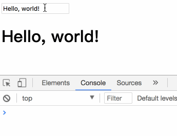
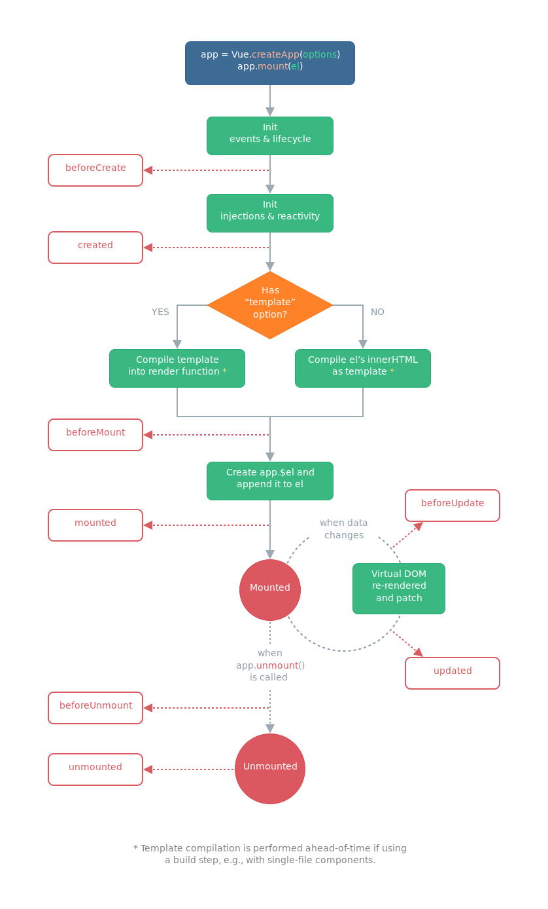

# 一、MVC

M（Mode）数据层

V（View）视图层

C（Controller）控制层

M -> 发送通知 -> 控制层 -> 刷新视图

V  -> 发送通知 -> 控制层 -> 刷新数据

# 二、MVVM

MVVM（ Model-View-ViewModel ） 为一种设计模式，下图不仅概括了 MVVM 模式，还描述了在Vue.js 中ViewModel 是如何和 View 以及 Model 进行交互的。


**\> ViewModel 是 Vue.js 的核心，它是一个 Vue 实例。**

当创建了ViewModel 后，双向绑定是如何达成的呢？

- 首先，我们将上图中的DOM Listeners 和 Data Bindings 看作两个工具，它们是实现双向绑定的关键。
- 从 View 看，ViewModel 中的 DOM Listeners 工具会帮我们监测页面上DOM元素的变化，如果有变化，则更改Model中的数据；
- 从 Model 看，当我们更新Model中的数据时，Data Bindings工具会帮我们更新页面中的DOM元素。

我们通过一组 `Hello, world!` 实例来深入了解 MVVM 设计模式：

```html
<!DOCTYPE html>
<html lang="zh-CN">
<head>
    <meta charset="UTF-8">
    <meta name="viewport" content="width=device-width, initial-scale=1.0">
    <meta http-equiv="X-UA-Compatible" content="ie=edge">
    <title>vue</title>
</head>
<body>
    <!-- V -->
    <div id="app">
        <!-- 双向绑定 -->
        <input type="text" v-model="message">
        <!-- 绑定数据 -->
        <h1>{{message}}</h1>
    </div>
    <!-- 引入库 -->
    <script src="./node_modules/vue/dist/vue.js"></script>
    <script src="./js/index.js"></script>
</body>
</html>
```

```js
// M
let model = {
    message: "Hello, vue.js!"
}
// VM
let vm = new Vue({
    // 挂载元素/值为选择器
    el: "#app",
    // Model/数据层/Object
    data: model
});
```




使用Vue的过程就是定义MVVM各个组成部分的过程。

1. **定义View**
2. **定义Model**
3. **创建一个Vue实例或"ViewModel"，它用于连接View和Model**

> 在这个示例中，**选项对象**的**el属性**指向View，`el: '#app' `表示该Vue实例将挂载到`<div id="app">...</div>`这个元素；**data属性**指向Model，`data: model` 表示我们的Model是model对象。

> Vue.js有多种数据绑定的语法，最基础的形式是文本插值，使用一对大括号语法，在运行时`{{ message }}`会被数据对象的message属性替换，所以页面上会输出"Hello World!"。

# 三、创建一个 vue 实例

上述 `Hello, world!` 示例已经结合 MVVM 设计模式创建了一个 vue 实例，这里不再阐述。

# 四、数据与方法

当一个 Vue 实例被创建时，它向 Vue 的**响应式系统**中加入了其 `data` 对象中能找到的所有的属性。当这些属性的值发生改变时，视图将会产生“响应”，即匹配更新为新的值。

# 五、生命周期

每个 Vue 实例在被创建之前都要经过一系列的初始化过程。例如需要设置数据监听、编译模板、挂载实例到 DOM、在数据变化时更新 DOM 等。同时在这个过程中也会运行一些叫做**生命周期钩子**的函数，给予用户机会在一些特定的场景下添加他们自己的代码。

比如 [`created`](https://cn.vuejs.org/v2/api/#created) 钩子可以用来在一个实例被创建之后执行代码：

```javascript
new Vue({
    el: "#app",
    data: {
        name: "Henrry Lee"
    },
    created() {
        // this 指向 vue 实例
        console.log(`Hello, ${this.name}!`);
    }
});
// => "Hello, Henrry Lee!"
```

也有一些其它的钩子，在实例生命周期的不同场景下调用，如 [`mounted`](https://cn.vuejs.org/v2/api/#mounted)、[`updated`](https://cn.vuejs.org/v2/api/#updated)、[`destroyed`](https://cn.vuejs.org/v2/api/#destroyed)。钩子的 `this` 指向调用它的 Vue 实例。

> 注意：
>
> 不要在选项属性或回调上使用[箭头函数](https://developer.mozilla.org/zh-CN/docs/Web/JavaScript/Reference/Functions/Arrow_functions)，比如：
>
> ```js
> created: () => console.log(this.a)
> OR
> vm.$watch('a', newValue => this.myMethod())
> ```
>
> 因为箭头函数是和父级上下文绑定在一起的，`this` 不会是如你所预期的 Vue 实例，经常导致 
>
> ```
> Uncaught TypeError: Cannot read property of undefined
> OR
> Uncaught TypeError: this.myMethod is not a function
> ```
>
> 之类的错误。

## 1、生命周期图示

下图说明了实例的生命周期。你不需要立马弄明白所有的东西，不过随着你的不断学习和使用，它的参考价值会越来越高。



## 2、生命周期详解

[参考官网](https://cn.vuejs.org/v2/api/#%E9%80%89%E9%A1%B9-%E7%94%9F%E5%91%BD%E5%91%A8%E6%9C%9F%E9%92%A9%E5%AD%90)

### \> beforeCreate

在实例初始化之后，数据观测(data observer) 和 event/watcher 事件配置之前被调用。

### \> created

实例已经创建完成之后被调用。在这一步，实例已完成以下的配置：数据观测(data observer)，属性和方法的运算， watch/event 事件回调。然而，挂载阶段还没开始，`$el` 属性目前不可见。 可以在组件的这个期间 **请求数据**，如果是keep-alive组件会被缓存起来，生命周期不会再次触发，如果需要更新数据可以watch当前router变化，如果router是当前组件所在的router则请求数据。

### \> beforeMount

在挂载开始之前被调用：相关的 `render` 函数首次被调用。

### \> mounted

vm.$el 已挂载在文档内，对已有dom节点的操作可以在这期间进行。

### \> beforeUpdate

数据更新时调用，发生在虚拟 DOM 重新渲染和打补丁之前。

可以在这个钩子中进一步地更改状态，这不会触发附加的重渲染过程。

### \> updated

由于数据更改导致的虚拟 DOM 重新渲染和打补丁，在这之后会调用该钩子。

当这个钩子被调用时，组件 DOM 已经更新，所以你现在可以执行依赖于 DOM 的操作。然而在大多数情况下，你应该避免在此期间更改状态，因为这可能会导致更新无限循环。

### \> activated

keep-alive 组件激活时调用。

### \> deactivated

keep-alive 组件停用时调用。

### \> beforeDestroy

实例销毁之前调用。在这一步，实例仍然完全可用。

### \> destroyed

Vue 实例销毁后调用。调用后，Vue 实例指示的所有东西都会解绑定，所有的事件监听器会被移除，所有的子实例也会被销毁。


