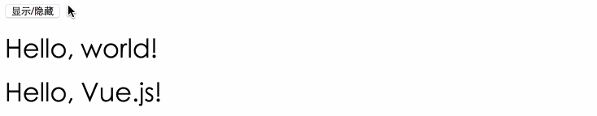

# # 条件语句

## 1、v-if

条件判断使用 `v-if` 命令。适用于元素 和 template。

```html
<div id="app">
    <button type="button" @click="showOrHiddenMsg">显示/隐藏</button>
    
    <h1 v-if="isShow">Hello, world!</h1>
    <template v-if="isVisible">
        <h1>{{ msg }}</h1>
    </template>
</div>
```

```javascript
new Vue({
    el: '#app',
    data: {
        isVisible: true,
        msg: "Hello, Vue.js!"
    },
    methods: {
        showOrHiddenMsg: function() {
            // 切换显示状态
            this.isVisible = !this.isVisible;
        }
    }
})
```

> 这里， v-if 指令将根据表达式 isVisible 的值(true 或 false )来决定是否插入 h1 元素。



## 2、v-else

`v-else` 指令可以为 `v-if` 添加一个 `else` 模块：

```html
<div id="app">
    <p v-if="isRain">外面下雨了，我们在家玩王者荣耀吧？</p>
    <p v-else>今天天气不错，我们出去逛街吧？</p>
</div>
```

```javascript
new Vue({
    el: '#app',
    data: {
        isRain: false
    }
})
```

> 页面显示：“今天天气不错，我们出去逛街吧？”

## 3、v-else-if

```html
<div id="app">
    <p v-if="grade >= 90 && score <= 100">优秀</p>
    <p v-else-if="grade >= 70 && score < 90">良好</p>
    <p v-else-if="grade >= 60 && score < 70">及格</p>
    <p v-else-if="grade >=  0 && score < 60">不及格</p>
    <p v-else>成绩有误！</p>
</div>
```

```javascript
new Vue({
    el: '#app',
    grade: {
        score: 98
    }
})
```

> 页面显示：“优秀”

# # 循环语句

