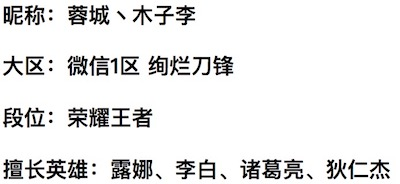
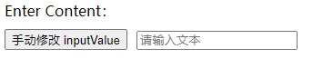
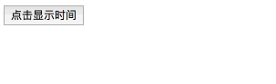

# 一、概述

Vue.js 使用了基于 HTML 的模版语法，允许开发者声明式地将 DOM 绑定至底层 Vue 实例的数据。

Vue.js 的核心是一个允许你采用简洁的模板语法来声明式的将数据渲染进 DOM 的系统。

结合响应系统，在应用状态改变时， Vue 能够智能地计算出重新渲染组件的最小代价并应用到 DOM 操作上。

# 二、插值

## 1、文本

数据绑定最常见的形式就是使用 “Mustache” 语法（双大括号）的文本插值：

```html
<div id="app">
    <!--方法1-->
    <h3>昵称：{{ username }}</h3>
    <!--方法2-->
    <h3>大区：<span v-text="area"></span></h3>
    <!--方法3-->
    <template>
        <h3>段位：{{ rank }}</h3>
        <h3>擅长英雄：{{ heros }}</h3>
    </template>
</div>
```

```javascript
var app = new Vue({
    el: "#app",
    data: {
        username: "蓉城丶木子李",
        area:"微信1区 绚烂刀锋",
        rank:"荣耀王者",
        heros:"露娜、李白、诸葛亮、狄仁杰"
    }
});
```



## 2、Html

使用 ` v-html ` 指令用于输出 html 代码：

```html
<div id="app">
    <div v-html="message"></div>
</div>
```

```javascript
new Vue({
    el: "#app",
 	  data: {
  		  message: "<h1>Hello, world!</h1>"
 	  }
})
```

## 3、属性

使用 ` v-bind ` 指令用于绑定属性：

```html
<div id="app">
    <h1 v-bind:id="className"></h1>
</div>
```

```javascript
new Vue({
    el: "#app",
 	  data: {
  		  className: "title"
 	  }
})
```

```html
<!-- 显示结果 -->
<div id="app">
    <h1 id="title"></h1>
</div>
```
## 4、表达式

Vue.js 提供了完全的 JavaScript 表达式支持。

```html
<div id="app">
    <template>
        <p>{{num + 5}}</p>
        <p>{{isRain ? "下雨了，出门记得带雨伞！" : "今天天气不错！"}}</p>
        <p>{{str.split("").reverse().join("")}}</p>
        <p v-text="'Hello, ' + name + ' !'"></p>
    </template>
</div>
```

```javascript
new Vue({
    el: '#app',
    data: {
      num: 5,
      isRain: true,
      str:"HELLO",
      name: "木子李"
    }
})
```

# 三、指令、参数、修饰符

\1. 指令：指令是带有 `v-` 前缀的特殊属性。

\2. 参数：在指令后以冒号指明。

\3. 修饰符：是以`.` 指明的特殊后缀，用于指出特殊何种方式绑定

```html
<div v-bind:class="className"></div>
<input type="text" v-model.number="num">
<button type="button" v-on:click="login">登录</button>
```

# 四、用户输入

在 input 输入框中我们可以使用 `v-model` 指令来实现双向数据绑定：

```html
<div id="app">
    <p v-text="message"></p>
    <input type="text" v-model="message">
</div>
```

```javascript
new Vue({
	el:"#app",
    data: {
    	message:"Hello, 饲养员！"
    }
});
```

```css
@charset "utf-8";
p {
    padding-left: 8px;
}
input {
    height: 30px;
    border: 1px solid #d3d3d3;
    outline: none;
    padding-left: 8px;
    border-radius: 5px;
    font-size: 16px;
}
input:focus {
    border: none;
    box-shadow: 0px 0px 5px 1px purple inset;
}
```




`v-on` 指令可以绑定事件监听器，通过该监听器可以vue示例中定义的方法：

```html
<div id="app-5">
    <h3 v-text="time"></h3>
    <button type="button" v-on:click="showTime">点击显示时间</button>
</div>
```

```javascript
var app5 = new Vue({
   el:"#app-5",
   data: {
       time:""
   },
   methods: {
       showTime: function () {
           // this 指向vue实例
           this.time = "北京时间：" +  new Date().toLocaleString();
       }
   }
});
```



# 五、缩写

Vue.js 为两个最为常用的指令提供了特别的缩写：

## 1、v-bind 缩写

```html
<!-- 完整语法 -->
<a v-bind:href="url"></a>
<!-- 缩写 -->
<a :href="url"></a>
```

## 2、v-on 缩写

```html
<!-- 完整语法 -->
<a v-on:click="doSomething"></a>
<!-- 缩写 -->
<a @click="doSomething"></a>
```


