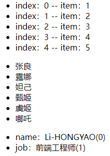
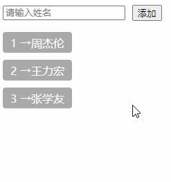

# 一、列表渲染

列表渲染类似于 JavaScript 中的循环，通常如果我们需要渲染一张列表或者说布局一致仅仅只是内容不同的元素时，可以使用列表渲染。

列表渲染使用 `v-for` 指令，其语法形式如下：

```vue
<li v-for="(item, index) in items" :key="index"></li>
```

其中：

- `items`：源数据数组；
- `item`：被迭代的数组元素的 **别名**；
- `index`：被迭代的元素所处的下标位置；

# 二、迭代示例

```vue
<script setup lang="ts">
import { reactive } from 'vue';
const heros = reactive([
  { name: '张良' },
  { name: '露娜' },
  { name: '妲己' },
  { name: '甄姬' },
  { name: '虞姬' },
]);

const user = reactive({
  name: 'Li-HONGYAO',
  job: '前端工程师',
});
</script>

<template>
  <!-- 循环数字 -->
  <ul>
    <li v-for="(item, index) in 5" :key="index">index：{{ index }} -- item：{{ item }}</li>
  </ul>
  <!-- 循环数组 -->
  <ul>
    <li v-for="(item, index) in heros" :key="index">{{ item.name }}</li>
  </ul>
  <!-- 循环对象 -->
  <ul>
    <li v-for="(value, key, index) in user" :key="index">{{key}}：{{value}}({{index}})</li>
  </ul>
</template>
```

效果演示：



# 三、维护状态

当 Vue 正在更新使用 `v-for` 渲染的元素列表时，它默认使用“就地更新”的策略。如果数据项的顺序被改变，Vue 将不会移动 DOM 元素来匹配数据项的顺序，而是就地更新每个元素，并且确保它们在每个索引位置正确渲染。

这个默认的模式是高效的，但是**只适用于不依赖子组件状态或临时 DOM 状态 (例如：表单输入值) 的列表渲染输出**。

为了给 Vue 一个提示，以便它能跟踪每个节点的身份，从而重用和重新排序现有元素，你需要为每项提供一个唯一的 `key` attribute。

`key` 主要用做 Vue 虚拟 DOM 的标记，以在比对新旧节点高效、快速地辨识 VNodes。如果不使用 key，Vue 会使用一种算法来最小化元素的移动并且尽可能尝试就地修改/复用相同类型元素。而使用 key 时，它会基于 key 的顺序变化重新排列元素，并且那些使用了已经不存在的 key 的元素将会被移除/销毁。

```vue
<div v-for="item in items" :key="item.id">
  <!-- 内容 -->
</div>
```

> 提示：不要使用对象或数组之类的非基本类型值作为 `v-for` 的 key。请用字符串或数值类型的值。

# 四、数组更新检测

## 1、变异方法

会改变原始数组的方法被称为变异方法。Vue 包含一组观察数组的变异方法，所以它们也将会触发视图更新。这些方法如下：`push()`、`pop()`、`shift()`、`unshift()`、`splice()`、`sort()`、`reverse()`。

我们来看一组示例：

```vue
<script setup lang="ts">
import { reactive, ref } from 'vue';

const inputValue = ref('');
const names = reactive(['周杰伦', '王力宏', '张学友']);

const onPushItem = () => {
  if (!inputValue.value) return;
  names.push(inputValue.value);
};
</script>

<template>
  <!-- 表单 -->
  <form>
    <input
      placeholder="请输入姓名"
      v-model="inputValue"
      style="margin-right: 10px"
    />
    <button type="button" @click="onPushItem">添加</button>
  </form>
  <!-- 列表 -->
  <div class="list">
    <div class="item" v-for="(item, index) in names" :key="index">
      <span>{{ index + 1 }} → </span>
      <span>{{ item }}</span>
    </div>
  </div>
</template>

<style scoped>
form {
  margin-bottom: 16px;
  display: flex;
  justify-content: flex-start;
  align-items: center;
}
.item {
  width: 100px;
  height: 30px;
  display: flex;
  justify-content: center;
  align-items: center;
  background: #a9a9a9;
  color: #ffffff;
  margin-bottom: 10px;
  border-radius: 4px;
}
</style>
```

演示效果：



通过示例效果可以看到，变异方法 `push` 修改了原始数组，触发视图更新。上面的示例只演示了 `push` 方法，其他变异方法下来之后大家可以自行尝试。

## 2、非变异方法

不会改变原始数组的方法被称为非变异方法。例如：`filter()`, `concat()` 和 `slice()` 。这些不会改变原始数组，但 **总是返回一个新数组**。当使用非变异方法时，可以用新数组替换旧数组以达到数据响应。

# 五、refs

```vue
<script setup lang="ts">

import { reactive, ref } from 'vue';

const refs = ref<HTMLLIElement[]>([]);

const heros = reactive([
  { name: '张良' },
  { name: '露娜' },
  { name: '妲己' },
  { name: '甄姬' },
  { name: '虞姬' },
]);

const pushDom = (el: any) => {
  // 存储DOM元素（li）
  refs.value.push(el as HTMLLIElement);
};
  
</script>

<template>
  <ul>
    <li v-for="(item, index) in heros" :key="index" :ref="pushDom">
      {{ item.name }}
    </li>
  </ul>
</template>
```