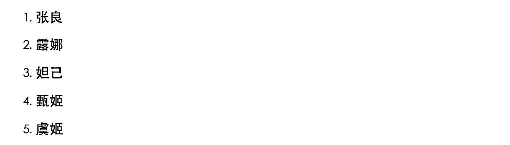
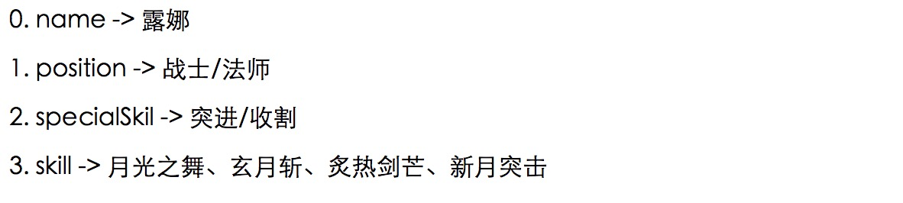

循环使用 `v-for` 指令

v-for 指令需要以 **item in items** 形式的特殊语法， items 是源数据数组并且 item 是数组元素迭代的别名。

# 一、v-for 迭代数组

```html
<div id="app">
    <ol>
        <li v-for="(hero, index) in heros" key="index">
            <h3>{{ hero.name }}</h3>
        </li>
    </ol>
</div>
```

```javascript
var app = new Vue({
    el: '#app',
    data: {
        heros: [
            {name:"张良"},
            {name:"露娜"},
            {name:"妲己"},
            {name:"甄姬"},
            {name:"虞姬"}
        ]
    }
})
```



> 提示：在控制台输入 `app.heros.push({name:"亚瑟"})` 你将会发现页面上将添加一个列表项。

# 二、v-for 迭代对象

```html
<div id="app">
    <div v-for="value in hero">
        <p>{{ value }}</p>
    </div>
</div>
```

```javascript
var app = new Vue({
    el: '#app',
    data: {
        hero: {
            // 英雄名
            name: "露娜",
            // 定位
            position: "战士/法师",
            // 特长
            specialSkil: "突进/收割",
            // 技能
            skill:"月光之舞、玄月斩、炙热剑芒、新月突击"
        }
    }
})
```


你也可以提供第二个参数（key）以及第三个参数（index），修改html部分代码，如下所示：

```html
<div id="app">
    <div v-for="(value, key, index) in hero">
        <p>{{ index }}.  {{ key }} -> {{ value }} </p>
    </div>
</div>
```



# 三、v-for 迭代整数

```html
<div id="app">
    <h3 v-for="idx in 5">{{ idx }}</h3>
</div>
```

```javascript
var vm = new Vue({
    el: '#app'
})
// 结果：1 2 3 4 5
```

# 四、数组更新检测

## 1、变异方法

会改变原始数组的方法被称为变异方法。Vue 包含一组观察数组的变异方法，所以它们也将会触发视图更新。这些方法如下：`push()`、`pop()`、`shift()`、`unshift()`、`splice()`、`sort()`、`reverse()`。

## 2、非变异方法

不会改变原始数组的方法被称为非变异方法。例如：`filter()`, `concat()` 和 `slice()` 。这些不会改变原始数组，但 **总是返回一个新数组**。当使用非变异方法时，可以用新数组替换旧数组以达到数据响应。

## 3、注意事项

由于 JavaScript 的限制，Vue 不能检测以下变动的数组：

1. 通过下标修改数据时
2. 修改数组的长度时

解决第一类问题：

```javascript
// Vue.set
Vue.set(vm.items, indexOfItem, newValue);
vm.$set(vm.items, indexOfItem, newValue);
// Array.prototype.splice
vm.items.splice(indexOfItem, 1, newValue);
```

解决第二类问题：

```javascript
vm.items.splice(newLength)
```

# 五、对象更改检测注意事项

还是由于 JavaScript 的限制，**Vue 不能检测对象属性的添加或删除** 

```javascript
let vm = new Vue({
  data: { a: 1 }
}
// "vm.a" 现在是响应式的
vm.b = 2
// "vm.b" 不是响应式的
```

对于已经创建的实例，Vue 不能动态添加根级别的响应式属性。但是，可以使用 `Vue.set(object, key, value)` 方法向嵌套对象添加响应式属性。例如，对于：

```javascript
let vm = new Vue({
    data: {
        user: {
            name: "木子李"
        }
    }
})
```

你可以添加一个新的 `age` 属性到嵌套的 `user` 对象：

```javascript
Vue.set(vm.user, "age", 27);
```

你还可以使用 `vm.$set` 实例方法，它只是全局 `Vue.set` 的别名：

```javascript
this.$set(this.user, "age", 27);
```

有时你可能需要为已有对象赋予多个新属性，比如使用 `Object.assign()` 或 `_.extend()`。在这种情况下，你应该用两个对象的属性创建一个新的对象。所以，如果你想添加新的响应式属性，不要像这样：

```javascript
Object.assign(this.user, {
  age: 27,
  tel: "17398888669"
})
```

你应该这样做：

```javascript
this.user = Object.assign({}, this.user, {
  age: 27,
  tel: "17398888669"
})
```

# 六、显示过滤/排序结果

有时，我们想要显示一个数组的过滤或排序副本，而不实际改变或重置原始数据。在这种情况下，可以创建返回过滤或排序数组的计算属性。

例如：

```html
<li v-for="n in evenNumbers"> {{ n }}</li>
```

```javascript
data: {
  	numbers: [ 1, 2, 3, 4, 5 ]
},
// 计算属性
computed: {
    // 筛选偶数
    eventNumbers() {
        return this.numbers.filters((num) => {
            return num % 2 === 0;
        });
    }
}
```

在计算属性不适用的情况下 (例如，在嵌套 `v-for` 循环中) 你可以使用一个 method 方法：

```html
<li v-for="n in even(numbers)">{{ n }}</li>
```

```javascript
data: {
 	 numbers: [ 1, 2, 3, 4, 5 ]
},
methods: {
 	 event() {
   		 return this.numbers.filter((num) => {
        		return num % 2 === 0;
  		 });
	}
}
```

> 提示：
>
> 如果是使用计算属性实现过滤，在调用计算属性方法时，无需加圆括号，
>
> 如果是使用方法实现过滤，在调用方法时，必须加圆括号。


