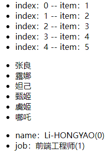
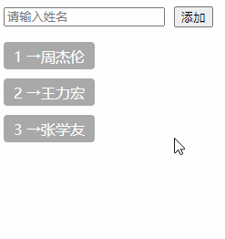

# 一、列表渲染

我们可以使用 `v-for` 指令基于一个数组来渲染一个列表。`v-for` 指令的值需要使用 `item in items` 形式的特殊语法，其语法形式如下：

```vue
<li v-for="(item, index) in items" :key="index"></li>
```

其中：

- `items`：源数据数组；
- `item`：被迭代的数组元素的 **别名**；
- `index`：被迭代的元素所处的下标位置；

# 二、迭代示例

```vue
<script setup lang="ts">
import { reactive } from 'vue';
const heros = reactive([
  { name: '张良' },
  { name: '露娜' },
  { name: '妲己' },
  { name: '甄姬' },
  { name: '虞姬' },
]);

const user = reactive({
  name: 'Li-HONGYAO',
  job: '前端工程师',
});
</script>

<template>
  <!-- 循环数字 -->
  <ul><li v-for="(item, index) in 5" :key="index">index：{{ index }} -- item：{{ item }}</li></ul>
  <!-- 循环数组 -->
  <ul><li v-for="(item, index) in heros" :key="index">{{ item.name }}</li></ul>
  <!-- 循环对象 -->
  <ul><li v-for="(value, key, index) in user" :key="index">{{key}}：{{value}}({{index}})</li></ul>
</template>
```

效果演示：



# 三、v-for & v-if

> 注意：同时使用 `v-if` 和 `v-for` 是**不推荐的**，因为这样二者的优先级不明显。请转阅[风格指南](https://cn.vuejs.org/style-guide/rules-essential.html#avoid-v-if-with-v-for)查看更多细节。

当它们同时存在于一个节点上时，`v-if` 比 `v-for` 的优先级更高。这意味着 `v-if` 的条件将无法访问到 `v-for` 作用域内定义的变量别名：

```vue
<!--
 这会抛出一个错误，因为属性 todo 此时
 没有在该实例上定义
-->
<li v-for="todo in todos" v-if="!todo.isComplete">
  {{ todo.name }}
</li>
```

在外新包装一层 `<template>` 再在其上使用 `v-for` 可以解决这个问题 (这也更加明显易读)：

```vue
<template v-for="todo in todos">
  <li v-if="!todo.isComplete">
    {{ todo.name }}
  </li>
</template>
```

# 四、通过 key 管理状态

Vue 默认按照“就地更新”的策略来更新通过 `v-for` 渲染的元素列表。当数据项的顺序改变时，Vue 不会随之移动 DOM 元素的顺序，而是就地更新每个元素，确保它们在原本指定的索引位置上渲染。

默认模式是高效的，但**只适用于列表渲染输出的结果不依赖子组件状态或者临时 DOM 状态 (例如表单输入值) 的情况**。

这个默认的模式是高效的，但是**只适用于不依赖子组件状态或临时 DOM 状态 (例如：表单输入值) 的列表渲染输出**。

为了给 Vue 一个提示，以便它可以跟踪每个节点的标识，从而重用和重新排序现有的元素，你需要为每个元素对应的块提供一个唯一的 `key` ：

```vue
<div v-for="item in items" :key="item.id">
  <!-- 内容 -->
</div>
```

`key` 主要用做 Vue 虚拟 DOM 的标记，以在比对新旧节点高效、快速地辨识 VNodes。如果不使用 key，Vue 会使用一种算法来最小化元素的移动并且尽可能尝试就地修改/复用相同类型元素。而使用 key 时，它会基于 key 的顺序变化重新排列元素，并且那些使用了已经不存在的 key 的元素将会被移除/销毁。

当你使用 `<template v-for>` 时，`key` 应该被放置在这个 `<template>` 容器上：

```vue
<template v-for="todo in todos" :key="todo.name">
  <li>{{ todo.name }}</li>
</template>
```

# 五、数组变化侦测

## 1. 变更方法

Vue 能够侦听响应式数组的变更方法，并在它们被调用时触发相关的更新。这些变更方法包括：：`push()`、`pop()`、`shift()`、`unshift()`、`splice()`、`sort()`、`reverse()`。

我们来看一组示例：

```vue
<script setup lang="ts">
import { reactive, ref } from 'vue';

const inputValue = ref('');
const names = reactive(['周杰伦', '王力宏', '张学友']);

const onPushItem = () => {
  if (!inputValue.value) return;
  names.push(inputValue.value);
};
</script>

<template>
  <!-- 表单 -->
  <form>
    <input
      placeholder="请输入姓名"
      v-model="inputValue"
      style="margin-right: 10px"
    />
    <button type="button" @click="onPushItem">添加</button>
  </form>
  <!-- 列表 -->
  <div class="list">
    <div class="item" v-for="(item, index) in names" :key="index">
      <span>{{ index + 1 }} → </span>
      <span>{{ item }}</span>
    </div>
  </div>
</template>

<style scoped>
form {
  margin-bottom: 16px;
  display: flex;
  justify-content: flex-start;
  align-items: center;
}
.item {
  width: 100px;
  height: 30px;
  display: flex;
  padding-left: 10px;
  align-items: center;
  background: #a9a9a9;
  color: #ffffff;
  margin-bottom: 10px;
  border-radius: 4px;
}
</style>

```

演示效果：



通过示例效果可以看到，变异方法 `push` 修改了原始数组，触发视图更新。上面的示例只演示了 `push` 方法，其他变异方法下来之后大家可以自行尝试。

## 2. 替换一个数组

变更方法，顾名思义，就是会对调用它们的原数组进行变更。相对地，也有一些不可变 (immutable) 方法，例如 `filter()`，`concat()` 和 `slice()`，这些都不会更改原数组，而总是 **返回一个新数组**。当遇到的是非变更方法时，我们需要将旧的数组替换为新的：

```js
// items 是一个数组的 ref
items.value = items.value.filter((item) => item.message.match(/Foo/))
```

你可能认为这将导致 Vue 丢弃现有的 DOM 并重新渲染整个列表——幸运的是，情况并非如此。Vue 实现了一些巧妙的方法来最大化对 DOM 元素的重用，因此用另一个包含部分重叠对象的数组来做替换，仍会是一种非常高效的操作。

# 六、展示过滤或排序后的结果

有时，我们希望显示数组经过过滤或排序后的内容，而不实际变更或重置原始数据。在这种情况下，你可以创建返回已过滤或已排序数组的计算属性。

举例来说：

```js
const numbers = ref([1, 2, 3, 4, 5])

const evenNumbers = computed(() => {
  return numbers.value.filter((n) => n % 2 === 0)
})
```

```vue
<li v-for="n in evenNumbers">{{ n }}</li>
```

在计算属性不可行的情况下 (例如在多层嵌套的 `v-for` 循环中)，你可以使用以下方法：

```js
const sets = ref([
  [1, 2, 3, 4, 5],
  [6, 7, 8, 9, 10]
])

function even(numbers) {
  return numbers.filter((number) => number % 2 === 0)
}
```

```vue
<ul v-for="numbers in sets">
  <li v-for="n in even(numbers)">{{ n }}</li>
</ul>
```

在计算属性中使用 `reverse()` 和 `sort()` 的时候务必小心！这两个方法将变更原始数组，计算函数中不应该这么做。请在调用这些方法之前创建一个原数组的副本：

```
- return numbers.reverse()
+ return [...numbers].reverse()
```

# 七、refs

```vue
<script setup lang="ts">
import { reactive, ref, onMounted } from 'vue';

const refs = ref<HTMLLIElement[]>([]);

const heros = reactive([
  { name: '张良' },
  { name: '露娜' },
  { name: '妲己' },
  { name: '甄姬' },
  { name: '虞姬' },
]);

const pushDom = (el: any) => {
  // 存储DOM元素（li）
  refs.value.push(el as HTMLLIElement);
};

onMounted(() => {
  console.log(refs.value);
});
</script>

<template>
  <ul>
    <li v-for="(item, index) in heros" :key="index" :ref="pushDom">
      {{ item.name }}
    </li>
  </ul>
</template>
```