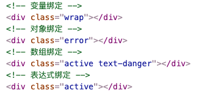

# 一、简介

操作元素的 class 列表和内联样式是数据绑定的一个常见需求。因为它们都是 attribute，所以我们可以用 `v-bind` 处理它们：只需要通过表达式计算出字符串结果即可。不过，字符串拼接麻烦且易错。因此，在将 `v-bind` 用于 `class` 和 `style` 时，Vue.js 做了专门的增强。表达式结果的类型除了字符串之外，还可以是对象或数组。

# 二、bind:class

## 1. 类型

```vue
<script setup lang="ts">
import { reactive } from 'vue';

const state = reactive({
  isActive: true,
  clsName: 'wrap',
  activeCls: 'active',
  errorCls: 'text-danger',
});
</script>

<template>
  <!-- 变量绑定 -->
  <div :class="state.clsName"></div>
  <!-- 对象绑定 -->
  <div :class="{ active: false, error: true }"></div>
  <!-- 数组绑定 -->
  <div :class="[state.activeCls, state.errorCls]"></div>
  <!-- 表达式绑定 -->
  <div :class="state.isActive ? 'active' : ''"></div>
</template>
```

运行结果：



## 3. 用在组件上

这个章节假设你已经对 [Vue 组件](https://v3.cn.vuejs.org/guide/component-basics.html)有一定的了解。当然你也可以先跳过这里，稍后再回过头来看。

当你在带有单个根元素的自定义组件上使用 `class` attribute 时，这些 class 将被添加到该元素中。此元素上的现有 class 将不会被覆盖。

例如，如果你声明了这个组件：

```typescript
const app = Vue.createApp({})

app.component('my-component', {
  template: `<p class="foo bar">Hi!</p>`
})
```

然后在使用它的时候添加一些 class：

```vue
<div id="app">
  <my-component class="baz boo"></my-component>
</div>
```

HTML 将被渲染为：

```html
<p class="foo bar baz boo">Hi</p>
```

对于带数据绑定 class 也同样适用：

```html
<my-component :class="{ active: isActive }"></my-component>
```

当 `isActive` 为 true 时，HTML 将被渲染成为：

```html
<p class="foo bar active">Hi</p>
```

如果你的组件有多个根元素，你需要定义哪些部分将接收这个 class。可以使用 `$attrs` 组件 property 执行此操作：

```html
<div id="app">
  <my-component class="baz"></my-component>
</div>
```

```typescript
const app = Vue.createApp({})

app.component('my-component', {
  template: `
    <p :class="$attrs.class">Hi!</p>
    <span>This is a child component</span>
  `
})
```

# 三、bind:style

## 1. 类型

```vue

<script setup lang="ts">
import { reactive } from 'vue';

const state = reactive({
  color: 'blue',
  styleObj: {
    color: 'orange',
    fontSize: '16px',
  },
  baseStyle: {
    letterSpacing: '2px',
  },
});
</script>

<template>
  <!-- 对象绑定  -->
  <div :style="{ color: state.color, fontSize: '16px' }">Hello</div>
  <div :style="state.styleObj">Hello</div>
  <!-- 数组绑定 -->
  <div :style="[state.styleObj, state.baseStyle]">Hello</div>
</template>
```

## 2. 自动添加前缀

在 `:style` 中使用需要一个 [vendor prefix](https://developer.mozilla.org/en-US/docs/Glossary/Vendor_Prefix) (浏览器引擎前缀) 的 CSS property 时，Vue 将自动侦测并添加相应的前缀。Vue 是通过运行时检测来确定哪些样式的 property 是被当前浏览器支持的。如果浏览器不支持某个 property，Vue 会进行多次测试以找到支持它的前缀。

## 3. 多重值

可以为 style 绑定中的 property 提供一个包含多个值的数组，常用于提供多个带前缀的值，例如：

```html
<div :style="{ display: ['-webkit-box', '-ms-flexbox', 'flex'] }"></div>
```

这样写只会渲染数组中最后一个被浏览器支持的值。在本例中，如果浏览器支持不带浏览器前缀的 flexbox，那么就只会渲染 `display: flex`。


