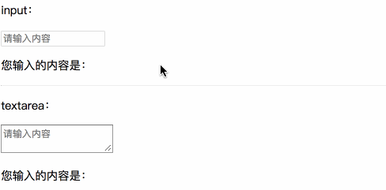
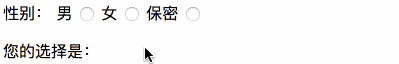
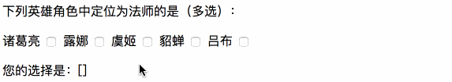
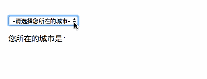

# 一、简介

你可以用 `v-model` 指令在表单控件元素上创建双向数据绑定，v-model 会根据控件类型**自动选取**正确的方法来更新元素。

> 提示：
>
> - `v-model` 会忽略所有表单元素的 `value`、`checked`、`selected` 特性的初始值。因为它会选择 Vue 实例数据来作为具体的值。你应该通过 JavaScript 在组件的 `data` 选项中声明初始值。
> - 对于要求 [IME](https://en.wikipedia.org/wiki/Input_method) (如中文、日语、韩语等) (IME 意为“输入法”)的语言，你会发现 `v-model` 不会在 ime 输入中得到更新。如果你也想实现更新，请使用 `input` 事件。

# 二、示例

如下示例体现 vue 在表单元素上的使用

## 1、输入框

```html
<div id="app">
    <form action="" name="myForm">
        <div class="demo-1">
            <p>input：</p>
            <input type="text" v-model="msg1" placeholder="请输入内容">
            <p>您输入的内容是：{{ msg1 }}</p>
        </div>
        <hr>
        <div class="demo-2">
            <p>textarea：</p>
            <textarea type="text" v-model="msg2" placeholder="请输入内容"></textarea>
            <p>您输入的内容是：{{ msg2 }}</p>
        </div>
    </form>
</div>
```

```javascript
var app = new Vue({
    el: '#app',
    data: {
        msg1: "",
        msg2: ""
    }
})
```



## 2、单选框

```html
<div id="app">
    <form action="" name="myForm">
        <label>性别：</label>

        <label>男</label>
        <input type="radio" value="男"  v-model="checkVal">

        <label>女</label>
        <input type="radio" value="女"  v-model="checkVal">

        <label>保密</label>
        <input type="radio" value="保密" v-model="checkVal">

        <p>您的选择是：{{ checkVal }}</p>
    </form>
</div>
```

```javascript
var app = new Vue({
    el: '#app',
    data: {
        checkVal: ""
    }
})
```



> 提示：单选框需设置 value 属性值便于 v-model 获取。

## 3、多选框

```html
<div id="app">
    <form action="" name="myForm">

        <p>下列英雄角色中定位为法师的是（多选）：</p>

        <label>诸葛亮</label>
        <input type="checkbox" value="诸葛亮" v-model="heros">

        <label>露娜</label>
        <input type="checkbox" value="露娜" v-model="heros">

        <label>虞姬</label>
        <input type="checkbox" value="虞姬" v-model="heros">

        <label>貂蝉</label>
        <input type="checkbox" value="貂蝉" v-model="heros">

        <label>吕布</label>
        <input type="checkbox" value="吕布" v-model="heros">

        <p>您的选择是：{{ heros }}</p>
    </form>
</div>
```

```javascript
var app = new Vue({
    el: '#app',
    data: {
        // 该变量值类型为数组类型
        heros: []
    }
})
```



> 提示：多选框应用时，绑定变量的值为数组类型。

## 4、选择框

```html
<div id="app">
    <form action="" name="myForm">
        <select name="mySel" v-model="selected">
            <option value="">-请选择您所在的城市-</option>
            <option value="成都">成都</option>
            <option value="上海">上海</option>
            <option value="北京">北京</option>
            <option value="深圳">深圳</option>
            <option value="杭州">杭州</option>
            <option value="昆明">昆明</option>
        </select>
    </form>
    <p>您所在的城市是：{{ selected }}</p>
</div>
```

```javascript
var app = new Vue({
    el: '#app',
    data: {
        selected: ""
    }
})
```



# 三、修饰符

## 1、.lazy

在默认情况下， v-model 在 input 事件中同步输入框的值与数据，但你可以添加一个修饰符 lazy ，从而转变为在 change 事件中同步：

```html
<!-- 在 "change" 而不是 "input" 事件中更新 -->
<input v-model.lazy="msg" >
```

## 2、.number

如果想自动将用户的输入值转为 Number 类型（如果原值的转换结果为 NaN 则返回原值），可以添加一个修饰符 number 给 v-model 来处理输入值：

```html
<input v-model.number="age" type="number">
```

## 3、.trim

如果要自动过滤用户输入的首尾空格，可以添加 trim 修饰符到 v-model 上过滤输入：

```html
<input v-model.trim="msg">
```


 