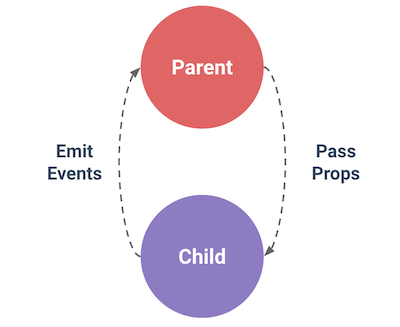
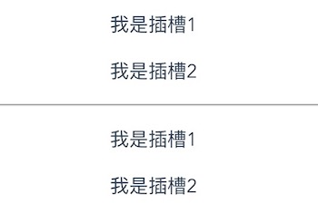
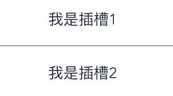
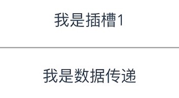

# # 什么是组件

组件 (Component) 是 Vue.js 最强大的功能之一。组件可以扩展 HTML 元素，封装可重用的代码。在较高层面上，组件是自定义元素，Vue.js 的编译器为它添加特殊功能。在有些情况下，组件也可以表现为用 `is` 特性进行了扩展的原生 HTML 元素。

# # 组件组成

单文件组件由三个部分组成：

- Template：视图部分，只能存在一个根元素
- Script：脚本部分
- Style：样式部分，scoped 关键字 -> 样式只在当前组件内生效

# # 使用组件

## 1、脚手架中使用组件

在 “./src/components/” 文件目录下创建一个 “MyComponent.vue” 组件，配置如下：

```vue
// MyComponent.vue
// 视图部分
<template>
    <div>
        我是一个自定义组件
    </div> 
</template>

// 脚本部分
<script>
export default {
    name: "MyComponent",
    data() {
        return {
            
        }
    }
}
</script>

// 样式部分
<style scoped>

</style>
```

然后再 “./src/App.vue” 组件中使用自定义组件，如下所示：

```vue
<template>
  <div id="app">
    
    <!-- 3.使用自定义组件 -->
    <MyComponent/>
  </div>
</template>

<script>
// 1.引入自定义组件
import MyComponent from './components/MyComponent'
import Vue from 'vue';

export default {
  name: 'App',
  components: {
    // 2.注册自定义组件
    MyComponent
  }
}
</script>

<style>
#app {
  font-family: 'Avenir', Helvetica, Arial, sans-serif;
  -webkit-font-smoothing: antialiased;
  -moz-osx-font-smoothing: grayscale;
  text-align: center;
  color: #2c3e50;
  margin-top: 60px;
}
</style>
```

呈现效果如下所示：


## 2、DOM 模板解析注意事项

当使用 DOM 作为模板时 (例如，使用 `el` 选项来把 Vue 实例挂载到一个已有内容的元素上)，你会受到 HTML 本身的一些限制，因为 Vue 只有在浏览器解析、规范化模板**之后**才能获取其内容。尤其要注意，像 `<ul>`、`<ol>`、`<table>`、`<select>` 这样的元素里允许包含的元素有限制，而另一些像 `<option>` 这样的元素只能出现在某些特定元素的内部。

在自定义组件中使用这些受限制的元素时会导致一些问题，例如：

```html
<table>
 	 <my-row>...</my-row>
</table>
```

自定义组件 `<my-row>` 会被当作无效的内容，因此会导致错误的渲染结果。变通的方案是使用特殊的 `is` 特性：

```html
<table>
  	<tr is="my-row"></tr>
</table>
```

**应当注意，如果使用来自以下来源之一的字符串模板，则没有这些限制：**

- `<script type="text/x-template">`
- JavaScript 内联模板字符串
- `.vue` 组件

因此，请尽可能使用字符串模板。

## 3、data 必须是函数

构造 Vue 实例时传入的各种选项大多数都可以在组件里使用。只有一个例外：`data` 必须是函数。实际上，如果你这么做：

```javascript
Vue.component('my-component', {
  	template: '<span>{{ message }}</span>',
  	data: {
  	 	 message: 'Hello, vue.js!'
  	}
})
```

那么 Vue 会停止运行，并在控制台发出警告，告诉你在组件实例中 `data` 必须是一个函数。但理解这种规则为何存在也是很有益处的，所以让我们先作个弊：

```html
<div id="app">
    <my-component></my-component>
    <my-component></my-component>
    <my-component></my-component>
</div>
```

```javascript
let data = {
    counter:0
}
let vm = new Vue({
   el: "#app",
   components: {
       "my-component": {
           template: "<button type='button' @click='counter += 1'> {{ counter }}</button>",
           data: function () {
               return data
           }
       }
   }
});
```

[查看demo](https://lihongyao.github.io/tutorials/vue/02.Components/data-error.html)

由于这三个组件实例共享了同一个 `data` 对象，因此递增一个 counter 会影响所有组件！这就错了。我们可以通过为每个组件返回全新的数据对象来修复这个问题：

```javascript
data: function () {
  	return {
   		 counter: 0
 	}
}
```

现在每个 counter 都有它自己内部的状态了：

[查看demo](https://lihongyao.github.io/tutorials/vue/02.Components/data.html)

## 4、组件组合

组件设计初衷就是要配合使用的，最常见的就是形成父子组件的关系：组件 A 在它的模板中使用了组件 B。它们之间必然需要相互通信：父组件可能要给子组件下发数据，子组件则可能要将它内部发生的事情告知父组件。然而，通过一个良好定义的接口来尽可能将父子组件解耦也是很重要的。这保证了每个组件的代码可以在相对隔离的环境中书写和理解，从而提高了其可维护性和复用性。

在 Vue 中，父子组件的关系可以总结为 **prop 向下传递，事件向上传递**。父组件通过 **prop**给子组件下发数据，子组件通过**事件**给父组件发送消息。看看它们是怎么工作的。




在 “./src/components/” 文件目录下创建一个 “Son.vue” 组件，配置如下：

```vue
// 视图部分
<template>
    <div>
        儿子
    </div> 
</template>

// 脚本部分
<script>
export default {
    name: "Son",
    data() {
        return {
            
        }
    }
}
</script>

// 样式部分
<style scoped>

</style>
```

然后在 “./src/components/MyComponent.vue” 组件中引用该组件，如下所示：

```vue
<template>
    <div>
        父亲
        <!-- 使用子组件 -->
        <Son />
    </div> 
</template>

<script>
// 引入子组件  
import Son from './Son'

export default {
    name: "MyComponent",
    components: {
       // 注册子组件
        Son
    },
    data() {
        return {
            
        }
    }
}
</script>

<style scoped>

</style>
```

此时就形成一个组件组合，运行之后查看效果检查元素可看到Son组件嵌套在MyComponent组件中。

# # 组件交互

- 父组件向子组件传递数据：prop
- 子组件向父组件传递数据：$emit event

## 1、Prop

prop 是父组件用来传递数据的一个自定义属性。

父组件的数据需要通过 props 把数据传给子组件，子组件需要显式地用 props 选项声明 "prop"

### 1.1、使用 Prop 传递数据

```vue
// 父组件
<template>
    <div>
        父亲
        <!-- 父组件传递title属性值给子组件 -->
        <Son title="传递数据"/>
    </div> 
</template>
```

```vue
// 子组件
<template>
    <div>
        <!-- 显示父组件传递过来的数据 -->
        儿子：{{title}}
    </div> 
</template>

<script>
export default {
    name: "Son",
    data() {
        return {
            
        }
    },
    // 子组件通过props接受
    // props为数组类型
    // 里面的成员为接收的变量
    props: ["title"]
}
</script>
```

### 1.2、动态 Prop

类似于用 v-bind 绑定 HTML 特性到一个表达式，也可以用 v-bind 动态绑定 props 的值到父组件的数据中。每当父组件的数据变化时，该变化也会传导给子组件，在父组件中我们这样修改：

```vue
<template>
    <div>
        父亲
        <p><input type="text" v-model="msg"></p>
        <Son :title="msg" />
    </div> 
</template>

<script>
import Son from './Son'

export default {
    name: "MyComponent",
    components: {
        Son
    },
    data() {
        return {
            // 定义数据
            msg: "I am a live data."
        }
    }
}
</script>
```

### 1.3、Prop 验证

我们可以为组件的 prop 指定验证规则。如果传入的数据不符合要求，Vue 会发出警告。这对于开发给他人使用的组件非常有用。

要指定验证规则，需要用对象的形式来定义 prop，而不能用字符串数组：

```javascript
Vue.component('example', {
    props: {
        // 基础类型检测 (`null` 指允许任何类型)
        propA: Number,
        // 可能是多种类型
        propB: [String, Number],
        // 必传且是字符串
        propC: {
            type: String,
            required: true
        },
        // 数值且有默认值
        propD: {
            type: Number,
            default: 100
        },
        // 数组/对象的默认值应当由一个工厂函数返回
        propE: {
            type: Object,
            default: function () {
                return { message: 'hello' }
            }
        },
        // 自定义验证函数
        propF: {
            validator: function (value) {
                return value > 10
            }
        }
    }
})
```

`type` 可以是下面原生构造器：

- String
- Number
- Boolean
- Function
- Object
- Array
- Symbol

`type` 也可以是一个自定义构造器函数，使用 `instanceof` 检测。

当 prop 验证失败，Vue 会抛出警告 (如果使用的是开发版本)。注意 prop 会在组件实例创建**之前**进行校验，所以在 `default` 或 `validator` 函数里，诸如 `data`、`computed` 或 `methods` 等实例属性还无法使用。

## 2、Emit Event

父组件是使用 props 传递数据给子组件，但如果子组件要把数据传递回去，就需要使用Emit事件！

为了便于观察，我们重新创建两个组件，Parent 组件和 Child 组件。

```vue
<template>
    <div>
        父组件
        <Child />
    </div>
</template>

<script>
    import Child from './Child.vue'
    export default {
        name: "Parent",
        data() {
            return {}
        },
        components: {
            Child
        }
    }
</script>

<style scoped>

</style>
```

```vue
<template>
    <div>
        子组件
    </div>
</template>

<script>
    export default {
        name: "Child",
        data() {
            return {}
        }
    }
</script>

<style scoped>

</style>
```

接在来在子组件中定义按钮，点击按钮将数据发送至父组件，如下所示：

```vue
<template>
    <div>
        子组件
        <button type="button" @click="sendMsg">BUTTON</button>
    </div>
</template>

<script>
    export default {
        name: "Child",
        data() {
            return {
                msg: "我是子组件数据"
            }
        },
        methods: {
            sendMsg(event) {
                // 像父组件发送数据
                // 参数1：key / 参数2：value
                this.$emit("msg", this.msg);
            }
        }
    }
</script>
```

如何在父组件中接收数据呢？

```vue
<template>
    <div>
        父组件
        <!-- 自定义事件 -->
        <!-- 注意：事件名和子组件传递数据时定义的key必须一致 -->
        <Child @msg="getMsg"/>
    </div>
</template>

<script>
    import Child from './Child.vue'
    export default {
        name: "Parent",
        data() {
            return {}
        },
        components: {
            Child
        },
        methods: {
            getMsg(data) {
                // 打印子组件传递过来的数据
                console.log(data);
            }
        }
    }
</script>
```

## 3、子父组件相互传递数据

实际开发中可能会有这样一种需求，那就是子父组件数据相互传递，比如，在父组件中传递一个 **num** 给子组件，子组件做响应运算之后再传回给父组件，那应该如何去实现呢？我们来看代码实现：

```vue
<template>
    <div>
        父组件
        <!-- 通过num属性将数据传递给子组件 -->
        <!-- 通过@msg事件接收子组件发送过来的数据 -->
        <Child @msg="getMsg" :num="num"/>
    </div>
</template>

<script>
    import Child from './Child.vue'
    export default {
        name: "Parent",
        data() {
            return {
                num: 10
            }
        },
        components: {
            Child
        },
        methods: {
            getMsg(data) {
                // 打印子组件处理后的数据
                console.log(data);
            }
        }
    }
</script>
```

```vue
<template>
    <div>
        子组件
        <button type="button" @click="sendMsg">BUTTON</button>
    </div>
</template>

<script>
    export default {
        name: "Child",
        data() {
            return {
    
            }
        },
        // 接收父组件传递过来的数据
        props: {
            num: {
                // 指定类型
                type: Number,
                // 指定默认值
                default: 5
            }
        },
        computed: {
            // 重新计算父组件传递过来的数据
            addNum() {
                return this.num + 5;
            }
        },
        methods: {
            sendMsg(event) {
                // 点击按钮时将数据重新运算之后再发送给父组件
                this.$emit("msg", this.addNum);
            }
        }
    }
</script>
```

# # 插槽

Vue 实现了一套内容分发的 API，这套 API 基于当前的 [Web Components 规范草案](https://github.com/w3c/webcomponents/blob/gh-pages/proposals/Slots-Proposal.md)，将 `<slot>` 元素作为承载分发内容的出口。

## 1、单个插槽

```vue
<template>
    <div>
        父组件
        <Child>
            <p>我是插槽</p>
        </Child>
    </div>
</template>
```

```vue
<template>
    <div>
        子组件
        <slot></slot>
    </div>
</template>
```

此时，布局结构如下：

```html
<div>
    <div>
        <p>我是插槽</p>
    </div>
</div>
```

> 提示：插槽样式在子父组件中都可以设置，所以在命名class时一定要注意。

## 2、具名插槽

我们知道，一个组件可能会有多个插槽，比如：

```vue
<template>
    <div>
        父组件
        <Child>
            <p>我是插槽1</p>
            <p>我是插槽2</p>
        </Child>
    </div>
</template>
```

```vue
<template>
    <div>
        子组件
        <slot></slot>
        <hr />
        <slot></slot>
    </div>
</template>
```

此时，页面展示效果如下：



显然，这不是我们想要的结果，比如我们想一个slot对应一个插槽该怎么办呢？我们可以借助“solt”属性和“name”属性实现绑定来控制solt对应插入，如下所示：

```vue
<template>
    <div>
        父组件
        <Child>
            <p slot="s1">我是插槽1</p>
            <p slot="s2">我是插槽2</p>
        </Child>
    </div>
</template>
```

```vue
<template>
    <div>
        子组件
        <slot name="s1"></slot>
        <hr />
        <slot name="s2"></slot>
    </div>
</template>
```

效果如下所示：



## 3、默认内容

使用插槽时，有可能父组件中并没有传递实际的内容，我们可以为 \<slot> 设置一个默认内容，如下所示：

```vue
<slot>如果没有传递视图，则显示我</slot>
```

## 4、作用域插槽

作用域插槽是一种特殊类型的插槽，用作一个（能被传递数据的）可重用模板，来代替已经渲染好的元素。

子传父。即长什么样，怎么布局由父级决定，而数据源则由子级决定。如：

```vue
<template>
    <div>
        父组件
        <Child>
            <p slot="s1">我是插槽1</p>
            <!-- 通过slot-scope来接收数据 -->
            <p slot="s2" slot-scope="props">{{ props.text }}</p>
        </Child>
    </div>
</template>
```

```vue
<template>
    <div>
        子组件
        <slot name="s1"></slot>
        <hr />
        <slot name="s2" text="我是数据传递"></slot>
    </div>
</template>
```

展示效果如下：



> 注意：在2.5.0之前，必须定义在 template 里，在 2.5.0+，`slot-scope` 不再限制在 `<template>` 元素上使用，而可以用在插槽内的任何元素或组件上。

# # 动态组件

通过使用保留的 \<component> 元素，动态地绑定到它的 is 特性，我们让多个组件可以使用同一个挂载点，并动态切换。

```vue
// Home.vue
<template>
    <div>
        <component :is="currentPage"></component>
        <button type="button" data-page="News" @click="menuItemClick">新闻</button>  
        <button type="button" data-page="Mine" @click="menuItemClick">个人中心</button>
    </div>
</template>

<script>
    import News from './News'
    import Mine from './Mine'
    export default {
        name: "Parent",
        data() {
            return {
                currentPage: "News"
            }
        },
        components: {
            News,
            Mine
        },
        methods: {
            menuItemClick(event) {
                this.currentPage = event.target.dataset.page;
                console.log(this.currentPage);

            }
        }
    }
</script>

<style scoped>

</style>
```

```vue
// News.vue
<template>
    <div>
        <h1>新闻页面</h1>
    </div>
</template>

<script>
    export default {
        name: "News",
        data() {
            return {
            }
        }
    }
</script>

<style scoped>

</style>
```

```vue
// Mine.vue
<template>
    <div>
        <h1>个人中心页面</h1>
    </div>
</template>

<script>
    export default {
        name: "Mine",
        data() {
            return {
            }
        }
    }
</script>

<style scoped>

</style>
```

展示效果：


## 1、keep-alive

如果把切换出去的组件保留在内存中，可以保留它的状态或避免重新渲染，为此可以添加一个 keep-alive 指令参数。如下所示：

```vue
<keep-alive>
    <component :is="currentPage"></component>
</keep-alive>
```

什么情况下使用缓存：如果你需要实时更新（比如网络请求/或者时间跳转）就不能使用缓存。

> 注意：这个 `<keep-alive>` 要求被切换到的组件都有自己的名字，不论是通过组件的 `name` 选项还是局部/全局注册

# # 弹框组件

[参考示例]()

```shell
$ npm install
$ npm run dev
```

# # npm 发布组件

## 1. 创建自己的组件

1. 初始化项目

2. 修改 package.json 文件

   ```
   {
     "private": false,
     "main": "dist/vue-lhy-alertview.min.js"
   }
   ```

3. 修改 webpack.prod.config.js 文件

   - 修改out输出目录

     ```js
     output: {
       path: config.build.assetsRoot,
       publicPath: config.build.assetsPublicPath,
       filename: 'vue-lhy-alertview.min.js',
       library: 'VueLhyAlertView',
       libraryTarget: 'umd'
     }
     ```

   - 删除无用内容

4. 修改config/index.js 文件

   ```
   - assetsSubDirectory: 'static'
   + assetsSubDirectory: '/',
   ```

5. 修改输出

   - 修改 main.js 文件，输出自己的组件即可使用

     ```js
     // main.js
     import VueLhyAlertView from './components/LHYAlertView'
     export default VueLhyAlertView;
     ```

6. 修改 .gitignore 文件

   ```js
   - dist/
   ```

## 2. NPM 发布一个包

1. 点击 [前往官网](https://www.npmjs.com/) 注册账号；

2. CMD 下登录账号：

   ```shell
   $ npm login
   ```

3. 打包项目

   ```shell
   $ npm run build
   ```

4. 发布项目

   ```shell
   $ npm publish
   ```

至此，恭喜您，已经发布成功！

接下来您可以创建一个项目 npm install 你的包就可以使用啦。


