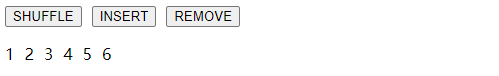

- https://blog.csdn.net/weixin_47529373/article/details/117935409
- https://jspang.com/detailed?id=71#toc29

# 一、概述

先来看两个概念，了解过渡与动画：

> 过渡：元素可动画属性的计算值产生变化时，需要以怎样的方式过渡到目标值。可以定义过渡时间和过渡函数来控制过渡动画的效果，默认行为是瞬间切换成变化后的结果，即无动画。

> 动画：使用 `@keyframes` 预定义一系列动画进程中的关键帧，关键帧中可以指定任意可动画属性的值，然后只需要应用动画到你想要的元素上并指定时间，次数，缓动函数，状态，动画结束后的行为等。

二者都会让你的页面元素动起来，区别在于：

**过渡（Transition）**

- 需要事件触发，比如 `hover`、`click` 等；
- 一次性的；
- 只能定义开始和结束状态，不能定义中间状态；

**动画（Animation）**

- 不需要事件触发；
- 显示地随着时间的流逝，周期性的改变元素的 CSS 属性值，区别于一次性。
- 通过百分比来定义过程中的不同形态，可以很细腻。

# 二、忆往昔

我们先来简单回顾一下在CSS中如何实现过渡与动画效果。

## 1. Transition in CSS

```vue
<script setup lang="ts">
import { reactive } from 'vue';

const classNames = reactive({
  transition: false
});

const onButtonTap = () => {
  classNames.transition = !classNames.transition;
}

</script>
<template>
  <div class="box" :class="classNames"></div>
  <button type="button" @click="onButtonTap">Toggle</button>
</template>
<style scoped>
.box {
  width: 100px;
  height: 100px;
  margin-bottom: 16px;
  background-color: red;
  transition: .5s background-color linear;
}
.transition {
  background-color: blue;
}

</style>
```

演示效果：


## 2. Animation in CSS

```vue
<script setup lang="ts">
import { reactive } from 'vue';

const classNames = reactive({
  ani: false,
});

const onButtonTap = () => {
  classNames.ani = true;
};
</script>
<template>
  <div class="box" :class="classNames"></div>
  <button type="button" @click="onButtonTap">启用动画</button>
</template>
<style scoped>
@keyframes ani {
  to {
    transform: translateX(300px);
    background-color: blue;
  }
}
.box {
  width: 100px;
  height: 100px;
  margin-bottom: 16px;
  background-color: red;
}
.ani {
  animation: ani 2s linear 1 forwards;
}
</style>
```

演示效果：


# 三、过渡 & 动画

接下来，我们一起了解在 Vue 中，如何使用过渡与动画。

## 1. 基本使用

Vue 内置组件 `<transition />` 在下面情况中，可以给任何元素和组件添加进入和离开动画。

- 条件渲染：`v-if` 或者 `v-show`
- 动态组件：`component`
- 组件根节点

## 2. 过渡类名

在进入/离开的过渡中，会有 6 个 class 切换。

| 类名             | 描述                     |
| ---------------- | ------------------------ |
| `v-enter-from`   | 定义进入过渡的开始状态   |
| `v-enter-active` | 定义进入过渡生效时的状态 |
| `v-enter-to`     | 定义进入过渡的结束状态   |
| `v-leave-from`   | 定义离开过渡的开始状态   |
| `v-leave-active` | 定义离开过渡生效时的状态 |
| `v-leave-to`     | 离开过渡的结束状态       |

> 注意：假设 `transition` 设有 `name`  属性，class 名将 `v-` 替换为 `name 属性值-`。
>
> 比如：`<transition name="fade >"`，那么 `v-enter-from` 将被替换为 `fade-enter-from`，以此类推。


## 3. 单元素/组件过渡

### 3.1. CSS 过渡

CSS 过渡是最常用的过渡类型之一，举例：

```vue
<script setup lang="ts">
import { ref } from 'vue';
const visible = ref(true);
</script>

<template>
  <button type="button" @click="visible = !visible">Toggle</button>
  <transition name="slide-fade">
    <div v-show="visible" class="box"></div>
  </transition>
</template>

<style scoped>
.box {
  width: 100px;
  height: 100px;
  margin-top: 16px;
  background-color: red;
}
/* 可以为进入和离开动画设置不同的持续时间和动画函数 */
.slide-fade-enter-active {
  transition: all 0.75s ease-out;
}

.slide-fade-leave-active {
  transition: all 1s cubic-bezier(1, 0.5, 0.8, 1);
}

.slide-fade-enter-from,
.slide-fade-leave-to {
  transform: translateX(300px);
  opacity: 0;
}
</style>
```

效果演示：


上述示例，点击 `Toggle` 按钮，切换元素显示状态，使得元素向右位移 300 像素，透明逐渐为0隐藏元素，呈现元素效果相反。

### 3.2. CSS 动画

CSS 动画用法同 CSS 过渡，区别是在动画中 `v-enter-from` 类在节点插入 DOM 后不会立即移除，而是在 `animationend` 事件触发时移除。

```vue
<script setup lang="ts">
import { ref } from 'vue';
const visible = ref(true);
</script>

<template>
  <button type="button" @click="visible = !visible">Toggle</button>
  <transition name="bounce">
    <div v-show="visible" class="box"></div>
  </transition>
</template>

<style scoped>
.box {
  width: 100px;
  height: 100px;
  margin-top: 16px;
  background-color: red;
}
.bounce-enter-active {
  animation: bounce-in 0.5s;
}
.bounce-leave-active {
  animation: bounce-in 0.5s reverse;
}
@keyframes bounce-in {
  0% {
    transform: scale(0);
  }
  50% {
    transform: scale(1.25);
  }
  100% {
    transform: scale(1);
  }
}
</style>

```

> 代码解读：
>
> 1）上述示例中，通过 `@keyframes` 定义 `bounce-in` 动画，该动画从0开始缩放到1.25倍再调整到1倍，所以有会一种从无到有，先放大再缩回原始尺寸的效果。
>
> 2）隐藏元素时同样使用 `bounce-in` 动画，不过增加了 `reverse` 关键字，该关键字的作用和显示的动画刚好相反，让预定义动画反向执行。

效果演示：


### 3.3. 自定义类名 & animate.css

我们可以通过以下属性来自定义过渡类名：

- `enter-from-class`
- `enter-active-class`
- `enter-to-class`
- `leave-from-class`
- `leave-active-class`
- `leave-to-class`

它们的优先级高于普通的类名，当你希望将其它第三方 CSS 动画库与 Vue 的过度系统相结合时十分有用，比如 [Animate.css](https://daneden.github.io/animate.css/)。

接下来我们尝试使用 Animate.css：

**Steps 1：安装 animate.css**

```shell
$ npm install animate.css
```

**Steps 2：导入**

```js
import 'animate.css'
```

**Steps 3：打开 [Animate.css >>](https://animate.style/) 官网，选择效果**


应用示例：

```html
<h1 class="animate__animated animate__bounce">An animated element</h1>
```

> 提示：`animate__animated` 这个 className **一定要** 加上，**不能省略**。

**Steps 4： 编写代码，复制效果**


```html
<script setup lang="ts">
import { ref } from 'vue';
const visible = ref(true);
</script>

<template>
  <button type="button" @click="visible = !visible">Toggle</button>
  <transition
    enter-active-class="animate__animated animate__bounceIn"
    leave-active-class="animate__animated animate__slideOutRight"
  >
    <h1 v-show="visible">Animate.css</h1>
  </transition>
</template>
```

效果演示：


### 3.4. 同时使用过渡和动画

Vue 为了知道过渡何时完成，必须设置相应的事件监听器。它可以是 `@transitionend` 或 `@animationend`，这取决于给元素应用的 CSS 规则。如果你只使用了其中一种，Vue 能自动识别其正确类型。

但是，在一些场景中，你需要给同一个元素同时设置两种过渡动效，比如有一个通过 Vue 触发的 CSS 动画，并且在悬停时结合一个 CSS 过渡。在这种情况中，你就需要使用 `type` 属性并设置 `animation` 或 `transition` 来显式声明你需要 Vue 监听的类型。

### 3.5. 显性的过渡持续时间

Vue 在 `<transition>` 组件上提供 `duration` 属性显式指定过渡持续时间 (以毫秒计)：

```vue
<transition :duration="1000">...</transition>
```

你也可以分别指定进入和离开的持续时间：

```vue
<transition :duration="{ enter: 500, leave: 800 }">...</transition>
```

### 3.6. JavaScript 钩子函数

可以在 属性 中声明 JavaScript 钩子：

```vue
<transition
  @before-enter="beforeEnter"
  @enter="enter"
  @after-enter="afterEnter"
  @enter-cancelled="enterCancelled"
  @before-leave="beforeLeave"
  @leave="leave"
  @after-leave="afterLeave"
  @leave-cancelled="leaveCancelled"
  :css="false"
>
  <!-- ... -->
</transition>
```

- 和之前在 CSS 中的类名类似，这些钩子函数会在过渡到了对应阶段调用；
- `cancelled` 是在过程中撤销操作，才会回调;
- `enter` 和 `leave` 对应的钩子函数有两个参数：
  - `el`：参与动画的元素；
  - `done`：过渡过程是否完成；
- `css:false`：使元素设置的动画 CSS 失效；

## 4. 初始渲染的过渡

可以通过 `appear` 属性设置节点在 **初始渲染**（即页面在初始化的时候就执行一次动画） 的过渡：

```vue
<transition appear>
  <!-- ... -->
</transition>
```

## 5、多元素过渡

对于原生标签可以使用 `v-if`/`v-else` 。最常见的多标签过渡是一个列表和描述这个列表为空消息的元素：

```html
<transition>
  <table v-if="items.length > 0">
    <!-- ... -->
  </table>
  <p v-else>Sorry, no items found.</p>
</transition>
```

实际上，通过使用 `v-if`/`v-else-if`/`v-else` 或将单个元素绑定到一个动态属性，可以在任意数量的元素之间进行过渡。例如：

```html
<transition>
  <button v-if="docState === 'saved'" key="saved">Edit</button>
  <button v-else-if="docState === 'edited'" key="edited">Save</button>
  <button v-else-if="docState === 'editing'" key="editing">Cancel</button>
</transition>
```

可以重写为：

```vue
<script setup lang="ts">
import { ref, computed } from 'vue';

const docState = ref('saved');

const buttonMessage = computed(() => {
  switch (docState.value) {
    case 'saved':return 'Edit';
    case 'edited':return 'Save';
    case 'editing': return 'Cancel';
  }
});
</script>

<template>
  <transition>
    <button :key="docState">{{buttonMessage}}</button>
  </transition>
</template>
```

### @过渡模式

`<transition>` 的默认行为 - 进入和离开同时发生，即 **上一个组件还在消失的过程中，但下一个组件已经在出现过程中**。我们看看一组示例：

```vue
<script setup lang="ts">
import { ref, computed } from 'vue';

// -- 定义 buttonState 形状（TS语法）
type ButtonStateType = 'disable' | 'enable';
// -- 定义 buttonState 变量，其类型为 ButtonStateType
const buttonState = ref<ButtonStateType>('disable');
</script>

<template>
  <transition>
    <button type="button" v-if="buttonState === 'enable'" @click="buttonState = 'disable'">禁用</button>
    <button type="button" v-else @click="buttonState = 'enable'">启用</button>
  </transition>
</template>

<style scoped>

@keyframes move-in {
  from {
    transform: translateX(100px);
    opacity: 0;
  }
  to {
    transform: translateX(0);
    opacity: 1;
  }
}

button {
  /* 为了方便查看效果，使用绝对定位使其重叠在一起 */
  position: absolute;
}
.v-enter-active {
  animation: move-in 1s linear;
}
.v-leave-active {
  animation: move-in 1s linear reverse;
}
</style>
```

示例效果：


可以看到，在多组件切换时，进入和离开是同时发生的。同时生效的进入和离开的过渡不能满足所有要求，所以 Vue 提供了 **过渡模式**

- `in-out`：新元素先进行进入过渡，完成之后当前元素过渡离开。

- `out-in`：当前元素先进行离开过渡，完成之后新元素过渡进入。

语法形式如下：

```vue
<transition mode="in-out">
  <!-- ... the buttons ... -->
</transition>
```

接下来，我们切换两种模式查看效果：

> **`in-out`**


> **`out-in`**


不难发现，`in-out` 和 `out-in` 模式刚好相反。

## 6、多个组件的过渡

多个组件的过渡简单很多 - 我们不需要使用 key 特性。相反，我们只需要使用动态组件：

```vue
<template>
  <div id="app">
    <!-- 导航栏 -->
    <div class="navigation-bar">{{title}}</div>
    <!-- 内容 -->
    <transition name="slide" mode="out-in">
      <keep-alive>
        <component :is="curPage"></component>
      </keep-alive>
    </transition>
    <!-- 标签栏 -->
    <div class="tabBar">
      <section v-for="(route, index) in routes" 
               :key="index" 
               class="tabBarItem"
               @click="handeTabBarItemClick({route, index})">
          {{route.title}}
      </section>
      <section class="cursor" :style="{left}"></section>
    </div>

  </div>
</template>

<script>

export default {
  name: "App",
  data() {
    return {
      routes: [
        {title: "主页", page: "Home"},
        {title: "新闻", page: "News"},
        {title: "关于", page: "About"},
        {title: "我的", page: "Mine"},
      ],
      left: 0,
      title: "主页",
      curPage: "Home"
    };
  },
  components: {
    Home : { template: `<div style="background:pink;" class="page">主页</div>` },
    News : { template: `<div style="background:green;" class="page">新闻</div>` },
    Mine : { template: `<div style="background:orange;" class="page">我的</div>` },
    About: { template: `<div style="background:blue;"  class="page">关于</div>` }
  },
  methods: {
    handeTabBarItemClick({route, index}) {
      this.curPage = route.page;
      this.title = route.title;
      this.left = (25 * index) + "%";
    }
  }
};
</script>

<style>
* {
  margin: 0; padding: 0;
}
html, body, #app {
  height: 100%;
  overflow: hidden;
}
/* 导航栏 */
.navigation-bar {
  height: 64px;
  background: #444;
  color: #fff;
  display: flex;
  justify-content: center;
  align-items: center;
}
/* 内容 */
.page {
  height: calc(100% - 64px - 49px);
  background: cornflowerblue;
  color: #fff;
  font-size: 22px;
}
/* 标签栏 */
.tabBar {
  position: relative;
  height: 49px;
  background: #444;
  color: #fff;
  display: flex;
  justify-content: space-around;
  align-items: center;
}
.tabBarItem {
  width: 25%;
  height: 100%;
  display: flex;
  justify-content: center;
  align-items: center;
  position: relative;
  z-index: 2;
}

.cursor {
  height: 100%;
  width: 25%;
  transition: all .25s linear;
  background: gray;
  position: absolute;
  top: 0;
  left: 0;
  z-index: 1;
}


/* 过渡 */
.slide-enter-active {
  transition: all .3s linear;
}
.slide-enter-to {
    transform: translate(0);
}
.slide-enter {
    transform: translate(100%);
}
</style>
```


# 四、列表过渡

目前为止，关于过渡我们已经讲到：

- 单个节点
- 同一时间渲染多个节点中的一个

那么怎么同时渲染整个列表，比如使用 v-for ？在这种场景中，使用 \<transition-group> 组件。在我们深入例子之前，先了解关于这个组件的几个特点：

- 不同于 \<transition>，它会以一个真实元素呈现：默认为一个 \<span>。你也可以通过 tag 特性更换为其他元素。
- 过渡模式不可用，因为我们不再相互切换特有的元素。
- 内部元素 总是需要 提供唯一的 key 属性值。

**【实例 - 01】基础示例**

现在让我们由一个简单的例子深入，进入和离开的过渡使用之前一样的 CSS 类名。

```vue
<template>
  <div id="app">
    <button v-on:click="add">Add</button>
    <button v-on:click="remove">Remove</button>
    <transition-group name="list" tag="ul" class="list">
      <li v-for="item in items" v-bind:key="item" class="list-item">{{ item }}</li>
    </transition-group>
  </div>
</template>

<script>
export default {
  name: "App",
  data() {
    return {
      items: [1, 2, 3, 4, 5, 6],
      nextNum: 7
    };
  },
  methods: {
    randomIndex: function() {
      return Math.floor(Math.random() * this.items.length);
    },
    add: function() {
      this.items.splice(this.randomIndex(), 0, this.nextNum++);
    },
    remove: function() {
      this.items.splice(this.randomIndex(), 1);
    }
  }
};
</script>

<style>
.list {
  list-style: none;
  padding: 0;
}
.list-item {
  display: inline-block;
  margin-right: 10px;
}
.list-enter-active,
.list-leave-active {
  transition: all 1s;
}
.list-enter, .list-leave-to {
  opacity: 0;
  transform: translateY(30px);
}
</style>
```


这个例子有个问题，当添加和移除元素的时候，周围的元素会瞬间移动到他们的新布局的位置，而不是平滑的过渡，我们下面会解决这个问题。

**【实例 - 02】列表的排序过渡**

\<transition-group> 组件还有一个特殊之处。不仅可以进入和离开动画，还可以改变定位。要使用这个新功能只需了解新增的 v-move 特性，它会在元素的改变定位的过程中应用。像之前的类名一样，可以通过 name 属性来自定义前缀，也可以通过 move-class 属性手动设置。

`v-move` 对于设置过渡的切换时机和过渡曲线非常有用，你会看到如下的例子，我们通过 [Lodash工具库](https://www.lodashjs.com/)  打乱集合顺序。

首先安装 loadash：

```shell
$ npm i -S lodash
```

然后引入 loadash：

```js
import _ from 'lodash'
```

接下来编码：

```vue
<template>
  <div id="app">
    <button @click="shuffle">Shuffle</button>
    <transition-group name="flip-list" tag="ul">
      <li v-for="item in items" :key="item">{{ item }}</li>
    </transition-group>
  </div>
</template>

<script>
import _ from "lodash";
export default {
  name: "TransAnim",
  data() {
    return {
      items: [1, 2, 3, 4, 5, 6, 7, 8, 9]
    };
  },
  methods: {
    shuffle() {
      this.items = _.shuffle(this.items);
    }
  }
};
</script>

<style>

.flip-list-move {
  transition: transform 1s;
}
</style>
```


这个看起来很神奇，内部的实现，Vue 使用了一个叫 [FLIP](https://aerotwist.com/blog/flip-your-animations/) 简单的动画队列，使用 transforms 将元素从之前的位置平滑过渡新的位置。

我们将之前实现的例子和这个技术结合，使我们列表的一切变动都会有动画过渡。

```vue
<template>
  <div id="app">
    <button @click="shuffle">Shuffle</button>
    <button @click="add">Add</button>
    <button @click="remove">Remove</button>
    <transition-group name="list-complete" tag="p">
      <span v-for="item in items" :key="item" class="list-complete-item">{{ item }}</span>
    </transition-group>
  </div>
</template>

<script>
import _ from "lodash";
export default {
  name: "App",
  data() {
    return {
      items: [1, 2, 3, 4, 5, 6, 7, 8, 9],
      nextNum: 10
    };
  },
  methods: {
    randomIndex: function() {
      return Math.floor(Math.random() * this.items.length);
    },
    add: function() {
      this.items.splice(this.randomIndex(), 0, this.nextNum++);
    },
    remove: function() {
      this.items.splice(this.randomIndex(), 1);
    },
    shuffle: function() {
      this.items = _.shuffle(this.items);
    }
  }
};
</script>

<style>
.list-complete-item {
  transition: all 1s;
  display: inline-block;
  margin-right: 10px;
}
.list-complete-enter, .list-complete-leave-to  {
  opacity: 0;
  transform: translateY(30px);
}
.list-complete-leave-active {
  position: absolute;
}
</style>
```




# 五、状态过渡

Vue 的过渡系统提供了非常多简单的方法设置进入、离开和列表的动效。那么对于数据元素本身的动效呢，比如：

- 数字和运算
- 颜色的显示
- SVG 节点的位置
- 元素的大小和其他的属性

所有的原始数字都被事先存储起来，可以直接转换到数字。做到这一步，我们就可以结合 Vue 的响应式和组件系统，使用第三方库来实现切换元素的过渡状态。

**\-> 状态动画**

[GSAP](https://www.tweenmax.com.cn/)

通过侦听器我们能监听到任何数值属性的数值更新。可能听起来很抽象，所以让我们先来看看使用 [GreenSock](https://greensock.com/) 一个例子：

首先，安装 “gsap” js动画库：

```shell
$ npm i -S gsap
```

引入 `TweenMax` ：

```js
import {TweenMax} from 'gsap'
```

html：

```html
<div id="app">
    <input v-model.number="number" type="number" step="20">
    <p>{{ animatedNumber }}</p>
</div>
```

js：

```js
new Vue({
  el: '#app',
  data: {
    number: 0,
    tweenedNumber: 0
  },
  watch: {
      number(newVal) {
          TweenLite.to(this.$data, 0.5, { tweenedNumber: newVal });
      }
  },
  computed: {
      animatedNumber() {
          return this.tweenedNumber.toFixed(0);
      }
  }
})
```

效果显示：


当你把数值更新时，就会触发动画。


