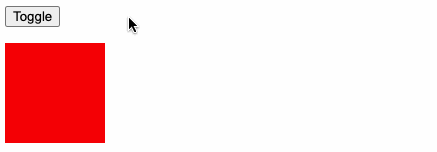
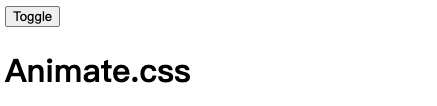
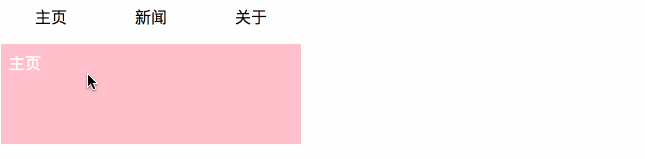
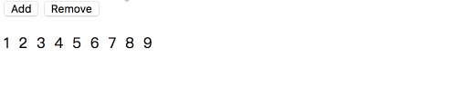
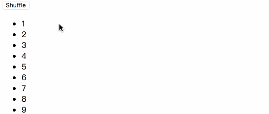
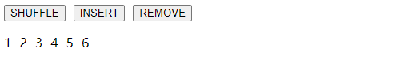
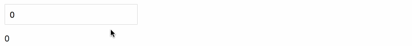

https://cn.vuejs.org/v2/guide/transitions.html

# 一、过渡

## 1、概述

Vue 在插入、更新或者移除 DOM 时，提供多种不同方式的应用过渡效果。
包括以下工具：

- 在 CSS 过渡和动画中自动应用 class
- 可以配合使用第三方 CSS 动画库，如 Animate.css
- 在过渡钩子函数中使用 JavaScript 直接操作 DOM
- 可以配合使用第三方 JavaScript 动画库，如 Velocity.js

vue.js 通过 `transition` 组件实现过渡效果

## 2、过渡类名

在进入/离开的过渡中，会有 6 个 class 切换。


> 提示：
>
> 1. 假设 `transition` 设有 `name`  属性，class 名将 `v-` 替换为 `name 属性值`。（eg：name 为fade，对应的类名为 -> fade-enter、fade-enter-active依次类推）。

## 3、单元素/组件过渡

Vue 提供了 `transition` 的封装组件，在下列情形中，可以给任何元素和组件添加进入/离开过渡

- 条件渲染 (使用 `v-if`)
- 条件展示 (使用 `v-show`)
- 动态组件
- 组件根节点

【实例 - 01】基础示例

```vue
<template>
    <div class="transition">
       <button type="button" @click='isVisible = !isVisible'>TOGGLE</button>
       <transition name="fade">
            <h1 v-show="isVisible">Hello, World!</h1>
       </transition>
    </div>
</template>

<script>
export default {
    name: "animate",
    data() {
        return {
            isVisible: false
        }
    }
}
</script>
<style scoped>

.fade-enter-active,
.fade-leave-active {
    transition: opacity 1s linear;
}
.fade-enter,
.fade-leave-to {
    opacity: 0;
}

</style>
```

效果演示：



【实例 - 02】通过CSS实现过渡

```html
<template>
    <div class="transition">
       <button type="button" @click='isVisible = !isVisible'>TOGGLE</button>
       <transition name="slide">
            <h1 v-show="isVisible">Hello, World!</h1>
       </transition>
    </div>
</template>

<script>
export default {
    name: "animate",
    data() {
        return {
            isVisible: true
        }
    }
}
</script>
<style scoped>

.slide-enter-active,
.slide-leave-active {
    transition: all 1s linear;
}
.slide-enter,
.slide-leave-to {
    opacity: 0;
    transform: translateX(100px)
}

</style>
```

效果演示：


【实例 - 03】通过动画实现过渡

动画用法同 CSS 过渡，区别是在动画中 `v-enter` 类名在节点插入 DOM 后不会立即删除，而是在 `animationend` 事件触发时删除。

```vue
<template>
    <div class="transition">
       <button type="button" @click='isVisible = !isVisible'>TOGGLE</button>
       <transition name="bounce">
            <h1 v-show="isVisible">Hello, World!</h1>
       </transition>
    </div>
</template>

<script>
export default {
    name: "animate",
    data() {
        return {
            isVisible: true
        }
    }
}
</script>
<style scoped>

@keyframes bounce {
  0%   { transform: scale(0)   }
  50%  { transform: scale(1.5) }
  100% { transform: scale(1)   }
}

.bounce-enter-active {
    animation: bounce .6s linear;
}
.bounce-leave-active {
    animation: bounce .6s linear reverse;
}
</style>
```

效果演示：


【实例 - 04】初始渲染过渡

可以通过 `appear` 特性设置节点在初始渲染的过渡，所谓初始渲染过渡就是页面在刷新时元素加载的时候出现过渡效果。

```vue
<transition appear>
  <!-- ... -->
</transition>
```

> 提示：[可以在属性中声明 JavaScript 钩子]([https://cn.vuejs.org/v2/guide/transitions.html#JavaScript-%E9%92%A9%E5%AD%90](https://cn.vuejs.org/v2/guide/transitions.html#JavaScript-钩子))，用于监听过渡的状态

## 4、三方库动画应用

我们可以通过以下特性来自定义过渡类名：

- enter-class
- enter-active-class
- enter-to-class (2.1.8+)
- leave-class
- leave-active-class
- leave-to-class (2.1.8+)

他们的优先级高于普通的类名，这对于 Vue 的过渡系统和其他第三方 CSS 动画库，如 [Animate.css](https://daneden.github.io/animate.css/) 结合使用十分有用。

**\> 安装**

```shell
$ npm i -S animate.css
```

**\> 导入**

```js
import 'animate.css'
```

**\> 使用**


```html
<template>
  <div class="anima">
    <button type="button" @click="isShow = !isShow">TOGGLE</button>
    <transition 
    enter-active-class="animated rubberBand" 
    leave-active-class="animated rotateOut">
      <h1 v-show="isShow">Hello, world！</h1>
    </transition>
  </div>
</template>

<script>
import 'animate.css'
export default {
  name: "anima",
  data() {
    return {
      isShow: true
    };
  }
};
</script>
```




## 5、多元素过渡

对于原生标签可以使用 `v-if`/`v-else` 。最常见的多标签过渡是一个列表和描述这个列表为空消息的元素：

```html
<transition>
  <table v-if="items.length > 0">
    <!-- ... -->
  </table>
  <p v-else>购物车为空</p>
</transition>
```

可以这样使用，但是有一点需要注意：

> 提示：
>
> 当有相同标签名的元素切换时，需要通过 key 特性设置唯一的值来标记以让 Vue 区分它们，否则 Vue 为了效率只会替换相同标签内部的内容。即使在技术上没有必要，给在 \<transition> 组件中的多个元素设置 key 是一个更好的实践。

示例：

```html
<transition>
  <button v-if="isEditing" key="save">
    Save
  </button>
  <button v-else key="edit">
    Edit
  </button>
</transition>
```

在一些场景中，也可以通过给同一个元素的 key 特性设置不同的状态来代替 v-if 和 v-else，上面的例子可以重写为：

```html
<transition>
  <button :key="isEditing">
    {{ isEditing ? 'Save' : 'Edit' }}
  </button>
</transition>
```

使用多个 `v-if` 的多个元素的过渡可以重写为绑定了动态属性的单个元素过渡。例如：

```html
<transition>
  <button v-if="docState === 'saved'"  key="saved">
    Edit
  </button>
  <button v-if="docState === 'edited'" key="edited">
    Save
  </button>
  <button v-if="docState === 'editing'" key="editing">
    Cancel
  </button>
</transition>
```

可以重写为：

```html
<transition>
  <button :key="docState">
    {{ buttonMessage }}
  </button>
</transition>
```

```js
// ...
computed: {
  buttonMessage: function () {
    switch (this.docState) {
      case 'saved'  : return 'Edit'
      case 'edited' : return 'Save'
      case 'editing': return 'Cancel'
    }
  }
}
```

**\-> 过渡模式**

`<transition>` 的默认行为 - 进入和离开同时发生。同时生效的进入和离开的过渡不能满足所有要求，所以 Vue 提供了 **过渡模式**

`in-out`：新元素先进行过渡，完成之后当前元素过渡离开。

`out-in`：当前元素先进行过渡，完成之后新元素过渡进入。

## 6、多个组件的过渡

多个组件的过渡简单很多 - 我们不需要使用 key 特性。相反，我们只需要使用动态组件：

```vue
<template>
  <div id="app">
    <!-- 导航栏 -->
    <div class="navigation-bar">{{title}}</div>
    <!-- 内容 -->
    <transition name="slide" mode="out-in">
      <keep-alive>
        <component :is="curPage"></component>
      </keep-alive>
    </transition>
    <!-- 标签栏 -->
    <div class="tabBar">
      <section v-for="(route, index) in routes" 
               :key="index" 
               class="tabBarItem"
               @click="handeTabBarItemClick({route, index})">
          {{route.title}}
      </section>
      <section class="cursor" :style="{left}"></section>
    </div>

  </div>
</template>

<script>

export default {
  name: "App",
  data() {
    return {
      routes: [
        {title: "主页", page: "Home"},
        {title: "新闻", page: "News"},
        {title: "关于", page: "About"},
        {title: "我的", page: "Mine"},
      ],
      left: 0,
      title: "主页",
      curPage: "Home"
    };
  },
  components: {
    Home : { template: `<div style="background:pink;" class="page">主页</div>` },
    News : { template: `<div style="background:green;" class="page">新闻</div>` },
    Mine : { template: `<div style="background:orange;" class="page">我的</div>` },
    About: { template: `<div style="background:blue;"  class="page">关于</div>` }
  },
  methods: {
    handeTabBarItemClick({route, index}) {
      this.curPage = route.page;
      this.title = route.title;
      this.left = (25 * index) + "%";
    }
  }
};
</script>

<style>
* {
  margin: 0; padding: 0;
}
html, body, #app {
  height: 100%;
  overflow: hidden;
}
/* 导航栏 */
.navigation-bar {
  height: 64px;
  background: #444;
  color: #fff;
  display: flex;
  justify-content: center;
  align-items: center;
}
/* 内容 */
.page {
  height: calc(100% - 64px - 49px);
  background: cornflowerblue;
  color: #fff;
  font-size: 22px;
}
/* 标签栏 */
.tabBar {
  position: relative;
  height: 49px;
  background: #444;
  color: #fff;
  display: flex;
  justify-content: space-around;
  align-items: center;
}
.tabBarItem {
  width: 25%;
  height: 100%;
  display: flex;
  justify-content: center;
  align-items: center;
  position: relative;
  z-index: 2;
}

.cursor {
  height: 100%;
  width: 25%;
  transition: all .25s linear;
  background: gray;
  position: absolute;
  top: 0;
  left: 0;
  z-index: 1;
}


/* 过渡 */
.slide-enter-active {
  transition: all .3s linear;
}
.slide-enter-to {
    transform: translate(0);
}
.slide-enter {
    transform: translate(100%);
}
</style>
```



## 7、列表过渡

目前为止，关于过渡我们已经讲到：

- 单个节点
- 同一时间渲染多个节点中的一个

那么怎么同时渲染整个列表，比如使用 v-for ？在这种场景中，使用 \<transition-group> 组件。在我们深入例子之前，先了解关于这个组件的几个特点：

- 不同于 \<transition>，它会以一个真实元素呈现：默认为一个 \<span>。你也可以通过 tag 特性更换为其他元素。
- 过渡模式不可用，因为我们不再相互切换特有的元素。
- 内部元素 总是需要 提供唯一的 key 属性值。

**【实例 - 01】基础示例**

现在让我们由一个简单的例子深入，进入和离开的过渡使用之前一样的 CSS 类名。

```vue
<template>
  <div id="app">
    <button v-on:click="add">Add</button>
    <button v-on:click="remove">Remove</button>
    <transition-group name="list" tag="ul" class="list">
      <li v-for="item in items" v-bind:key="item" class="list-item">{{ item }}</li>
    </transition-group>
  </div>
</template>

<script>
export default {
  name: "App",
  data() {
    return {
      items: [1, 2, 3, 4, 5, 6],
      nextNum: 7
    };
  },
  methods: {
    randomIndex: function() {
      return Math.floor(Math.random() * this.items.length);
    },
    add: function() {
      this.items.splice(this.randomIndex(), 0, this.nextNum++);
    },
    remove: function() {
      this.items.splice(this.randomIndex(), 1);
    }
  }
};
</script>

<style>
.list {
  list-style: none;
  padding: 0;
}
.list-item {
  display: inline-block;
  margin-right: 10px;
}
.list-enter-active,
.list-leave-active {
  transition: all 1s;
}
.list-enter, .list-leave-to {
  opacity: 0;
  transform: translateY(30px);
}
</style>
```




这个例子有个问题，当添加和移除元素的时候，周围的元素会瞬间移动到他们的新布局的位置，而不是平滑的过渡，我们下面会解决这个问题。

**【实例 - 02】列表的排序过渡**

\<transition-group> 组件还有一个特殊之处。不仅可以进入和离开动画，还可以改变定位。要使用这个新功能只需了解新增的 v-move 特性，它会在元素的改变定位的过程中应用。像之前的类名一样，可以通过 name 属性来自定义前缀，也可以通过 move-class 属性手动设置。

`v-move` 对于设置过渡的切换时机和过渡曲线非常有用，你会看到如下的例子，我们通过 [Lodash工具库](https://www.lodashjs.com/)  打乱集合顺序。

首先安装 loadash：

```shell
$ npm i -S lodash
```

然后引入 loadash：

```js
import _ from 'lodash'
```

接下来编码：

```vue
<template>
  <div id="app">
    <button @click="shuffle">Shuffle</button>
    <transition-group name="flip-list" tag="ul">
      <li v-for="item in items" :key="item">{{ item }}</li>
    </transition-group>
  </div>
</template>

<script>
import _ from "lodash";
export default {
  name: "TransAnim",
  data() {
    return {
      items: [1, 2, 3, 4, 5, 6, 7, 8, 9]
    };
  },
  methods: {
    shuffle() {
      this.items = _.shuffle(this.items);
    }
  }
};
</script>

<style>

.flip-list-move {
  transition: transform 1s;
}
</style>
```



这个看起来很神奇，内部的实现，Vue 使用了一个叫 [FLIP](https://aerotwist.com/blog/flip-your-animations/) 简单的动画队列，使用 transforms 将元素从之前的位置平滑过渡新的位置。

我们将之前实现的例子和这个技术结合，使我们列表的一切变动都会有动画过渡。

```vue
<template>
  <div id="app">
    <button @click="shuffle">Shuffle</button>
    <button @click="add">Add</button>
    <button @click="remove">Remove</button>
    <transition-group name="list-complete" tag="p">
      <span v-for="item in items" :key="item" class="list-complete-item">{{ item }}</span>
    </transition-group>
  </div>
</template>

<script>
import _ from "lodash";
export default {
  name: "App",
  data() {
    return {
      items: [1, 2, 3, 4, 5, 6, 7, 8, 9],
      nextNum: 10
    };
  },
  methods: {
    randomIndex: function() {
      return Math.floor(Math.random() * this.items.length);
    },
    add: function() {
      this.items.splice(this.randomIndex(), 0, this.nextNum++);
    },
    remove: function() {
      this.items.splice(this.randomIndex(), 1);
    },
    shuffle: function() {
      this.items = _.shuffle(this.items);
    }
  }
};
</script>

<style>
.list-complete-item {
  transition: all 1s;
  display: inline-block;
  margin-right: 10px;
}
.list-complete-enter, .list-complete-leave-to  {
  opacity: 0;
  transform: translateY(30px);
}
.list-complete-leave-active {
  position: absolute;
}
</style>
```




# 二、状态过渡

Vue 的过渡系统提供了非常多简单的方法设置进入、离开和列表的动效。那么对于数据元素本身的动效呢，比如：

- 数字和运算
- 颜色的显示
- SVG 节点的位置
- 元素的大小和其他的属性

所有的原始数字都被事先存储起来，可以直接转换到数字。做到这一步，我们就可以结合 Vue 的响应式和组件系统，使用第三方库来实现切换元素的过渡状态。

**\-> 状态动画**

[GSAP](https://www.tweenmax.com.cn/)

通过侦听器我们能监听到任何数值属性的数值更新。可能听起来很抽象，所以让我们先来看看使用 [GreenSock](https://greensock.com/) 一个例子：

首先，安装 “gsap” js动画库：

```shell
$ npm i -S gsap
```

引入 `TweenMax` ：

```js
import {TweenMax} from 'gsap'
```

html：

```html
<div id="app">
    <input v-model.number="number" type="number" step="20">
    <p>{{ animatedNumber }}</p>
</div>
```

js：

```js
new Vue({
  el: '#app',
  data: {
    number: 0,
    tweenedNumber: 0
  },
  watch: {
      number(newVal) {
          TweenLite.to(this.$data, 0.5, { tweenedNumber: newVal });
      }
  },
  computed: {
      animatedNumber() {
          return this.tweenedNumber.toFixed(0);
      }
  }
})
```

效果显示：



当你把数值更新时，就会触发动画。


