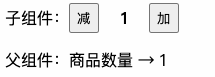
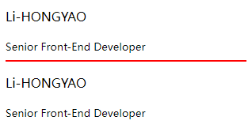
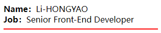
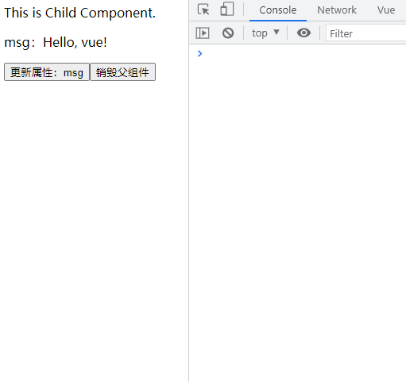

#  一、概述

组件是带有名称的可复用实例， 是 Vue 最强大的功能之一。组件可以扩展 HTML 元素，封装可重用的代码。在较高层面上，组件是自定义元素，Vue 的编译器为它添加特殊功能。

通常一个应用会以一棵嵌套的组件树的形式来组织：


例如，你可能会有页头、侧边栏、内容区等组件，每个组件又包含了其它的像导航链接、博文之类的组件。

为了能在模板中使用，这些组件必须先注册以便 Vue 能够识别。这里有两种组件的注册类型：**全局注册** 和 **局部注册**。

# 二、 组件注册

## 1. 组件名

在字符串模板或单文件组件中定义组件时，定义组件名的方式有两种：

**@使用 kebab-case**

```javascript
app.component('my-component-name', {
  /* ... */
})
```

当使用 kebab-case (短横线分隔命名) 定义一个组件时，你在引用这个自定义元素时也必须使用 kebab-case

**@使用 PascalCase**

```javascript
app.component('MyComponentName', {
  /* ... */
})
```

当使用 PascalCase (首字母大写命名) 定义一个组件时，你在引用这个自定义元素时两种命名法都可以使用。尽管如此，还是建议使用 kebab-case。

## 2. 全局注册

```js
// Create a Vue application
const app = Vue.createApp({})

// Define a new global component called button-counter
app.component('button-counter', {
  data() {
    return {
      count: 0
    }
  },
  template: `
    <button @click="count++">
      You clicked me {{ count }} times.
    </button>`
})
```

> 注意：`data` 必须是函数，且必须返回一个对象。

使用组件：

```vue
<div id="app">
  <button-counter />
  <button-counter />
  <button-counter />
</div>
```

## 3. 局部注册

```javascript
const ComponentA = {
  /* ... */
}

const ComponentB = {
  components: {
    'component-a': ComponentA
  }
  // ...
}
```

## 4. 模版字符串异常

在 Vue3 中，如果你使用 `template` 模板字符串定义组件，会抛出如下异常：

```
[Vue warn]: Component provided template option but runtime compilation is not supported in this build of Vue. Configure your bundler to alias "vue" to "vue/dist/vue.esm-bundler.js". 
```

**异常解读**：组件提供了模板选项，但在此Vue构建中不支持运行时编译。 将你的 bundler 的别名 `vue` 配置为 `vue/dist/vue.esm-bundle .js`。  

**解决方案：**由于本教程主要基于 `Vite` 构建，所以这里主要讲解在 vite 中的处理方案。根据异常解读，不难发现，我们只需要配置 `vue` 别名即可。在 `vite.config.js` 文件中添加如下代码：

```javascript
import { defineConfig } from 'vite';
import vue from '@vitejs/plugin-vue';

// https://vitejs.dev/config/
export default defineConfig({
  plugins: [vue()],
  // +++
  resolve: {
    alias: {
      vue: 'vue/dist/vue.esm-bundler.js', 
    },
  },
  // +++
});
```

## 5. 单文件组件（推荐）

### 5.1. 介绍

Vue 单文件组件（又名 `*.vue` 文件，缩写为 **SFC**）是一种特殊的文件格式，它允许将 Vue 组件的 **模板**、**逻辑** 与 **样式** 封装在单个文件中。下面是 SFC 示例：

```vue
<!-- 脚本 -->
<script setup lang="ts">
import { ref } from 'vue';

const greeting = ref('Hello World!');
</script>

<!-- 模板 -->
<template>
  <p class="greeting">{{ greeting }}</p>
</template>

<!-- 样式 -->
<style scoped>
.greeting {
  color: red;
  font-weight: bold;
}
</style>
```

> 提示：上述示例中，使用 `Composition API` 风格演示 ，因为 [使用 Composition API 时更符合人体工程学的语法 >>](https://v3.cn.vuejs.org/api/sfc-script-setup) 

单文件组件由以下三种类型的顶层代码块组成：

- `<script setup>`：JavaScript 模块（脚本，处理业务逻辑）
  - 每个 `*.vue` 文件最多可同时包含一个 `<script setup>` 块
  - 该脚本会被预处理并作为组件的 `setup()` 函数使用，也就是说它会在**每个组件实例**中执行。`<script setup>` 的顶层绑定会自动暴露给模板。
- `<template>`： 组件模板（视图）
  - 每个 `*.vue` 文件最多可同时包含一个顶层 `<template>` 块。
  - 其中的内容会被提取出来并传递给 `@vue/compiler-dom`，预编译为 JavaScript 的渲染函数，并附属到导出的组件上作为其 `render` 选项。
- `<style>`：样式
  - 一个 `*.vue` 文件可以包含多个 `<style>` 标签。
  - `<style>`  标签可以通过 `scoped` 或 `module` 属性将样式封装在当前组件内。

查阅 [SFC语法规范 >>](https://v3.cn.vuejs.org/api/sfc-spec.html) 查看更多细节。

> 提示：**推荐使用单文件组件~**

### 5.2. 使用流程

单文件组件使用流程：`创建单文件组件` → `导入组件` → `注册组件` → `使用组件`

> 提示：如果你使用 `<script setup>`，则无需注册，导入之后直接使用即可。

### 5.3. 关注点分离？

一些来自传统 Web 开发背景的用户可能会担心 SFC 在同一个地方混合了不同的关注点——HTML/CSS/JS 应该分开！

要回答这个问题，我们必须同意关注点分离不等于文件类型分离。工程原理的最终目标是提高代码库的可维护性。关注点分离，当墨守成规地应用为文件类型的分离时，并不能帮助我们在日益复杂的前端应用程序的上下文中实现该目标。

在现代 UI 开发中，我们发现与其将代码库划分为三个相互交织的巨大层，不如将它们划分为松散耦合的组件并进行组合更有意义。在组件内部，它的模板、逻辑和样式是**内在耦合**的，将它们搭配起来实际上可以使组件更具**凝聚力**和**可维护性**。

# 三、组件交互

## 1. `defineProps` & `defineEmits`

组件交互尽可能将父子组件解耦是很重要的，这保证了每个组件的代码可以在相对隔离的环境中书写和理解，从而提高了其可维护性和复用性。

在 Vue 中，父子组件的交互可以总结为：

- 父组件通过属性（[`props →`](https://v3.cn.vuejs.org/guide/component-props.html)） 向子组件传递数据；
- 子组件通过事件（[`emits →`](https://v3.cn.vuejs.org/guide/component-custom-events.html)） 向父组件传递数据；


在 `<script setup>` 中必须使用 `defineProps` 和 `defineEmits` API 来声明 `props` 和 `emits` ，它们具备完整的类型推断并且在 `<script setup>` 中是直接可用的。

- `defineProps` 和 `defineEmits` 都是只在 `<script setup>` 中才能使用的**编译器宏**。他们不需要导入且会随着 `<script setup>` 处理过程一同被编译掉。
- `defineProps` 接收与 [`props` 选项](https://v3.cn.vuejs.org/api/options-data.html#props) 相同的值，`defineEmits` 也接收 [`emits` 选项](https://v3.cn.vuejs.org/api/options-data.html#emits) 相同的值。

**@`defineProps`  **

接下来我们来看一组示例：

> **子组件**

```vue
<!-- child.vue -->
<script setup lang="ts">
// -- 声明属性类型（TS）
interface IProps {
  name: string;
  age: number;
  job?: string;
}
// -- 定义属性
const props = defineProps<IProps>();
console.log(props);
</script>

<template>
  <div>{{ name }} - {{ age }} - {{ job }}</div>
</template>
```

> **父组件**

```vue
<!-- parent.vue -->
<script setup lang="ts">
// 导入子组件（无需注册）
import Child from './Child.vue';
</script>

<template>
  <!-- 使用子组件 -->
  <Child name="Li-HONGYAO" :age="28" job="前端工程师" />
</template>
```

页面输出：

```
Li-HONGYAO - 28 - 前端工程师
```

**@属性默认值：`withDefaults`**

使用 `defineProps` 定义属性时无法设置默认值，为了解决这个问题，提供了 `withDefaults` 编译器宏：

```typescript
const props = withDefaults(defineProps<IProps>(), {
  name: 'Muzili',
  age: 18,
  job: '未知',
});
```

**@`defineEmits`** 

1）首先，我们在 **子组件** 中定义事件：

```
const emit = defineEmits<{
    (e: 'change', id: number):void;
    (e: 'update', value: string):void;
}>();
```

上述示例中，`e` 对应事件名称，该名称可自行定义，`id` 和 `value` 表示触发时间传递的参数。

2）在 **子组件** 模板中触发事件：

```vue
<button type="button" @click="emit('change', 1)">触发[change]事件</button>
<button type="button" @click="emit('update', 'Hello')">触发[update]事件</button>
```

3）在 **父组件** 中接收事件

```vue
<script setup lang="ts">
// -- 引入子组件
import Child from './Child.vue';

// -- 监听子组件[change]事件
const onChange = (id: number) => {
  console.log(id);
};
// -- 监听子组件[update]事件
const onUpdate = (value: string) => {
  console.log(value);
};
</script>

<template>
  <Child name="Li-HONGYAO" :age="28" @change="onChange" @update="onUpdate" />
</template>
```

## 2. `defineExpose`

暴露属性或方法给父组件使用，通过 `defineExpose` 实现：

> **子组件**

```vue
<script setup lang="ts">
// -- 变量
const name = 'Li-HONGYAO';
// -- 方法
const sayHello = (name: string) => {
  console.log(`Hello, ${name}!`);
};

// -- 定义子子组件暴露出去的属性的类型声明
export interface ExposeProps {
  name: string;
  sayHello: (name: string) => void;
}

// -- 将变量 name 和方法 sayHello 暴露给父组件
// -- 父组件可通过 ref 访问
defineExpose({
  name,
  sayHello,
});
</script>

<template></template>
```

> **父组件**

```vue
<script setup lang="ts">
import { onMounted, ref } from 'vue';
import Child, { ExposeProps } from './Child.vue';

const childRef = ref<ExposeProps>();

onMounted(() => {
  // 访问子组件属性：name
  console.log(childRef.value?.name); // Li-HONGYAO
  // 调用子组件方法：sayHello
  childRef.value?.sayHello('Li-HONGYAO'); // Hello, Li-HONGYAO!
});
</script>

<template>
  <Child ref="childRef" />
</template>
```

## 3. `v-mode`

默认情况下，组件上的 `v-model` 使用 `modelValue` 作为 prop 和 `update:modelValue` 作为事件。

当需要使用多个 `v-model` 或者说你想要实现子组件某个特定属性的 `v-model` 时，比如 `count` 属性，我们可以这样做，这里以简单封装一个 `Counter` 组件为例：

> **子组件：`src/components/Counter.vue`**

```vue
<script setup lang="ts">
interface IProps {
  min?: number;
  max?: number;
  count?: number;
}
const props = withDefaults(defineProps<IProps>(), {
  min: 1,
  max: 5,
  count: 1,
});

const emit = defineEmits<{
  (e: 'update:count', count: number): void;
}>();

// events
const plus = () => {
  const { count, max } = props;
  emit('update:count', count + 1 > max ? max : count + 1);
};
const minus = () => {
  const { count, min } = props;
  emit('update:count', count - 1 < min ? min : count - 1);
};
</script>

<template>

  <div class="wrap">
    <span>子组件：</span>
    <button type="button" @click="minus">减</button>
    <div class="v">{{ count }}</div>
    <button type="button" @click="plus">加</button>
  </div>
</template>

<style scoped>
.wrap {
  display: flex;
  justify-content: flex-start;
  align-items: center;
}
button {
  width: 30px;
  height: 30px;
  display: flex;
  justify-content: space-between;
  align-items: center;
  cursor: pointer;
}
.v {
  text-align: center;
  width: 50px;
  font-weight: bold;
}
</style>

```

> **父组件：`src/App.vue`**

```vue
<script setup lang="ts">
import { ref } from 'vue';
import Counter from './components/Counter.vue';
const count = ref(1);
</script>

<template>
  <Counter v-model:count="count" />
  <p>父组件：商品数量 → {{ count }}</p>
</template>
```

> **演示效果**：




## 4. 单向数据流

数据总是从父组件传到子组件，子组件没有权利修改父组件传过来的数据，只能请求父组件对原始数据进行修改。这样会防止从子组件 **意外改变** 父组件的状态，从而导致你的应用的数据流向难以理解。

注意：在子组件直接用 `v-model` 绑定父组件传过来的 props 这样是不规范的写法，开发环境会报警告。

如果实在要改变父组件的 props 值可以再 data 里面定义一个变量，并用 prop 的值初始化它，之后用 `$emit` 通知父组件去修改。

## 5. Provide & Inject

通常，当我们需要从父组件向子组件传递数据时，我们使用 `props`，想象一下这样的结构：有一些深度嵌套的组件，而深层的子组件需要访问顶层组件的属性。在这种情况下，如果仍然将 prop 沿着组件链逐级传递下去，可能会很麻烦。

对于这种情况，我们可以使用一对 `provide` 和 `inject`。无论组件层次结构有多深，父组件都可以作为其所有子组件的依赖提供者。这个特性有两个部分：父组件有一个 `provide` 选项来提供数据，子组件有一个 `inject` 选项来开始使用这些数据。


接下来，我们看一组示例，在顶层组件中通过 `Provide` 传递一组数据，在子组件中通过 `Inject` 接收：

> 顶层组件：

```vue
<script setup lang="ts">
import { provide } from 'vue';
provide("global", {
  env: "development",
  appID: 'xxx'
});
</script>
```

其中，`global` 表示 `key`，底层组件可通过 `inject(key)` 访问， 后面跟的对象表示传递的值。

> 底层组件：

```vue
<script setup lang="ts">
import { inject } from 'vue';

const global = inject('global');
console.log(global); // → {env: 'development', appID: 'xxx'}

</script>
```

## 6. $attrs

`$attr` 主要用于获取没有在组件内部通过 `props` 或者 `emits` 明确定义的属性。我们来看一组示例：

> 子组件

```vue
<script setup lang="ts">
defineProps<{ name: string }>();
</script>
```

在子组件中，定义了 `name` 属性。

> 父组件

```vue
<child-comp name="Li-HONGYAO" job="Senior Front-End Developer" />
```

父组件在调用子组件时，除了传递子组件需要的 `name` 属性之外，还传递了 `job` 属性，该属性并没有在 `props` 中定义，接下来我们通过 `useAttrs` 来访问它。

```vue
<script setup lang="ts">
// +++
import { useAttrs } from 'vue';
// +++

defineProps<{ name: string }>();
// +++
// -- 获取非props属性
const attrs = useAttrs();
console.log(attrs); // → Proxy {job: 'Senior Front-End Developer', __vInternal: 1}
// +++

</script>
```

可以看到，访问 `attrs` 变量，输出了 `job` 信息。

**@Attribute  继承**

非props属性具有 **隐式贯穿** 行为，  如果你在根组件中（或者任意父组件中）使用非props属性，那么它将会传递给其所有的子组件。如果你想要的禁用 attribute 继承，可以在组件的选项中设置 `inheritAttrs: false`。

```vue
<!-- <script setup> & <script> -->
<script>
export default {
  inheritAttrs: false,
};
</script>

<script setup lang="ts"></script>
```

> 注意：`<script setup>` 可以和普通的 `<script>` 一起使用。普通的 `<script>` 在有这些需要的情况下或许会被使用到：
>
> - 无法在 `<script setup>` 声明的选项，例如 `inheritAttrs` 或通过插件启用的自定义的选项。
> - 声明命名导出。
> - 运行副作用或者创建只需要执行一次的对象。

## 7. \$parent & \$children 

在vue2.x 以及 vue3.x 的选项式API中，允许使用 `this.$parent` 和 `this.$children` 获取当前组件的**父组件**和当前组件的**子组件**。但是在 vue3.x `setup` 中，想要调用父组件的方法，我们需要用 provide & inject 来实现。

# 四、插槽

Vue 实现了一套内容分发的 API，这套 API 的设计灵感源自 [Web Components 规范草案](https://github.com/w3c/webcomponents/blob/gh-pages/proposals/Slots-Proposal.md)，将 `<slot>` 元素作为承载分发内容的出口。

## 1. 插槽内容

```vue
<script setup lang="ts">
defineProps<{ url: string }>();
</script>

<template>
  <a :href="url">
    <!-- 接收插槽内容 -->
    <slot />
  </a>
</template>
```

```html
<navigation-link url="/login">前往登录</navigation-link>
<navigation-link url="/register">前往注册</navigation-link>
```

渲染效果：

```html
<a href="/login">前往登录</a>
<a href="/register">前往注册</a>
```

> 提示：插槽样式在子父组件中都可以设置，所以在命名class时一定要注意。

## 2. 渲染作用域

当你想在一个插槽中使用数据时，例如：

```html
<navigation-link url="/profile">
  Logged in as {{ user.name }}
</navigation-link>
```

该插槽可以访问与模板其余部分相同的实例属性 (即相同的“作用域”)，所以这里**不能**访问 `<navigation-link >`  的作用域。例如  `url`  是访问不到的：

```vue
<navigation-link url="/profile">
    <!-- → Property "url" was accessed during render but is not defined on instance.  -->
    <span>Clicking here will send you to: {{ url }}</span>
</navigation-link>
```

简单理解就是，现有组件 `A` 和 `B`，在 `A` 组件中通过插槽的形式将内容分发给组件 `B`，尽管插槽内容最终是在 `B` 组件中渲染的，但是在插槽内容也只能访问组件 `A` 中的属性，不能访问组件 `B` 中的属性。

请记住这条规则：

> 父级模板里的所有内容都是在父级作用域中编译的；子模板里的所有内容都是在子作用域中编译的。

## 3. 后备内容

为插槽指定默认值，它只会在没有提供内容的时候被渲染

```html
<a :href="url">
    <!-- 接收插槽内容 -->
    <slot>默认内容</slot>
</a>
```

```html
<navigation-link url="/orders"></navigation-link>
```

渲染效果：

```html
<a href="/orders">默认内容</a>
```

## 4. 具名插槽

有时我们需要多个插槽，但是插槽内容会重复，如下所示：

```vue
<template>
  <!-- 期望在这里展示姓名 -->
  <slot></slot>
  <hr color="red" />
  <!-- 期望在这里展示职位 -->
  <slot></slot>
</template>
```

```vue
<template>
  <Layout>
    <p>Li-HONGYAO</p>
    <small>Senior Front-End Developer</small>
  </Layout>
</template>
```

运行效果：



可以看到，上述示例展示的效果并没有根据期望来渲染，为了解决这个问题，我们可以给插槽命名，进行相应绑定，我们修改一下示例：

```vue
<template>
  <div>
    <b>Name：</b>
    <!-- 具名插槽：name -->
    <slot name="name"></slot>
  </div>
  <div>
    <b>Gender：</b>
    <!-- 默认插槽：default -->
    <slot></slot>
  </div>
  <div>
    <b>job：</b>
    <!-- 具名插槽：job -->
    <slot name="job"></slot>
  </div>
  <hr color="red" />
</template>
```

```vue
<template>
  <Layout>
    <span>male</span>
    <template v-slot:name>Li-HONGYAO</template>
    <template v-slot:job>Senior Front-End Developer</template>
  </Layout>
</template>
```

运行效果：


> 提示：`v-slot` 指令可以使用 `#` 替代，比如：`v-slot:job` 可以缩写为 `#job`

> 注意：**`v-slot` 只能添加在 `<template>` 上**

## 5. 作用域插槽

作用域插槽是一种特殊类型的插槽，有时让插槽内容能够访问子组件中才有的数据是很有用的。

简单理解就是：父组件决定布局，数据由子组件提供。先来看示例：

```vue
<script setup lang="ts">
import { reactive } from 'vue';

const state = reactive({
  name: 'Li-HONGYAO',
  job: 'Senior Front-End Developer',
});
</script>

<template>
  <!-- 通过属性将state数据传递出去 -->
  <slot :scope="state" />
</template>
```

```vue
<template>
  <Layout>
    <template #default="{ scope: { name, job } }">
      <!-- name -->
      <div>
        <b>Name：</b>
        <span>{{ name }}</span>
      </div>
      <!-- job -->
      <div>
        <b>Job：</b>
        <span>{{ job }}</span>
      </div>
      <hr color="red" />
    </template>
  </Layout>
</template>
```

运行效果：



> 注意：作用域插槽不能和具名插槽混合使用。

# 五、动态组件

通过使用保 `<component`> 元素，动态地绑定到它的 `is` 特性，可以实现组件的动态切换，这对于多标签页是非常有用的。

```vue
<script setup lang="ts">
import { reactive, shallowRef, defineComponent } from 'vue';

// -- 定义组件
const Home = defineComponent({
  template: `<div class="page">This is Home page.</div>`
})
const News = defineComponent({
  template: `<div class="page">This is News page.</div>`
})
const Mine = defineComponent({
  template: `<div class="page">This is Mine page.</div>`
})

// -- 定义状态
const state = reactive({
  currentTab: shallowRef(Home),
  tabs: ['Home', 'News', 'Mine'],
});

// -- 时间处理
const switchTab = (key: string) => {
  switch(key) {
    case 'Home': state.currentTab = Home; break;
    case 'News': state.currentTab = News; break;
    case 'Mine': state.currentTab = Mine; break;
  }
}
</script>

<template>
  <div class="wrap">
    <button
      type="button"
      v-for="(item, index) in state.tabs"
      :key="index"
      @click="switchTab(item)"
    >
      {{ item }}
    </button>
    <component :is="state.currentTab"></component>
  </div>
</template>


<style scoped>
button {
  margin-bottom: 16px;
}
</style>
```

展示效果：


**keep-alive**

当在这些组件之间切换的时候，你有时会想保持这些组件的状态，以避免反复渲染导致的性能问题。为此可以用一个 `<keep-alive>` 元素将其动态组件包裹起来。

```vue
<keep-alive>
  <component :is="state.currentTab"></component>
</keep-alive>
```

# 六、生命周期钩子函数执行顺序

接下来我们讨论父子组件生命周期钩子函数的执行顺序，当然，这里不以 `<script setup>` 来讲，主要以 `Options API` 来讲。

为了便于大家可以更加直观的去观察生命周期的执行顺序，我们先通过 `Options API` 构建如下组件：

> 子组件：`src/components/Child.vue`

```vue
<script lang="ts">
import { defineComponent } from 'vue';
export default defineComponent({
  props: {
    msg: String,
  },
  beforeCreate() {
    console.log('子：__beforeCreate__');
  },
  created() {
    console.log('子：__created__');
  },
  beforeMount() {
    console.log('子：__beforeMount__');
  },
  mounted() {
    console.log('子：__mounted__');
  },
  beforeUpdate() {
    console.log('子：__beforeUpdate__');
  },
  updated() {
    console.log('子：__updated__');
  },
  beforeUnmount() {
    console.log('子：__beforeUnmount__');
  },
  unmounted() {
    console.log('子：__unmounted__');
  },
});
</script>

<template>
  <div>This is Child Component.</div>
  <p>msg：{{ msg }}</p>
</template>
```

> 父组件：`src/components/Parent.vue`

```vue
<script lang="ts">
import { defineComponent } from 'vue';
import Child from './Child.vue';
export default defineComponent({
  components: {
    Child,
  },
  data() {
    return {
      msg: 'Hello, vue!',
    };
  },
  beforeCreate() {
    console.log('父：__beforeCreate__');
  },
  created() {
    console.log('父：__created__');
  },
  beforeMount() {
    console.log('父：__beforeMount__');
  },
  mounted() {
    console.log('父：__mounted__');
  },
  beforeUpdate() {
    console.log('父：__beforeUpdate__');
  },
  updated() {
    console.log('父：__updated__');
  },
  beforeUnmount() {
    console.log('父：__beforeUnmount__');
  },
  unmounted() {
    console.log('父：__unmounted__');
  },
});
</script>

<template>
  <Child :msg="msg" />
  <button type="button" @click="msg = 'Hello, world!'">更新属性：msg</button>
</template>
```

> 根组件：`src/App.vue`

```vue
<script setup lang="ts">
import { ref } from 'vue';
const removeParent = ref(false);
</script>

<template>
  <Parent v-if="!removeParent" />
  <button type="button" @click="removeParent = true">销毁父组件</button>
</template>
```

注意：由于根组件只用于销毁父组件（`Parent`），所以这个组件我使用的是 组合式API（`<script setup>`）.

接下来，我们启动项目，观察父子组件在渲染、更新和销毁时，钩子函数的执行顺序，请看示例动图：



通过上述示例，可以得出如下结论：

- **加载渲染过程**：`父:beforeCreate ` → `父:created ` → `父:beforeMount` → `子:beforeCreate` → `子:created` → `子:beforeMount` → `子:mounted` → `父:mounted`
- **子组件更新过程**：`父:beforeUpdate` → `子:beforeUpdate` → `子:updated ` → `父:updated`
- **父组件更新过程**：`父:beforeUpdate` → `父:updated`
- **销毁过程**：`父:beforeUnmount` → `子:beforeUnmount` → `子:unmounted` →  `父:unmounted` 

