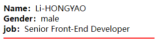

#  一、概述

组件允许我们将 UI 划分为独立的、可重用的部分，并且可以对每个部分进行单独的思考。在实际应用中，组件常常被组织成层层嵌套的树状结构：


这和我们嵌套 HTML 元素的方式类似，Vue 实现了自己的组件模型，使我们可以在每个组件内封装自定义内容与逻辑。Vue 同样也能很好地配合原生 Web Component。如果你想知道 Vue 组件与原生 Web Components 之间的关系，可以[阅读此章节](https://cn.vuejs.org/guide/extras/web-components.html)。

# 二、 定义组件

当使用构建步骤时，我们一般会将 Vue 组件定义在一个单独的 `.vue` 文件中，这被叫做 [单文件组件](https://cn.vuejs.org/guide/scaling-up/sfc.html) (简称 SFC)：

```vue
<!-- 脚本 -->
<script setup lang="ts">
// -- imports
import { ref } from 'vue';

// -- refs
const count = ref(0);
</script>

<!-- 模板 -->
<template>
  <button @click="count++">You clicked me {{ count }} times.</button>
</template>

<!-- 样式 -->
<style lang="less" scoped></style>
```

单文件组件由以下三种类型的顶层代码块组成：

- `<script setup>`：JavaScript 模块（脚本，处理业务逻辑）
  - 每个 `*.vue` 文件最多可同时包含一个 `<script setup>` 块
  - 该脚本会被预处理并作为组件的 `setup()` 函数使用，也就是说它会在**每个组件实例**中执行。`<script setup>` 的顶层绑定会自动暴露给模板。
- `<template>`： 组件模板（视图）
  - 每个 `*.vue` 文件最多可同时包含一个顶层 `<template>` 块。
  - 其中的内容会被提取出来并传递给 `@vue/compiler-dom`，预编译为 JavaScript 的渲染函数，并附属到导出的组件上作为其 `render` 选项。
- `<style>`：样式
  - 一个 `*.vue` 文件可以包含多个 `<style>` 标签。
  - `<style>`  标签可以通过 `scoped` 或 `module` 属性将样式封装在当前组件内。

查阅 [SFC语法规范 >>](https://v3.cn.vuejs.org/api/sfc-spec.html) 查看更多细节。

# 三、使用组件

要使用一个子组件，我们需要在父组件中导入它。假设我们把计数器组件放在了一个叫做 `ButtonCounter.vue` 的文件中，这个组件将会以默认导出的形式被暴露给外部。

```vue
<script setup>
import ButtonCounter from './ButtonCounter.vue'
</script>

<template>
  <h1>Here is a child component!</h1>
  <ButtonCounter />
</template>
```

通过 `<script setup>`，导入的组件都在模板中直接可用。

组件可以被重用任意多次：

```vue
<h1>Here is a child component!</h1>
<ButtonCounter />
<ButtonCounter />
<ButtonCounter />
```

[在演练场中尝试一下](https://play.vuejs.org/#eNqVj91KAzEQhV/lmJsqlY3eSlr8ufEVhNys6ZQGNz8kE0GWfXez2SJUsdCLuZiZM9+ZM4qnGLvPQuJBqGySjYxMXOJWe+tiSIznwhz8SyieKWGfgsOqkyfTGbDSXsmFUG9rw+Ti0DPNHavD/faVEqGv5Xr/BXOwww4mVBNPnvOVklXTtKeO8qKhkj++4lb8+fL/mCMS7TEdAy6BtDfBZ65fVgA2s+L67uZMUEC9N0s8msGaj40W7Xa91qKtgbdQ0Ha0gyOM45E+TWDrKHeNIhfMr0DTN4U0me8=)

你会注意到，每当点击这些按钮时，每一个组件都维护着自己的状态，是不同的 `count`。这是因为每当你使用一个组件，就创建了一个新的 **实例**。

在单文件组件中，推荐为子组件使用 `PascalCase` 的标签名，以此来和原生的 HTML 元素作区分。虽然原生 HTML 标签名是不区分大小写的，但 Vue 单文件组件是可以在编译中区分大小写的。我们也可以使用 `/>` 来关闭一个标签。

如果你是直接在 DOM 中书写模板 (例如原生 `<template>` 元素的内容)，模板的编译需要遵从浏览器中 HTML 的解析行为。在这种情况下，你应该需要使用 `kebab-case` 形式并显式地关闭这些组件的标签。

```vue
<!-- 如果是在 DOM 中书写该模板 -->
<button-counter></button-counter>
<button-counter></button-counter>
<button-counter></button-counter>
```

# 四、组件交互

## 1. `defineProps` & `defineEmits`

组件交互尽可能将父子组件解耦是很重要的，这保证了每个组件的代码可以在相对隔离的环境中书写和理解，从而提高了其可维护性和复用性。

在 Vue 中，父子组件的交互可以总结为：

- 父组件通过属性（[`props →`](https://cn.vuejs.org/guide/components/props.html)） 向子组件传递数据；
- 子组件通过事件（[`emits →`](https://cn.vuejs.org/guide/components/events.html)） 向父组件传递数据；


在 `<script setup>` 中使用 `defineProps` 和 `defineEmits` 编译宏命令（*并不需要显式地导入*）来声明 `props` 和 `emits` ，它们具备完整的类型推断并且在 `<script setup>` 中是直接可用的。

`defineProps` 接收与 [`props` 选项](https://v3.cn.vuejs.org/api/options-data.html#props) 相同的值，`defineEmits` 也接收 [`emits` 选项](https://v3.cn.vuejs.org/api/options-data.html#emits) 相同的值。

**@`defineProps`**

接下来我们来看一组示例：

> **子组件**

```vue
<script setup lang="ts">
// -- props
interface IProps {
  name: string;
  age: number;
  job?: string;
}
const props = defineProps<IProps>();
console.log(props);
</script>

<template>
  <div>{{ name }} - {{ age }} - {{ job }}</div>
</template>
```

> **父组件**

```vue
<script setup lang="ts">
// -- 导入子组件（无需注册）
import Child from './Child.vue';
</script>

<template>
  <!-- 使用子组件 -->
  <Child name="张三" :age="30" job="前端工程师" />
</template>
```

页面输出：

```
张三 - 30 - 前端工程师
```

**@属性默认值：`withDefaults`**

使用 `defineProps` 定义属性时无法设置默认值，为了解决这个问题，提供了 `withDefaults` 编译器宏：

```typescript
const props = withDefaults(defineProps<IProps>(), {
  name: '————',
  age: 0,
  job: '未知',
});
```

**@`defineEmits`** 

1）首先，我们在 **子组件** 中定义事件：

```ts
const emits = defineEmits<{
  (e: 'change', id: number): void;
  (e: 'update', value: string): void;
}>();
```

上述示例中，`e` 对应事件名称，该名称可自行定义，`id` 和 `value` 表示触发时间传递的参数。

2）在 **子组件** 模板中触发事件：

```vue
<button type="button" @click="emits('change', 1)">触发[change]事件</button>
<button type="button" @click="emits('update', 'Hello')">触发[update]事件</button>
```

3）在 **父组件** 中接收事件

```vue
<script setup lang="ts">
// -- 引入子组件
import Child from './Child.vue';

// -- 监听子组件[change]事件
const onChange = (id: number) => {
  console.log(id);
};
// -- 监听子组件[update]事件
const onUpdate = (value: string) => {
  console.log(value);
};
</script>

<template>
  <Child name="张三" :age="30" @change="onChange" @update="onUpdate" />
</template>
```

## 2. `defineExpose`

暴露属性或方法给父组件使用，通过 `defineExpose` 实现：

> **子组件**

```vue
<script setup lang="ts">
// -- 变量
const name = '张三';
// -- 方法
const sayHello = (name: string) => {
  console.log(`Hello, ${name}!`);
};


// -- 将变量 name 和方法 sayHello 暴露给父组件
// -- 父组件可通过 ref 访问
defineExpose({
  name,
  sayHello,
});
</script>

<template></template>
```

> **父组件**

```vue
<script setup lang="ts">
// -- imports
import { ref, onMounted } from 'vue';
import Child from './Child.vue';

// -- refs
const childRef = ref<InstanceType<typeof Expose> | null>(null);

// -- life circles
onMounted(() => {
  // 访问子组件属性：name
  console.log(childRef.value?.name); // Li-HONGYAO
  // 调用子组件方法：sayHello
  childRef.value?.sayHello('Li-HONGYAO'); // Hello, Li-HONGYAO!
});
</script>

<template>
  <Child ref="childRef" />
</template>
```

## 3. `v-model`

`v-model` 可以在组件上使用以实现双向绑定。

首先让我们回忆一下 `v-model` 在原生元素上的用法：

```vue
<input v-model="searchText" />
```

在代码背后，模板编译器会对 `v-model` 进行更冗长的等价展开。因此上面的代码其实等价于下面这段：

```vue
<input
  :value="searchText"
  @input="searchText = $event.target.value"
/>
```

而当使用在一个组件上时，`v-model` 会被展开为如下的形式：

```vue
<CustomInput
  :modelValue="searchText"
  @update:modelValue="newValue => searchText = newValue"
/>
```

要让这个例子实际工作起来，`<CustomInput>` 组件内部需要做两件事：

1. 将内部原生 `<input>` 元素的 `value` 属性 绑定到 `modelValue` 属性；
2. 当原生的 `input` 事件触发时，触发一个携带了新值的 `update:modelValue` 自定义事件。

这里是相应的代码：

```vue
<!-- CustomInput.vue -->
<script setup lang="ts">
// -- props
defineProps<{
  modelValue: string;
}>();
// -- emits
const emits = defineEmits<{
  (e: 'update:modelValue', value: string): void;
}>();

// -- events
const onInput = (e: Event) => {
  emits('update:modelValue', (e.currentTarget as HTMLInputElement).value);
};
</script>

<template>
  <input :value="modelValue" @input="onInput" />
</template>
```

现在 `v-model` 可以在这个组件上正常工作了：

```vue
<CustomInput v-model="searchText" />
```

[在演练场中尝试一下](https://play.vuejs.org/#eNp9j81qwzAQhF9lEQE7kNp344SW0kNvPfVS9WDidSrQH9LKF+N37yoOxoSQm7QzO9/sJN68r8aEohFtPAflCSJS8idplfEuEEwQcIAZhuAMFGwtVuk9RXLm0/pEN7mqN7Ocy2YAac/ORgKDMXYXhGOOLIs/1NoVe2nbekEzlD+ExuuOkH8A7ZYxvhjXoz5KcUuSAuoTTNOaPM85bU0QB3HX58GdPQ7K4ldwPpY/xZXw3Wmu/svVFvHDKMpi8j3HNneeZ/VVBucXQDPmjVx+XZdikV6vNpZ2yKTyAecAOxzRUkVduCCfkqf7Zb9m1Pbo+R9ZkqZn)

### 3.1. 参数

默认情况下，`v-model` 在组件上都是使用 `modelValue` 作为 属性，并以 `update:modelValue` 作为对应的事件。

我们可以通过给 `v-model` 指定一个参数来更改这些名字，如 `v-model:title` ，此时，子组件应声明一个 `title` 属性，并通过触发 `update:title` 事件更新父组件值，如下所示：

```vue
defineProps(['title'])
defineEmits(['update:title'])
```

> **提示**：当然，你也可以举一反三，定义多个 `v-model` 属性。

### 3.2. 修饰符

在学习输入绑定时，我们知道了 `v-model` 有一些[内置的修饰符](https://cn.vuejs.org/guide/essentials/forms.html#modifiers)，例如 `.trim`，`.number` 和 `.lazy`。在某些场景下，你可能想要一个自定义组件的 `v-model` 支持自定义的修饰符。

我们来创建一个自定义的修饰符 `capitalize`，它会自动将 `v-model` 绑定输入的字符串值第一个字母转为大写。

```vue
<MyComponent v-model.capitalize="myText" />
```

组件的 `v-model` 上所添加的修饰符，可以通过 `modelModifiers` 属性在组件内访问到。在下面的组件中，我们声明了 `modelModifiers` 这个 属性：

```vue
<script setup lang="ts">
// -- props
const props = defineProps<{
  modelValue: string;
  modelModifiers?: { capitalize: boolean };
}>();
// -- emits
const emits = defineEmits<{
  (e: 'update:text', value: string): void;
}>();
console.log(props.modelModifiers); // {capitalize: true}

// -- events
const onInput = (e: Event) => {
  let value = (e.currentTarget as HTMLInputElement).value;
  if (props.modelModifiers?.capitalize) {
    value = value.charAt(0).toUpperCase() + value.slice(1);
  }
  emits('update:text', value);
};
</script>

<template>
  <input :value="modelValue" @input="onInput" />
</template>
```

注意这里组件的 `modelModifiers` 属性包含了 `capitalize` 且其值为 `true`，因为我们在使用时指定了 `capitalize` 参数。有了这个属性，我们就可以检查 `modelModifiers` 对象的键，并编写一个处理函数来改变抛出的值。

对于又有参数又有修饰符的 `v-model` 绑定，生成的 属性 名将是 `arg + "Modifiers"`。举例来说：

```vue
<MyComponent v-model:title.capitalize="myText">
```

相应的声明应该是：

```vue
const props = defineProps<{
  title: string;
  titleModifiers?: { capitalize: boolean };
}>();
```

## 4. 单向数据流

数据总是从父组件传到子组件，子组件没有权利修改父组件传过来的数据，只能请求父组件对原始数据进行修改。这样会防止从子组件 **意外改变** 父组件的状态，从而导致你的应用的数据流向难以理解。

注意：在子组件直接用 `v-model` 绑定父组件传过来的 props 这样是不规范的写法，开发环境会报警告。

如果实在要改变父组件的 props 值可以再 data 里面定义一个变量，并用 prop 的值初始化它，之后用 `$emit` 通知父组件去修改。

## 5. 依赖注入（Provide & Inject）

### 5.1. 逐级透传

通常情况下，当我们需要从父组件向子组件传递数据时，会使用 [props](https://cn.vuejs.org/guide/components/props.html)。想象一下这样的结构：有一些多层级嵌套的组件，形成了一颗巨大的组件树，而某个深层的子组件需要一个较远的祖先组件中的部分数据。在这种情况下，如果仅使用 props 则必须将其沿着组件链逐级传递下去，这会非常麻烦：


注意，虽然这里的 `<Footer>` 组件可能根本不关心这些 props，但为了使 `<DeepChild>` 能访问到它们，仍然需要定义并向下传递。如果组件链路非常长，可能会影响到更多这条路上的组件。这一问题被称为 “**prop 逐级透传**”，显然是我们希望尽量避免的情况。

`provide` 和 `inject` 可以帮助我们解决这一问题。 一个父组件相对于其所有的后代组件，会作为**依赖提供者**。任何后代的组件树，无论层级有多深，都可以**注入**由父组件提供给整条链路的依赖。


### 5.2. Provide

要为组件后代提供数据，需要使用到 [`provide()`](https://cn.vuejs.org/api/composition-api-dependency-injection.html#provide) 函数：

```js
<script setup>
import { provide } from 'vue'

provide(/* 注入名 */ 'message', /* 值 */ 'hello!')
</script>
```

参数解读：

- 注入名：可以是一个字符串或是一个 `Symbol`。后代组件会用注入名来查找期望注入的值。一个组件可以多次调用 `provide()`，使用不同的注入名，注入不同的依赖值。
- 值：可以是任意类型，包括响应式的状态，比如一个 ref。

### 5.3. 应用层Provide

除了在一个组件中提供依赖，我们还可以在整个应用层面提供依赖：

```js
import { createApp } from 'vue'

const app = createApp({})

app.provide(/* 注入名 */ 'message', /* 值 */ 'hello!')
```

在应用级别提供的数据在该应用内的所有组件中都可以注入。这在你编写[插件](https://cn.vuejs.org/guide/reusability/plugins.html)时会特别有用，因为插件一般都不会使用组件形式来提供值。

### 5.4. Inject

要注入上层组件提供的数据，需使用 [`inject()`](https://cn.vuejs.org/api/composition-api-dependency-injection.html#inject) 函数：

```vue
<script setup>
import { inject } from 'vue'

const message = inject('message')
</script>
```

接下来，我们看一组示例，在顶层组件中通过 `Provide` 传递一组数据，在子组件中通过 `Inject` 接收，示例中，我们将Key单独定义到一个文件中便于维护和管理：

> 顶层组件：

```ts
// key.ts
import { InjectionKey } from 'vue';

interface InjectProps {
  env: string;
  appID: string;
}

export const appKey = Symbol() as InjectionKey<InjectProps>;
```

```vue
<!-- App.vue -->
<script setup lang="ts">
import { provide } from 'vue';
import { APP_KEY } from './keys';
provide(APP_KEY, {
  env: 'development',
  appID: 'xxx',
});
</script>
```

> 底层组件：

```vue
<script setup lang="ts">
import {  inject } from 'vue';
import { APP_KEY } from './keys';
const foo = inject(APP_KEY);
console.log(foo);
</script>
```


## 6. 透传属性（$attrs）

`$attr` 主要用于获取没有在组件内部通过 `props` 或者 `emits` 明确定义的属性。我们来看一组示例：

> 子组件

```vue
<script setup lang="ts">
defineProps<{ name: string }>();
</script>
```

在子组件中，定义了 `name` 属性。

> 父组件

```vue
<child-comp name="Li-HONGYAO" job="Senior Front-End Developer" />
```

父组件在调用子组件时，除了传递子组件需要的 `name` 属性之外，还传递了 `job` 属性，该属性并没有在 `props` 中定义，接下来我们通过 `useAttrs` 来访问它。

```vue
<script setup lang="ts">
// +++
import { useAttrs } from 'vue';
// +++

defineProps<{ name: string }>();
// +++
// -- 获取非props属性
const attrs = useAttrs();
console.log(attrs); // → Proxy {job: 'Senior Front-End Developer', __vInternal: 1}
// +++

</script>
```

可以看到，访问 `attrs` 变量，输出了 `job` 信息。

**@Attribute  继承**

非props属性具有 **隐式贯穿** 行为，  如果你在根组件中（或者任意父组件中）使用非props属性，那么它将会传递给其所有的子组件。如果你想要的禁用 attribute 继承，可以在组件的选项中设置 `inheritAttrs: false`。

```vue
<!-- <script setup> & <script> -->
<script>
export default {
  inheritAttrs: false,
};
</script>

<script setup lang="ts"></script>
```

> 注意：`<script setup>` 可以和普通的 `<script>` 一起使用。普通的 `<script>` 在有这些需要的情况下或许会被使用到：
>
> - 无法在 `<script setup>` 声明的选项，例如 `inheritAttrs` 或通过插件启用的自定义的选项。
> - 声明命名导出。
> - 运行副作用或者创建只需要执行一次的对象。

# 五、插槽

插槽（Slots）是一种用于在组件中扩展和自定义内容的机制。插槽允许你将组件的内容定义为可替换的部分，以便在使用组件时灵活地传递内容进去。

`<slot>` 元素是一个**插槽出口** ，标示了父元素提供的**插槽内容**将在哪里被渲染。

## 1. 插槽内容

```vue
<!-- Link.vue -->
<script setup lang="ts">
defineProps<{ to: string }>();
</script>

<template>
  <a :href="to">
    <slot />
  </a>
</template>
```

```html
<Link to="/login">sign in</Link>
<Link to="/register">sign up</Link>
```

渲染效果：

```html
<a href="/login">sign in</a>
<a href="/register">sign up</a>
```

## 2. 渲染作用域

插槽内容可以访问到父组件的数据作用域，因为插槽内容本身是在父组件模板中定义的。举例来说：

```vue
<span>{{ message }}</span>
<FancyButton>{{ message }}</FancyButton>
```

这里的两个 `{{ message }}` 插值表达式渲染的内容都是一样的。

插槽内容 **无法访问** 子组件的数据。Vue 模板中的表达式只能访问其定义时所处的作用域，这和 JavaScript 的词法作用域规则是一致的。换言之：

> 父组件模板中的表达式只能访问父组件的作用域；子组件模板中的表达式只能访问子组件的作用域。

## 3. 默认内容

在外部没有提供任何内容的情况下，可以为插槽指定默认内容：

```html
<a :href="url">
    <slot>默认内容</slot>
</a>
```

```html
<Link url="/login"></Link>
```

渲染效果：

```html
<a href="/login">默认内容</a>
```

## 4. 具名插槽

有时我们可能需要多个插槽，但是插槽内容会重复，如下所示：

```vue
<template>
  <!-- 期望在这里展示姓名 -->
  <slot></slot>
  <hr color="red" />
  <!-- 期望在这里展示职位 -->
  <slot></slot>
</template>
```

```vue
<template>
  <Layout>
    <p>Li-HONGYAO</p>
    <small>Senior Front-End Developer</small>
  </Layout>
</template>
```

运行效果：


可以看到，上述示例展示的效果并没有根据期望来渲染，为了解决这个问题，我们可以给插槽命名，进行相应绑定，我们修改一下示例：

```vue
<template>
  <div>
    <b>Name：</b>
    <!-- 具名插槽：name -->
    <slot name="name"></slot>
  </div>
  <div>
    <b>Gender：</b>
    <!-- 默认插槽：default -->
    <slot></slot>
  </div>
  <div>
    <b>job：</b>
    <!-- 具名插槽：job -->
    <slot name="job"></slot>
  </div>
  <hr color="red" />
</template>
```

```vue
<template>
  <Layout>
    <span>male</span>
    <template v-slot:name>Li-HONGYAO</template>
    <template v-slot:job>Senior Front-End Developer</template>
  </Layout>
</template>
```

运行效果：



> 提示：`v-slot` 指令可以使用 `#` 替代，比如：`v-slot:job` 可以缩写为 `#job`

> 注意：**`v-slot` 只能添加在 `<template>` 上**

## 5. 动态插槽名

[动态指令参数](https://cn.vuejs.org/guide/essentials/template-syntax.html#dynamic-arguments) 在 `v-slot` 上也是有效的，即可以定义下面这样的动态插槽名：

```vue
<base-layout>
  <template v-slot:[dynamicSlotName]>
    ...
  </template>

  <!-- 缩写为 -->
  <template #[dynamicSlotName]>
    ...
  </template>
</base-layout>
```

注意这里的表达式和动态指令参数受相同的[语法限制](https://cn.vuejs.org/guide/essentials/template-syntax.html#directives)。

## 6. 作用域插槽

在讲解渲染作用域时我们有提到，插槽的内容无法访问到子组件的状态。

然而在某些场景下插槽的内容可能想要同时使用父组件域内和子组件域内的数据。要做到这一点，我们需要一种方法来让子组件在渲染时将一部分数据提供给插槽。

我们也确实有办法这么做！可以像对组件传递属性那样，向一个插槽的出口上传递属性：

```vue
<!-- <MyComponent> 的模板 -->
<div>
  <slot :text="greetingMessage" :count="1" />
</div>
```

当需要接收插槽 props 时，默认插槽和具名插槽的使用方式有一些小区别。下面我们将先展示默认插槽如何接受 props，通过子组件标签上的 `v-slot` 指令，直接接收到了一个插槽 props 对象：

```vue
<MyComponent v-slot="slotProps">
  {{ slotProps.text }} {{ slotProps.count }}
</MyComponent>
```


[在演练场中尝试一下](https://play.vuejs.org/#eNp9kMEKgzAMhl8l9OJlU3aVOhg7C3uAXsRlTtC2tFE2pO++dA5xMnZqk+b/8/2dxMnadBxQ5EL62rWWwCMN9qh021vjCMrn2fBNoya4OdNDkmarXhQnSstsVrOOC8LedhVhrEiuHca97wwVSsTj4oz1SvAUgKJpgqWZEj4IQoCvZm0Gtgghzss1BDvIbFkqdmID+CNdbbQnaBwitbop0fuqQSgguWPXmX+JePe1HT/QMtJBHnE51MZOCcjfzPx04JxsydPzp2Szxxo7vABY1I/p)

子组件传入插槽的 props 作为了 `v-slot` 指令的值，可以在插槽内的表达式中访问。

### 6.1. 具名作用域插槽

具名作用域插槽的工作方式也是类似的，插槽 props 可以作为 `v-slot` 指令的值被访问到：`v-slot:name="slotProps"`。当使用缩写时是这样：

```vue
<Layout>
  <template #default="defaultProps">
    {{ defaultProps }}
  </template>

  <template #name="nameProps">
    {{ nameProps }}
  </template>

  <template #job="jobProps">
    {{ jobProps }}
  </template>
</Layout>
```

向具名插槽中传入 props：

```vue
<slot name="job" message="hello"></slot>
```

注意插槽上的 `name` 是一个 Vue 特别保留的属性，不会作为 props 传递给插槽。因此最终 `jobProps` 的结果是 `{ message: 'hello' }`。

### 6.2. 高级列表组件示例

需求：封装List组件，实现上拉加载和下拉刷新，列表内容由调用者定义。

```vue
<script setup lang="ts">
// -- imports
// -- props
defineProps<{ data: any[] }>();
// -- emits
defineEmits<{
  (e: 'refresh'): void;
  (e: 'load'): void;
}>();
</script>

<template>
  <div class="list">
    <!-- 下拉刷新区域 -->
    <div class="refresher"></div>
    <!-- 显示内容区域 -->
    <div class="content">
      <div class="list-item" v-for="item in data" :key="item.id">
        <slot :rowData="item" />
      </div>
    </div>
    <!-- 上拉加载区域 -->
    <div class="loader"></div>
  </div>
</template>
```

```vue
<List @refresh="" @load="">
  <template #default="{ rowData }">
    ...
  </template>
</List>
```

# 六、动态组件

通过使用保 `<component`> 元素，动态地绑定到它的 `is` 特性，可以实现组件的动态切换，这对于多标签页是非常有用的。

```vue
<script setup lang="ts">
// -- imports
import Home from './Home.vue';
import News from './News.vue';
import Mine from './Mine.vue';
import { ref } from 'vue';

const currentTab = ref('Home');
const tabs = {
  Home,
  News,
  Mine,
};
</script>

<template>
  <div class="demo">
    <button
      v-for="(_, tab) in tabs"
      :key="tab"
      :class="['tab-button', { active: currentTab === tab }]"
      @click="currentTab = tab"
    >
      {{ tab }}
    </button>
    <component
      :is="tabs[currentTab as (keyof typeof tabs)]"
      class="tab"
    />
  </div>
</template>

<style scoped>
.demo {
  font-family: sans-serif;
  border: 1px solid #eee;
  border-radius: 2px;
  padding: 20px 30px;
  margin-top: 1em;
  margin-bottom: 40px;
  user-select: none;
  overflow-x: auto;
}

.tab-button {
  padding: 6px 10px;
  border-top-left-radius: 3px;
  border-top-right-radius: 3px;
  border: 1px solid #ccc;
  cursor: pointer;
  background: #f0f0f0;
  margin-bottom: -1px;
  margin-right: -1px;
}
.tab-button:hover {
  background: #e0e0e0;
}
.tab-button.active {
  background: #e0e0e0;
}
.tab {
  border: 1px solid #ccc;
  padding: 10px;
}
</style>
```

展示效果：


**keep-alive**

当使用 `<component :is="...">` 来在多个组件间作切换时，被切换掉的组件会被卸载。我们可以通过 [`<keep-alive>`](https://cn.vuejs.org/guide/built-ins/keep-alive.html) 组件强制被切换掉的组件仍然保持“存活”的状态。

```vue
<keep-alive>
  <component :is="tabs[currentTab as (keyof typeof tabs)]" class="tab" />
</keep-alive>
```

# 七、异步组件

```ts
import { defineAsyncComponent } from 'vue'
const AsyncComp = defineAsyncComponent({
  // 加载函数
  loader: () => import('./Foo.vue'),

  // 加载异步组件时使用的组件
  loadingComponent: LoadingComponent,
  // 展示加载组件前的延迟时间，默认为 200ms
  delay: 200,

  // 加载失败后展示的组件
  errorComponent: ErrorComponent,
  // 如果提供了一个 timeout 时间限制，并超时了
  // 也会显示这里配置的报错组件，默认值是：Infinity
  timeout: 3000
})
```

# 八、生命周期钩子函数执行顺序

接下来我们讨论父子组件生命周期钩子函数的执行顺序，当然，这里不以 `<script setup>` 来讲，主要以 `Options API` 来讲。

为了便于大家可以更加直观的去观察生命周期的执行顺序，我们先通过 `Options API` 构建如下组件：

> 子组件：`src/components/Child.vue`

```vue
<script lang="ts">
import { defineComponent } from 'vue';
export default defineComponent({
  props: {
    msg: String,
  },
  beforeCreate() {
    console.log('子：__beforeCreate__');
  },
  created() {
    console.log('子：__created__');
  },
  beforeMount() {
    console.log('子：__beforeMount__');
  },
  mounted() {
    console.log('子：__mounted__');
  },
  beforeUpdate() {
    console.log('子：__beforeUpdate__');
  },
  updated() {
    console.log('子：__updated__');
  },
  beforeUnmount() {
    console.log('子：__beforeUnmount__');
  },
  unmounted() {
    console.log('子：__unmounted__');
  },
});
</script>

<template>
  <div>This is Child Component.</div>
  <p>msg：{{ msg }}</p>
</template>
```

> 父组件：`src/components/Parent.vue`

```vue
<script lang="ts">
import { defineComponent } from 'vue';
import Child from './Child.vue';
export default defineComponent({
  components: {
    Child,
  },
  data() {
    return {
      msg: 'Hello, vue!',
    };
  },
  beforeCreate() {
    console.log('父：__beforeCreate__');
  },
  created() {
    console.log('父：__created__');
  },
  beforeMount() {
    console.log('父：__beforeMount__');
  },
  mounted() {
    console.log('父：__mounted__');
  },
  beforeUpdate() {
    console.log('父：__beforeUpdate__');
  },
  updated() {
    console.log('父：__updated__');
  },
  beforeUnmount() {
    console.log('父：__beforeUnmount__');
  },
  unmounted() {
    console.log('父：__unmounted__');
  },
});
</script>

<template>
  <Child :msg="msg" />
  <button type="button" @click="msg = 'Hello, world!'">更新属性：msg</button>
</template>
```

> 根组件：`src/App.vue`

```vue
<script setup lang="ts">
import { ref } from 'vue';
const removeParent = ref(false);
</script>

<template>
  <Parent v-if="!removeParent" />
  <button type="button" @click="removeParent = true">销毁父组件</button>
</template>
```

注意：由于根组件只用于销毁父组件（`Parent`），所以这个组件我使用的是 组合式API（`<script setup>`）.

接下来，我们启动项目，观察父子组件在渲染、更新和销毁时，钩子函数的执行顺序，请看示例动图：


通过上述示例，可以得出如下结论：

- **加载渲染过程**：`父:beforeCreate ` → `父:created ` → `父:beforeMount` → `子:beforeCreate` → `子:created` → `子:beforeMount` → `子:mounted` → `父:mounted`
- **子组件更新过程**：`父:beforeUpdate` → `子:beforeUpdate` → `子:updated ` → `父:updated`
- **父组件更新过程**：`父:beforeUpdate` → `父:updated`
- **销毁过程**：`父:beforeUnmount` → `子:beforeUnmount` → `子:unmounted` →  `父:unmounted` 

# 九、三方组件库

这里只是分门别类的去汇总 Vue 相关的一些UI库，每个UI组件库的使用请自行点击下方链接进入文档查阅。本章节会不定时更新~


- [Ant Design Vue >>](https://next.antdv.com/components/overview-cn/)
- [Element+ >>](https://element-plus.gitee.io/zh-CN/)
- [BalmUI >>](https://next-material.balmjs.com/#/)
- [Wave UI >>](https://antoniandre.github.io/wave-ui/)

- [Vant-contrib >>](https://vant-contrib.gitee.io/vant/v3/#/zh-CN)

- [NutUI >>](https://nutui.jd.com/#/)

- [Cube UI >>](https://didi.github.io/cube-ui/#/zh-CN)
- [MUI >>](https://dev.dcloud.net.cn/mui/)

