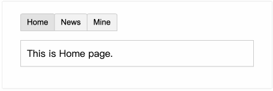

# 一、概述

组件是可重用的实例， 是 Vue.js 最强大的功能之一。组件可以扩展 HTML 元素，封装可重用的代码。在较高层面上，组件是自定义元素，Vue.js 的编译器为它添加特殊功能。

通常一个应用会以一棵嵌套的组件树的形式来组织：


例如，你可能会有页头、侧边栏、内容区等组件，每个组件又包含了其它的像导航链接、博文之类的组件。

为了能在模板中使用，这些组件必须先注册以便 Vue 能够识别。

# 二、组件注册

## 1、全局注册

```js
// Create a Vue application
const app = Vue.createApp({})

// Define a new global component called button-counter
app.component('button-counter', {
  data() {
    return {
      count: 0
    }
  },
  template: `
    <button @click="count++">
      You clicked me {{ count }} times.
    </button>`
})
```

## 2、局部注册

```vue
<script>
export default {
  setup() {
    
  },
  components: {
    自定义组件
  }
}
</script>
```

## 3、单文件组件

单文件组件由三个部分组成：

- Template：视图部分，只能存在一个根元素
- Script：脚本部分
- Style：样式部分，scoped 关键字 -> 样式只在当前组件内生效

```vue
<!-- 组件模板 -->
<template>
  <div></div>
</template>

<!-- 组件脚本 -->
<script>
export default {
  setup() {
    
  },
}
</script>

<!-- 组件样式 -->
<style scoped></style>
```

**单文件组件使用流程：**

\1. 创建单文件组件

\2. 导入组件

\3. 注册组件

\4. 使用组件

# 四、组件交互

组件设计初衷就是要配合使用的，最常见的就是形成父子组件的关系：组件 A 在它的模板中使用了组件 B。它们之间必然需要相互通信：父组件可能要给子组件下发数据，子组件则可能要将它内部发生的事情告知父组件。然而，通过一个良好定义的接口来尽可能将父子组件解耦也是很重要的。这保证了每个组件的代码可以在相对隔离的环境中书写和理解，从而提高了其可维护性和复用性。

在 Vue 中，父子组件的关系可以总结为 **prop 向下传递/事件 向上传递**。父组件通过 **prop**给子组件下发数据，子组件通过**事件**给父组件发送消息。看看它们是怎么工作的。


- 父组件向子组件传递数据：prop
- 子组件向父组件传递数据：$emit event

组件通信常用方式：

- props
- eventbus
- vuex
- 自定义事件
- 边界情况
  - $parent
  - $children
  - $root
  - $refs
  - provide/inject
- 非prop特性
  - $attrs
  - $listeners

## 1、Prop

prop 是父组件用来传递数据的一个自定义属性。

父组件的数据需要通过 props 把数据传给子组件，子组件需要显式地用 props 选项声明 "prop"

--- 子组件

```vue
<template>
  <!-- 访问属性 -->
  <div>{{ name }} - {{ age }}</div>
</template>

<script>
export default {
  name: 'Child',
  // 简单接收属性
  // props: ['name', age],
  props: {
    name: String,
    age: Number,
  },
  setup(props) {
    // 访问属性
    console.log(props.name);
    console.log(props.age);
  },
  components: {},
};
</script>

<style scoped></style>
```

--- 父组件

```vue
<template>
  <!-- 调用子组件 -->
  <!-- name - 静态传递数据 -->
  <!-- age  - 动态传递数据 -->
  <child name="Muizli" :age="28" />
</template>

<script>
// 引入子组件
import Child from "./Child.vue";
export default {
	name: 'Comp',
  setup(props) {
    console.log(props);
  },
  // 注册子组件
  components: {
    Child,
  },
};
</script>

<style scoped></style>
```

## 2、Prop 验证

我们可以为组件的 prop 指定验证规则。如果传入的数据不符合要求，Vue 会发出警告。这对于开发给他人使用的组件非常有用。要指定验证规则，需要用对象的形式来定义 prop，而不能用字符串数组：

```javascript
Vue.component('my-component', {
  props: {
    // 基础的类型检查 (`null` 和 `undefined` 会通过任何类型验证)
    propA: Number,
    // 多个可能的类型
    propB: [String, Number],
    // 必填的字符串
    propC: {
      type: String,
      required: true
    },
    // 带有默认值的数字
    propD: {
      type: Number,
      default: 100
    },
    // 带有默认值的对象
    propE: {
      type: Object,
      // 对象或数组默认值必须从一个工厂函数获取
      default: function () {
        return { message: 'hello' }
      }
    },
    // 自定义验证函数
    propF: {
      validator: function (value) {
        // 这个值必须匹配下列字符串中的一个
        return ['success', 'warning', 'danger'].indexOf(value) !== -1
      }
    }
  }
})
```

`type` 可以是下面原生构造器：

- String
- Number
- Boolean
- Function
- Object
- Array
- Symbol

`type` 也可以是一个自定义构造器函数，使用 `instanceof` 检测。

当 prop 验证失败，Vue 会抛出警告 (如果使用的是开发版本)。注意 prop 会在组件实例创建**之前**进行校验，所以在 `default` 或 `validator` 函数里，诸如 `data`、`computed` 或 `methods` 等实例属性还无法使用。

## 3、Emit 

父组件是使用 props 传递数据给子组件，但如果子组件要把数据传递回去，就需要使用Emit事件！实现流程如下：

\1. 在父组件调用子组件的时候定义一个自定义事件

```js
<child name="Muizli" :age="28" @custom-event="onTap" />
```

> 提示：`custom-event` 为自定义事件名称。

\2. 在子组件中合适的位置触发事件

```vue
<template>
  <!-- 访问属性 -->
  <div>{{ name }} - {{ age }}</div>
  <button @click="$emit('custom-event', 'Hello, Comp!')">Send Msg.</button>
</template>

<script>
export default {
  emits: ["custom-event"],
  props: {
    name: String,
    age: Number,
  },
  setup(props) {
    // 访问属性
    console.log(props.name);
    console.log(props.age);
  },
  components: {},
};
</script>
```

> 提示：始终使用 kebab-case 的事件名

# 五、插槽

Vue 实现了一套内容分发的 API，这套 API 基于当前的 [Web Components 规范草案](https://github.com/w3c/webcomponents/blob/gh-pages/proposals/Slots-Proposal.md)，将 `<slot>` 元素作为承载分发内容的出口。

## 1、插槽内容

```vue
<template>
    <a :href="url">
        <!-- 接收插槽内容 -->
        <slot></slot>
    </a>
</template>

<script>
export default {
    name: "navigation-link",
    data() {
        return {}
    },
    props: ["url"]
}
</script>
<style scoped></style>
```

```html
<navigation-link url="/login">前往登录</navigation-link>
<navigation-link url="/register">前往注册</navigation-link>
```

渲染效果：

```html
<a href="/login">前往登录</a>
<a href="/register">前往注册</a>
```

提示：插槽样式在子父组件中都可以设置，所以在命名class时一定要注意。

## 2、编译作用域

当你想在一个插槽中使用数据时，例如：

```html
<nav-link url="/profile">
  Logged in as {{ user.name }}
</nav-link>
```

该插槽跟当前模板的其它地方一样可以访问相同的实例属性 (也就是相同的“作用域”)，而**不能**访问 \<nav-link>  的作用域。例如  `url`  是访问不到的：

```html
<nav-link url="/profile">
  Clicking here will send you to: {{ url }}
</nav-link>
```

这里的 `url` 会是 undefined，因为 "/profile" 是传递给 \<nav-link> 的而不是
在 \<nav-link> 组件内部定义的。

> 父级模板里的所有内容都是在父级作用域中编译的；子模板里的所有内容都是在子作用域中编译的。

## 3、后备内容

```html
<template>
    <a :href="url">
        <!-- 接收插槽内容 -->
        <slot>默认内容</slot>
    </a>
</template>
```

```html
<navigation-link url="/orders"></navigation-link>
```

渲染效果：

```html
<a href="/orders">默认内容</a>
```

## 3、具名插槽

有时我们需要多个插槽，但是插槽内容会重复，如下所示：

```html
<template>
    <div class="box">
        <slot></slot>
        <hr />
        <slot></slot>
    </div>
</template>

<script>
export default {
    name: "box",
}
</script>
<style scoped></style>
```


```html
<Box>
  <h3>李鸿耀</h3>
  <p>前端开发工程师</p>
</Box>
```

运行效果：


为了解决这个问题，我们可以给插槽命名，进行相应绑定。

```vue
<template>
    <div class="box">
        <slot name="name"></slot>
        <hr />
        <slot name="job"></slot>
    </div>
</template>

<script>
export default {
    name: "box",
}
</script>
```

```vue

<Box>
  <!-- 插槽1：name -->
  <template v-slot:name>
    <h3>李鸿耀</h3>
  </template>
  <!-- 插槽2：job -->
  <template v-slot:job>
    <p>前端开发工程师</p>
  </template>
</Box>
```

运行效果：


> 提示：`v-slot` 指令可以使用 `#` 替代，比如：“v-slot:job” 可以缩写为 “#job”

> 注意：切记使用 template 包裹

## 4、作用域插槽

作用域插槽是一种特殊类型的插槽，用作一个（能被传递数据的）可重用模板，来代替已经渲染好的元素。

子传父。即长什么样，怎么布局由父级决定，而数据源则由子级决定。如：

```vue
<template>
  <div class="user">
    <!-- 绑定user属性，以便在父组件中使用 -->
    <!-- 插槽 Prop -->
    <slot :user="user"></slot>
  </div>
</template>

<script>
export default {
  name: "user",
  data() {
    return {
      user: {
        title: "李鸿耀",
        des: "前端工程师"
      }
    };
  }
};
</script>
```

```vue
<User>
  <template #default="slotProps">
    {{slotProps.user.title}} - {{slotProps.user.des}}
  </template>
</User>
```

> 注意：作用域插槽不能和具名插槽混合使用。

# 六、动态组件

通过使用保留的 \<component> 元素，动态地绑定到它的 is 特性，我们让多个组件可以使用同一个挂载点，并动态切换。

```vue
<template>
  <div id="app">
    <component :is="curPage"></component>
    <button type="button" @click="curPage = 'news'">新闻</button>
    <button type="button" @click="curPage = 'mine'">个人中心</button>
  </div>
</template>

<script>
export default {
  name: "App",
  data() {
    return {
      curPage:"news"
    }
  },
  components: {
    news: {
      template: `<div class="news">
        <h1>新闻页面</h1>
      </div>`
    },
    mine: {
      template: `<div class="news">
        <h1>个人中心页面</h1>
      </div>`
    }
  }
};
</script>
```


展示效果：



**keep-alive**

如果把切换出去的组件保留在内存中，可以保留它的状态或避免重新渲染，为此可以添加一个 keep-alive 指令参数。如下所示：

```vue
<keep-alive>
    <component :is="·currentPage"></component>
</keep-alive>
```

什么情况下使用缓存：如果你需要实时更新（比如网络请求/或者时间跳转）就不能使用缓存。

> 注意：这个 `<keep-alive>` 要求被切换到的组件都有自己的名字，不论是通过组件的 `name` 选项还是局部/全局注册

## 2. v3.x 之后

[3.0 参考 >>](https://blog.csdn.net/WEB_CSDN_SHARE/article/details/95480145)


