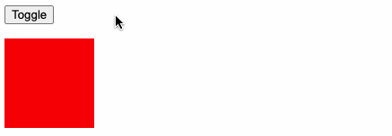

# # 进入/离开 & 列表过渡

## 1. 概述

Vue 在插入、更新或者移除 DOM 时，提供多种不同方式的应用过渡效果。
包括以下工具：

- 在 CSS 过渡和动画中自动应用 class
- 可以配合使用第三方 CSS 动画库，如 Animate.css
- 在过渡钩子函数中使用 JavaScript 直接操作 DOM
- 可以配合使用第三方 JavaScript 动画库，如 Velocity.js

## 2. 单元素/组件过渡

Vue 提供了 `transition` 的封装组件，在下列情形中，可以给任何元素和组件添加进入/离开过渡

- 条件渲染 (使用 `v-if`)
- 条件展示 (使用 `v-show`)
- 动态组件
- 组件根节点

我们来看一组示例：

```html
<div id="app">
  <p class="btn-wrap">
    <button type="button" @click='isVisible = !isVisible'>TOGGLE</button>
  </p>
  <transition name='fade'>
    <h1 v-show="isVisible">Hello, World!</h1>
  </transitio>
</div>
```

```css

.fade-enter-active, .fade-leave-active {
  transition: opacity .5s;
}
.fade-enter, .fade-leave-to  {
  opacity: 0;
}
```

```js
new Vue({
  el: '#app',
  data: {
    isVisible: true
  }
})
```

效果演示：



当插入或删除包含在 `transition` 组件中的元素时，Vue 将会做以下处理：

1. 自动嗅探目标元素是否应用了 CSS 过渡或动画，如果是，在恰当的时机添加/删除 CSS 类名。
2. 如果过渡组件提供了 [JavaScript 钩子函数](https://cn.vuejs.org/v2/guide/transitions.html#JavaScript-%E9%92%A9%E5%AD%90)，这些钩子函数将在恰当的时机被调用。
3. 如果没有找到 JavaScript 钩子并且也没有检测到 CSS 过渡/动画，DOM 操作 (插入/删除) 在下一帧中立即执行。(注意：此指浏览器逐帧动画机制，和 Vue 的 `nextTick` 概念不同)

### 2.1. 过渡类名

在进入/离开的过渡中，会有 6 个 class 切换。

- **v-enter**

  定义进入过渡的开始状态。在元素被插入之前生效，在元素被插入之后的下一帧移除。

- **v-enter-active**

  定义进入过渡生效时的状态。在整个进入过渡的阶段中应用，在元素被插入之前生效，在过渡/动画完成之后移除。这个类可以被用来定义进入过渡的过程时间，延迟和曲线函数。

- **v-enter-to**

  定义进入过渡的结束状态。在元素被插入之后下一帧生效 (与此同时 `v-enter` 被移除)，在过渡/动画完成之后移除。*（2.1.8版及以上）*

- **v-leave**

  定义离开过渡的开始状态。在离开过渡被触发时立刻生效，下一帧被移除。

- **v-leave-active**

  定义离开过渡生效时的状态。在整个离开过渡的阶段中应用，在离开过渡被触发时立刻生效，在过渡/动画完成之后移除。这个类可以被用来定义离开过渡的过程时间，延迟和曲线函数。

- **v-leave-to**

  定义离开过渡的结束状态。在离开过渡被触发之后下一帧生效 (与此同时 `v-leave` 被删除)，在过渡/动画完成之后移除。*（2.1.8版及以上）*


对于这些在过渡中切换的类名来说，如果你使用一个没有名字的 `<transition>`，则 `v-`是这些类名的默认前缀。如果你使用了 `<transition name="my-transition">`，那么 `v-enter` 会替换为 `my-transition-enter`。

`v-enter-active` 和 `v-leave-active` 可以控制进入/离开过渡的不同的缓和曲线，在下面章节会有个示例说明。

### 2.2. CSS 过渡

```html
<div id="app">
  <p class="btn-wrap">
    <button type="button" @click='isVisible = !isVisible'>TOGGLE</button>
  </p>
  <transition name='slide-fade'>
    <h1 v-show="isVisible">Hello, World!</h1>
  </transitio>
</div>
```

```css
.slide-fade-enter-active, .slide-fade-leave-active {
  transition: all .75s linear;
}
.slide-fade-enter, .slide-fade-leave-to {
  opacity: 0;
  transform: translateX(100px)
  
}
.slide-fade-enter-to, .slide-fade-leave {
  opacity: 1;
  transform: translateX(0)
}
```

```js
new Vue({
  el: '#app',
  data: {
    isVisible: true
  }
})
```

效果演示：


### 2.3. CSS 动画

CSS 动画用法同 CSS 过渡，区别是在动画中 `v-enter` 类名在节点插入 DOM 后不会立即删除，而是在 `animationend` 事件触发时删除。

```html
<div id="app">
  <p class="btn-wrap">
    <button type="button" @click='isVisible = !isVisible'>TOGGLE</button>
  </p>
  <transition name='bounce'>
    <h1 v-show="isVisible" style="display: inline-block">Hello, World!</h1>
  </transitio>
</div>
```

```css
.bounce-enter-active {
  animation: bounce .6s linear;
}
.bounce-leave-active {
  animation: bounce .6s linear reverse;
}
@keyframes bounce {
  0%   { transform: scale(0)   }
  50%  { transform: scale(1.5) }
  100% { transform: scale(1)   }
}
```

```js
new Vue({
  el: '#app',
  data: {
    isVisible: true
  }
})
```

效果演示：


### 2.4. 三方库动画应用

我们可以通过以下特性来自定义过渡类名：

- enter-class
- enter-active-class
- enter-to-class (2.1.8+)
- leave-class
- leave-active-class
- leave-to-class (2.1.8+)

他们的优先级高于普通的类名，这对于 Vue 的过渡系统和其他第三方 CSS 动画库，如 [Animate.css](https://daneden.github.io/animate.css/) 结合使用十分有用。

```html
<link href="https://cdn.jsdelivr.net/npm/animate.css@3.5.1" rel="stylesheet" type="text/css">

<div id="app"  style='padding: 200px;'>
  <p class="btn-wrap">
    <button type="button" @click='isVisible = !isVisible'>TOGGLE</button>
  </p>
  <transition
  name="custom-classes-transition"
  enter-active-class="animated rubberBand"
  leave-active-class="animated rotateOut">
    <h1 v-show="isVisible" style="display: inline-block">Hello, World!</h1>
  </transitio>
</div>
```

```js
new Vue({
  el: '#app',
  data: {
    isVisible: true
  }
})
```


# # 状态过渡

Vue 的过渡系统提供了非常多简单的方法设置进入、离开和列表的动效。那么对于数据元素本身的动效呢，比如：

- 数字和运算
- 颜色的显示
- SVG 节点的位置
- 元素的大小和其他的属性

所有的原始数字都被事先存储起来，可以直接转换到数字。做到这一步，我们就可以结合 Vue 的响应式和组件系统，使用第三方库来实现切换元素的过渡状态。

## 1. 状态动画与侦听器

通过侦听器我们能监听到任何数值属性的数值更新。可能听起来很抽象，所以让我们先来看看使用 [GreenSock](https://greensock.com/) 一个例子：

首先，安装 “gsap” js动画库：

```shell
$ npm i -S gsap
```

引入 `TweenMax` ：

```js
import {TweenMax} from 'gsap'
```

html：

```html
<div id="app">
    <input v-model.number="number" type="number" step="20">
    <p>{{ animatedNumber }}</p>
</div>
```

js：

```js
new Vue({
  el: '#app',
  data: {
    number: 0,
    tweenedNumber: 0
  },
  computed: {
    animatedNumber: function() {
      return this.tweenedNumber.toFixed(0);
    }
  },
  watch: {
    number: function(newValue) {
      TweenLite.to(this.$data, 0.5, { tweenedNumber: newValue });
    }
  }
})
```

效果显示：


当你把数值更新时，就会触发动画。


