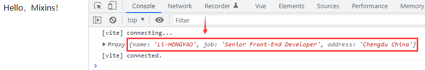
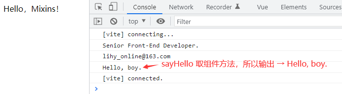
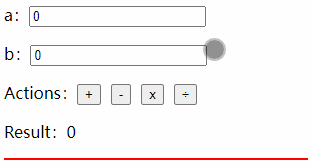

# 一、前言

在 Vue 2 中，`mixin`（混合） 是将部分组件逻辑抽象成可重用块的主要工具。但是，他们存在一些题，比如容易冲突、可重用性有限等等。为了解决这些问题，Vue3.x 添加了一种通过逻辑关注点组织代码的新方法：组合式API（Composition API）。尽管在 Vue3.x 之后你可能在开发中不会用到 `mixin`，但有必要了解一下，毕竟 Vue3 并没有移除 `mixin`，你仍然可以使用 `mixin` 的功能。

注意： `mixin` 需要使用 `Option API`。

# 二、基础

Mixin 提供了一种非常灵活的方式，来分发 Vue 组件中的可复用功能。一个 mixin 对象可以包含任意组件选项。当组件使用 mixin 对象时，所有 mixin 对象的选项将被“混合”进入该组件本身的选项。

```vue
<script lang="ts">
import { defineComponent } from 'vue';

// -- create mixin
const myMixin = {
  created() {
    // @ts-ignore
    this.hello();
  },
  methods: {
    hello() {
      console.log('Hello from mixin!');
    },
  },
};

export default defineComponent({
  mixins: [myMixin],
});
</script>
```

调用组件时，输出：`Hello from mixin!`

# 三、选项合并

当组件和 mixin 对象含有同名选项时，这些选项将以恰当的方式进行“合并”。

比如，数据对象在内部会进行递归合并，并在发生冲突时以组件数据优先。

```vue
<script lang="ts">
import { defineComponent } from 'vue';

// -- create mixin
const myMixin = {
  data() {
    return {
      name: 'Muzili',
      job: 'Senior Front-End Developer',
    };
  },
};

export default defineComponent({
  mixins: [myMixin],
  data() {
    return {
      name: 'Li-HONGYAO',
      address: 'Chengdu China',
    };
  },
  created() {
    console.log(this.$data);
  },
});
</script>

<template>
  <div>Hello，Mixins！</div>
</template>
```

输出结果：



同名钩子函数将合并为一个数组，因此都将被调用。另外，mixin 对象的钩子将在组件自身钩子**之前**调用。

```vue
<script lang="ts">
import { defineComponent } from 'vue';

// -- create mixin
const myMixin = {
  created() {
    console.log('mixin 对象的钩子被调用');
  },
};

export default defineComponent({
  mixins: [myMixin],
  created() {
    console.log('组件钩子被调用');
  },
});

// => "mixin 对象的钩子被调用"
// => "组件钩子被调用"
</script>
```

值为对象的选项，例如 `methods`、`components` 和 `directives`，将被合并为同一个对象。两个对象键名冲突时，取组件对象的键值对。

```vue
<script lang="ts">
import { defineComponent } from 'vue';

// -- create mixin
const myMixin = {
  methods: {
    showJob() {
      console.log('Senior Front-End Developer.');
    },
    sayHello() {
      console.log('Hello, girl.');
    },
  },
};

export default defineComponent({
  mixins: [myMixin],
  methods: {
    showEmail() {
      console.log('lihy_online@163.com');
    },
    sayHello() {
      console.log('Hello, boy.');
    },
  },
  created() {
    this.showJob();
    this.showEmail();
    this.sayHello();
  },
});
```

输出结果：



> 注意：`Vue.extend()` 也使用同样的策略进行合并。

# 四、全局混入

混入也可以进行全局注册。使用时格外小心！一旦使用全局混入，它将影响**每一个**之后创建的 Vue 实例。使用恰当时，这可以用来为自定义选项注入处理逻辑。

```typescript
app.mixin({ /** */ })
```

> 注意：请谨慎使用全局混入，因为它会影响每个单独创建的 Vue 实例 (包括第三方组件)。大多数情况下，只应当应用于自定义选项，就像上面示例一样。推荐将其作为[插件](https://cn.vuejs.org/v2/guide/plugins.html)发布，以避免重复应用混入。

# 五、合并策略

自定义选项在合并时，默认策略为简单地覆盖已有值。如果想让某个自定义选项以自定义逻辑进行合并，可以在 `app.config.optionMergeStrategies` 中添加一个函数：

```js
app.config.optionMergeStrategies.customOption = (toVal, fromVal) => {
  // return mergedVal
}
```

合并策略接收在父实例和子实例上定义的该选项的值，分别作为第一个和第二个参数。

# 六、@3.x 替代方案 - Hooks

在章节开篇前有提到，传统的 mixin 有很多让人诟病的地方，mixin 的深度合并非常隐式，这让代码逻辑更难理解和调试，具体表现为以下几点：

1）**容易冲突**：因为每个特性的属性都被合并到同一个组件中，组件内同名的属性或方法会把mixins里的覆盖掉。

2）**可重用性有限**：我们不能向 mixins 传递任何参数来改变它的逻辑，这降低了它们在抽象逻辑方面的灵活性。

3）**数据来源不清晰**：组件里所使用的mixins里的数据或方法在当前组件代码里搜索不到，易造成错误的解读，比如被当成错误代码或冗余代码而误删。

为了解决这些问题，在 Vue3.x 中，添加了一种通过逻辑关注点组织代码的新方法：**组合式API**，但是在组合式API中，由于 `setup` 内部无法访问 `this`，所以这两者是冲突的，我们只能封装一套全新的方式来使用类似 mixin 的功能，我们称这种全新的方式为 `自定义hooks`。

- Hooks 其实就一个函数；
- Hooks 命名通常以 `use` 开头；

通过一个示例去帮助大家理解如何自定义 Hooks，ok，开始干活儿，接下来我们要定义一个 `useCount` 的 Hooks，该函数的功能主要是返回 `加`、`减`、`乘`、`除` 4个运算法方法以及 `运算结果`，请看示例：

> `src/hooks/useCount.ts`

```typescript
import { Ref, ref } from 'vue';

export default function useCount(a: Ref<number>, b: Ref<number>) {
  // -- 运算结果
  const result = ref(0);
  // -- 运算方法
  const plus = () => (result.value = a.value + b.value);
  const minus = () => (result.value = a.value - b.value);
  const multiply = () => (result.value = a.value * b.value);
  const divide = () => (result.value = a.value / b.value);
  // -- 返回值
  return { result, plus, minus, multiply, divide };
}
```

然后我们 在组件中调用它：

> `src/components/test.vue`

```vue
<script setup lang="ts">
import { ref } from 'vue';
import useCount from '../hooks/useCount';

const a = ref(0);
const b = ref(0);

const { result, plus, minus, multiply, divide } = useCount(a, b);
</script>

<template>
  <p>
    <span>a：</span>
    <input v-model.number="a" />
  </p>
  <p>
    <span>b：</span>
    <input v-model.number="b" />
  </p>
  <p>
    <span>Actions：</span>
    <button type="button" @click="plus">+</button>
    <button type="button" @click="minus">-</button>
    <button type="button" @click="multiply">x</button>
    <button type="button" @click="divide">÷</button>
  </p>
  <p>
    <span>Result：</span>
    <span>{{ result }}</span>
  </p>
</template>

<style scoped>
button {
  margin-right: 10px;
}
</style>
```

演示效果：



怎么样，是不是很简单呢？其实我们也可以单独定义一个文件，比如 `utils/index.ts`，然后将一些公共的方法封装在这一个文件中，但我们需要的时候，直接引入调用对应方法即可。