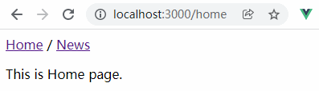

# 一、概述

[Vue Router >>](https://next.router.vuejs.org/zh/) 是 [Vue.js](https://v3.cn.vuejs.org/) 官方的路由管理器。它和 `Vue.js` 的核心深度集成，让构建单页面应用变得易如反掌。包含的功能有：

- 嵌套的路由/视图表
- 模块化的、基于组件的路由配置
- 路由参数、查询、通配符
- 基于 Vue.js 过渡系统的视图过渡效果
- 细粒度的导航控制
- 带有自动激活的 CSS class 的链接
- HTML5 历史模式或 hash 模式，在 IE9 中自动降级
- 自定义的滚动条行为

用 Vue + Vue Router 创建单页应用非常简单：通过 Vue.js，我们已经用组件组成了我们的应用。当加入 Vue Router 时，我们需要做的就是将我们的组件映射到路由上，让 Vue Router 知道在哪里渲染它们。下面是一个基本的例子：

# 二、初探

接下来，我们先通过一个示例，让大家了解路由的基础使用：

## 1. 构建项目

```shell
$ npm init vite@latest vue-router-test -- --template vue-ts
```

## 2. 新建页面文件

在项目根目录，输入如下终端指令，创建页面文件：

```shell
# 新建目录
$ mkdir -p src/pages/Home
$ mkdir -p src/pages/News
# 新建文件
$ cd > src/pages/Home/index.vue
$ cd > src/pages/News/index.vue
```

并在页面文件中，填入如下内容：

```vue
<script setup lang="ts"></script>
<template>
  <p>This is XXX page.</p>
</template>
```

> 提示：请将 `XXX` 替换为目录名。

## 3. 新建路由文件 & 安装路由

```shell
# 新建路由文件
$ mkdir -p src/router && cd > src/router/index.ts  
# 安装路由
$ npm install vue-router@4
```

> `src/router/index.ts`

```typescript
import { createRouter, createWebHistory, RouteRecordRaw } from 'vue-router';

// → 引入组件模块
import Home from '../pages/Home/index.vue';

// → 定义路由
const routes: Array<RouteRecordRaw> = [
  { path: '/', redirect: '/home' /** 重定向 */ },
  { path: '/home', component: Home },
  { path: '/news', component: () => import('../pages/News/index.vue') /** 懒加载组件模块 */ },
];

// → 创建路由
const router = createRouter({
  history: createWebHistory() /** 创建基于history模式的路由 */,
  routes,
});

// → 导出路由
export default router;
```

## 4. 注册路由

> `src/main.ts`

```typescript
import { createApp } from 'vue';
import router from './router';
import App from './App.vue';

// → 创建应用实例
const app = createApp(App);
// → 注入路由
app.use(router);
// → 挂载
app.mount('#app');
```

## 5. 配置路由链接

> `src/App.vue`

```vue
<script setup lang="ts"></script>

<template>
  <!-- 导航 -->
  <nav>
    <router-link to="/home">Home</router-link>
    <span> / </span>
    <router-link to="/news">News</router-link>
  </nav>
  <!-- 路由视图 -->
  <router-view></router-view>
</template>
```

## 6. 运行项目，查看效果

```shell
$ npm run dev
```

演示效果：



> 注意：
>
> 1. 路由实例创建后需在vue实例中注册路由。
> 2. 通过 `<router-link>` 实现路由动态切换，最终会被渲染成超链接。
> 3. 通过 `<router-view>` 呈现路由切换后显示的组件内容。

# 三、基础

## 1. 路由模式

vue-router 在创建路由实例时，提供了2种路由有模式：`hash` / `history`

| #            | `hash`                           | `history`                  |
| ------------ | -------------------------------- | -------------------------- |
| **呈现形式** | http://localhost:3000/#/home     | http://localhost:3000/home |
| **构造函数** | `createWebHashHistory()`         | `createWebHistory()`       |
| **是否重载** | 否（Hash不会被包括在Http请求中） | 是                         |
| **回车刷新** | 无影响                           | 404，需配置重定向          |

## 2. 路由嵌套 *

一些应用程序的 UI 由多层嵌套的组件组成，比如一些UI组件库的使用文档就是使用这种结构，我们称之为路由嵌套结构。在路由配置中，同样根据嵌套结构进行嵌套配置，比如：

```
/web/html
/web/css
/web/js
```

在 `/web` 路由下，嵌套 `/html`、`/css`和 `/js` 路由：

```js
{
  path: '/web',
  redirect: '/web/html',
  component: import('../pages/Web/index.vue'),
  children: [
    { path: 'html', component: import('../pages/Html/index.vue') },
    { path: 'css', component: import('../pages/CSS/index.vue') },
    { path: 'js', component: import('../pages/JavaScript/index.vue') },
  ],
};
```

**注意事项：**

- 配置路由时通过指定 `children` 属性来配置当前路由的子路由。
- 子路由属于谁，`<router-view />` 就写在谁下面。 *
- 默认重定向，使用 `redirect` 属性。
- 如果子路由在主页中，设置 `path` 属性时，直接 `/子路由路径` 即可。

## 3. 编程式的导航 

除了使用 `<router-link>` 创建 a 标签来定义导航链接，我们还可以借助 router 的实例方法，通过编写代码来实现。

### 3.1. `router.push()` *

语法如下：

```js
router.push(location, onComplete?, onAbort?)
```

> 注意：在 Vue 实例内部的模板文件中，你可以通过 `$router` 访问路由实例。

示例代码：

```vue
<script setup lang="ts">
import { useRouter } from 'vue-router';

// → 获取router实例
const router = useRouter();

// → 在事件函数中调用
const onGoNews = () => {
  router.push('/news');
};
</script>
<template>
  <p>This is Home page.</p>
  <button type="button" @click="onGoNews">Go News</button>
  <!-- 直接在模板中获取router实例 -->
  <button type="button" @click="$router.push('/news')">Go News</button>
</template>

```

想要导航到不同的 URL，可以使用 `router.push` 方法。这个方法会向 history 栈添加一个新的记录，所以，当用户点击浏览器后退按钮时，会回到之前的 URL。

当你点击 `<router-link>` 时，内部会调用这个方法，所以点击 `<router-link :to="...">` 相当于调用 `router.push(...)` ：

| 声明式                    | 编程式             |
| ------------------------- | ------------------ |
| `<router-link :to="...">` | `router.push(...)` |

该方法的参数可以是一个字符串路径，或者一个描述地址的对象。例如：

```js
// → 字符串
router.push('/home')

// → 对象
router.push({ path: '/home' })

// → 命名的路由
router.push({ name: 'home', params: { id: '123' }})

// → 带查询参数，变成 /register?plan=private
router.push({ path: '/register', query: { plan: 'private' }})
```

> **注意**：如果提供了 `path`，`params` 会被忽略，上述例子中的 `query` 并不属于这种情况。取而代之的是下面例子的做法，你需要提供路由的 `name` 或手写完整的带有参数的 `path` ：

```js
const username = 'muzili'
// → 我们可以手动建立 url，但我们必须自己处理编码
router.push(`/user/${username}`) // → /user/muzili
// → 同样
router.push({ path: `/user/${username}` }) // → /user/muzili
// → 如果可能的话，使用 name 和 params 从自动 URL 编码中获益
router.push({ name: 'user', params: { username } }) // → /user/muzili
// params 不能与 path 一起使用
router.push({ path: '/user', params: { username } }) // → /user
```

> **提示：**同样的规则也适用于 `<router-link\> ` 组件的 `to` 属性。

### 3.2. `router.replace()`

语法如下：

```
router.replace(location, onComplete?, onAbort?)
```

跟 `router.push()` 很像，唯一的不同就是，它不会向 history 添加新记录，而是跟它的方法名一样 —— 替换掉当前的 history 记录。

| 声明式                            | 编程式                |
| --------------------------------- | --------------------- |
| `<router-link :to="..." replace>` | `router.replace(...)` |

也可以直接在传递给 `router.push` 的 `routeLocation` 中增加一个属性 `replace: true` ：

```typescript
router.push({ path: '/home', replace: true })
// 相当于
router.replace({ path: '/home' })
```

### 3.3. `router.go()`

这个方法的参数是一个整数，意思是在 history 记录中向前或者后退多少步，类似 `window.history.go(n)`。

```js
//  → 向前移动一条记录，与 router.forward() 相同
router.go(1)

//  → 返回一条记录，与router.back() 相同
router.go(-1)

//  → 前进 3 条记录
router.go(3)

//  → 如果没有那么多记录，静默失败
router.go(-100)
router.go(100)
```

## 4. 命名路由

除了 `path` 之外，你还可以为任何路由提供 `name`。这有以下优点：

- 没有硬编码的 URL
- `params` 的自动编码/解码。
- 防止你在 url 中出现打字错误。
- 绕过路径排序（如显示一个）

```js
{
  path: '/commodities/:kind',
  name: 'commodities',
  component: Commodities
}
```

要链接到一个命名路由，可以给 `router-link` 的 `to` 属性传一个对象：

```html
<router-link :to="{name:'commodities', params:{ kind:'phone'}}">Commodities</router-link>
```

这跟代码调用 `router.push()` 是一回事：

```js
router.push({ name:'commodities', params:{ kind:'phone'}})
```

这两种方式都会把路由导航到 `/commodities/phone` 路径。

## 5. 命名视图

有时候想同时 (同级) 展示多个视图，而不是嵌套展示，例如创建一个布局，有 `sidebar` (侧导航) 和 `main` (主内容) 两个视图，这个时候命名视图就派上用场了。你可以在界面中拥有多个单独命名的视图，而不是只有一个单独的出口。如果 `router-view` 没有设置名字，那么默认为 `default`。

```html
<router-view class="view left-sidebar" name="LeftSidebar" />
<router-view class="view main-content" />
<router-view class="view right-sidebar" name="RightSidebar" />
```

一个视图使用一个组件渲染，因此对于同个路由，多个视图就需要多个组件。确保正确使用 `components` 配置 (带上 **s**)：

```js
{
  path: '/',
  components: {
    default: Home,
    // LeftSidebar: LeftSidebar 的缩写
    LeftSidebar,
    // 它们与 <router-view> 上的 name 属性匹配
    RightSidebar,
  },
},
```

## 6. 路由高亮效果

在路由链接选中时，会自动添加 `router-link-active` 类名：


你可以在 `App.vue` 中全局设置高亮时的颜色，如：

```css
.router-link-active {
  color: blue;
}
```

## 7. 重定向/取别名

### 7.1. 重定向

重定向也是通过 `routes` 配置来完成，下面例子是从 `/a` 重定向到 `/b`：

```js
{ path: '/a', redirect: '/b' }
```

重定向的目标也可以是一个命名的路由：

```js
{ path: '/a', redirect: { name: 'foo' }}
```

甚至是一个方法，动态返回重定向目标：

```js
{ path: '/a', redirect: to => {
  // → 方法接收 目标路由 作为参数
  // → return 重定向的 字符串路径/路径对象
  return { path: '/search', query: { q: to.params.searchText } }
}}
```

> 注意：<u>导航守卫</u> 并没有应用在跳转路由上，而仅仅应用在其目标上。

### 7.2. 取别名 

**重定向** 的意思是，当用户访问 `/a`时，URL 将会被替换成 `/b`，然后匹配路由为 `/b`，那么 **别名** 又是什么呢？

/a 的别名是 /b，意味着，当用户访问 /b 时，URL 会保持为 /b，但是路由匹配则为 /a，就像用户访问 /a 一样。

上面对应的路由配置为：

```js
{ path: '/a', component: A, alias: '/b' }
```

别名的功能让你可以自由地将 UI 结构映射到任意的 URL，而不是受限于配置的嵌套路由结构。

## 8. 路由参数 *

设置路由跳转时，可以进行参数传递，如下所示：

### 8.1. 参数以 `/` 传递（`path`）

**@指定传递参数：**

```javascript
{
  // → 动态路径参数 以冒号开头
  // → name、course 为传递数据
  path: '/news/:name/:course',
  name: 'news',
  component: News
}
```

**@设置传递数据：**

```html
<!-- 方法1 ->
<router-link to="/news/muzili/web">News</router-link> 
<!-- 方法2 ->
<router-link :to="{name:'news', params:{name:'muzili', course:'web'}}">News</router-link>
```

**@获取传递数据：**

```vue
<script setup lang="ts">
import { useRoute } from 'vue-router';
const route = useRoute();
// 1. 脚本中访问
console.log(route.params); // → {name: 'muzili', course: 'web'}
</script>

<template>
  <!-- 2. 模板中访问 -->
  <p>{{ $route.params.name }} - {{ $route.params.course }}</p>
</template>
```

> 注意：是 `$route.params` 而不是 `$router.params`，后面不要加 `s`。

### 8.2. 参数以 `?` 传递（`query`）

我们常见的参数传递是通过 `location.search` 传递的，即在 URI 中将参数 以 `?` 隔开进行传递，vue中要使用此方式传递设置如下：

**@指定参数传递：**

使用query传参，路由配置的时候path不用带参数

**@设置传递参数：**

```vue
<router-link to="/news?name=muzili&course=web">News</router-link>
<router-link :to="{path:'/news', query:{name:'muzili', course:'web'">}}">News</router-link>
```

**@获取传递数据：**

```vue
<script setup lang="ts">
import { useRoute } from 'vue-router';
const route = useRoute();
// 1. 脚本中访问
console.log(route.query); // → {name: 'muzili', course: 'web'}
</script>

<template>
  <!-- 2. 模板中访问 -->
  <p>{{ $route.query.name }} - {{ $route.query.course }}</p>
</template>
```

### 8.3. Path vs Query

| #           | 类型 | 路由配置文件    | 传递            | 访问                |
| ----------- | ---- | --------------- | --------------- | ------------------- |
| **`Path`**  | `/`  | `/path/:params` | `name` / params | `$route.params.xxx` |
| **`Query`** | `?`  | 无需特殊配置    | `path` / query  | `$route.query.x`xx  |

## 9. 匹配 404 Not Fount

```javascript
{ path: '/:pathMatch(.*)*', name: 'NotFound', component: NotFound }
```

## 10. `v-slot`

`<router-link>` 通过一个作用域插槽暴露底层的定制能力。这是一个更高阶的 API，主要面向库作者，但也可以为开发者提供便利，大多数情况下用在一个类似 NavLink 这样的组件里。

```vue
<router-link
  to="/about"
  custom
  v-slot="{ href, route, navigate, isActive, isExactActive }"
>
  <NavLink :active="isActive" :href="href" @click="navigate">
    {{ route.fullPath }}
  </NavLink>
</router-link>
```

- `href`：解析后的 URL。将会作为一个 `<a>` 元素的 `href` 属性。如果什么都没提供，则它会包含 `base`。
- `route`：解析后的规范化的地址。
- `navigate`：触发导航的函数。 **会在必要时自动阻止事件**，和 `router-link` 一样。例如：`ctrl` 或者 `cmd` + 点击仍然会被 `navigate` 忽略。
- `isActive`：如果需要应用 [active class](https://next.router.vuejs.org/zh/api/#active-class)，则为 `true`。允许应用一个任意的 class。
- `isExactActive`：如果需要应用 [exact active class](https://next.router.vuejs.org/zh/api/#exact-active-class)，则为 `true`。允许应用一个任意的 class。

# 四、进阶

## 1. 导航守卫 

`导航`：表示路由正在发生改变

`守卫`： 防守护卫，类似于关卡，决定是否放行

正如其名，vue-router 提供的导航守卫主要用来通过跳转或取消的方式守卫导航。这里有很多方式植入路由导航中：`全局的`，`单个路由独享的`，或者 `组件级` 的。

**守卫参数：**

每个守卫方法接收三个参数：

- `to`： 即将要进入的 [目标路由对象 >>](https://next.router.vuejs.org/zh/api/#routelocationnormalized)
- `from`：当前导航正要离开的 [源路由对象 >>](https://next.router.vuejs.org/zh/api/#routelocationnormalized)

**返回值：**

各个守卫可以返回的值如下：

- `false`： 取消当前的导航（不执行跳转）
- `路由地址`：多用于重定向，比如在守卫中判断登录状态，如果没有登录则重定向到登录页
- `undefine` / `true`：导航有效，放行并调用下一个导航守卫。

### 2.1. 全局守卫

**@前置守卫**

当一个导航触发时，全局前置守卫按照创建顺序调用。守卫是异步解析执行，此时导航在所有守卫 resolve 完之前一直处于**等待中**。

```js
// -- 前置守卫
router.beforeEach(async (to, from) => {
  console.log('__beforeEach__');
  // → 检测登录状态
  if (to.path !== '/login' && !localStorage.getItem('loginStatus')) {
    return '/login';
  }
});
```

**@解析守卫**

和前置守卫类似，区别是在导航被确认之前，同时在所有组件内守卫和异步路由组件被解析之后，解析守卫就被调用。

```js
// -- 解析守卫
router.beforeResolve(async (to, from) => {
  console.log('__beforeResolve__');
});
```

> 提示：解析守卫是获取数据或执行任何其他操作（如果用户无法进入页面时你希望避免执行的操作）的理想位置。

**@后置钩子**

你也可以注册全局后置钩子，然而和守卫不同的是，这些钩子不会接受 `next` 函数也不会改变导航本身：

```js
// -- 后置钩子
router.afterEach(async (to, from) => {
  console.log('__afterEach__');
  document.title = to.meta.title as string;
});
```

> 提示：后置钩子对于分析、更改页面标题、声明页面等辅助功能以及许多其他事情都很有用.

### 2.2. 路由独享守卫

你可以直接在路由配置上定义 `beforeEnter` 守卫：

```js
{
  path: '/home',
  component: Home,
  beforeEnter: (to, from) => {
    /** ... */
  },
},
```

### 2.3. 组件内守卫

最后，你可以在路由组件内直接定义路由导航守卫(传递给路由配置的)

- `beforeRouteEnter`
- `beforeRouteUpdate
- `beforeRouteLeave`

```js
const UserDetails = {
  template: `...`,
  beforeRouteEnter(to, from) {
    // 在渲染该组件的对应路由被验证前调用
    // 不能获取组件实例 `this` ！
    // 因为当守卫执行时，组件实例还没被创建！
  },
  beforeRouteUpdate(to, from) {
    // 在当前路由改变，但是该组件被复用时调用
    // 举例来说，对于一个带有动态参数的路径 `/users/:id`，在 `/users/1` 和 `/users/2` 之间跳转的时候，
    // 由于会渲染同样的 `UserDetails` 组件，因此组件实例会被复用。而这个钩子就会在这个情况下被调用。
    // 因为在这种情况发生的时候，组件已经挂载好了，导航守卫可以访问组件实例 `this`
  },
  beforeRouteLeave(to, from) {
    // 在导航离开渲染该组件的对应路由时调用
    // 与 `beforeRouteUpdate` 一样，它可以访问组件实例 `this`
  },
};
```

`beforeRouteEnter` 守卫 **不能** 访问 `this`，因为守卫在导航确认前被调用，因此即将登场的新组件还没被创建。

不过，你可以通过传一个回调给 `next` 来访问组件实例。在导航被确认的时候执行回调，并且把组件实例作为回调方法的参数：

```js
beforeRouteEnter (to, from, next) {
  next(vm => {
    // → 通过 vm 访问组件实例
  })
}
```

注意 `beforeRouteEnter` 是支持给 `next` 传递回调的唯一守卫。对于 `beforeRouteUpdate` 和 `beforeRouteLeave` 来说，`this` 已经可用了，所以不支持传递回调，因为没有必要了：

```js
beforeRouteUpdate (to, from) {
  // just use `this`
  this.name = to.params.name
}
```

这个 **离开守卫** 通常用来预防用户在还未保存修改前突然离开。该导航可以通过返回 `false` 来取消。

```js
beforeRouteLeave (to, from) {
  const answer = window.confirm('Do you really want to leave? you have unsaved changes!')
  if (!answer) return false
}
```

> 提示：在組合式API  `<script setup>` 中，你可以通过 `onBeforeRouteUpdate` 和 `onBeforeRouteLeave` 分别添加 `update` 和 `leave` 守卫。 

### 2.4. 完整的导航解析流程

- → 导航被触发
- → 在失活的组件里调用 `beforeRouteLeave` 守卫
- → 调用全局的 `beforeEach` 守卫
- → 在重用的组件里调用 `beforeRouteUpdate` 守卫(2.2+)
- → 在路由配置里调用 `beforeEnter`
- → 解析异步路由组件
- → 在被激活的组件里调用 `beforeRouteEnter`
- → 调用全局的 `beforeResolve` 守卫(2.5+)
- → 导航被确认
- → 调用全局的 `afterEach` 钩子
- → 触发 DOM 更新
- → 调用 `beforeRouteEnter` 守卫中传给 `next` 的回调函数，创建好的组件实例会作为回调函数的参数传入

## 2. 路由元信息 

定义路由的时候可以配置 `meta` 字段，用于添加关于路由的一些额外信息，比如页面标题：

```js
{
  path: '/home',
  name: 'home',
  component: Home,
  meta: { title: '首页' },
}
```

那么如何访问这个 `meta` 字段呢？

```js
// -- 后置钩子
router.afterEach(async (to, from) => {
  console.log('__afterEach__');
  document.title = to.meta.title as string;
});
```

## 3. 过渡动效 

想要在你的路径组件上使用转场，并对导航进行动画处理，你需要使用 [v-slot API >>](https://next.router.vuejs.org/zh/api/#router-view-s-v-slot)

```html
<router-view v-slot="{ Component }">
  <transition
    enter-active-class="animate__animated animate__fadeInRight"
    leave-active-class="animate__animated animate__fadeOutLeft"
  >
    <component :is="Component" />
  </transition>
</router-view>
```

> **提示**：上述示例中，通过 [animate.css >>](https://animate.style/) 来定义过渡效果。

**！异常处理**

提示：

```ini
Component inside <Transition> renders non-element root node that cannot be animated.
```

原因：由于 `<Transition>` 只能应用在 **单节点元素** 上，而我们在构造组件模块时，直接在 `<template>` 中写布局，如：

```vue
<template>
  <p>This is Home page.</p>
  <p>Hello, vue.js!</p>
</template>
```

在渲染之后，实际呈现的结构为：

```vue
<transition>
  <p>This is Home page.</p>
  <p>Hello, vue.js!</p>
</transition>
```

所以抛出了异常，解决方案，我们只需要在组件外部包裹一层标签即可，如：

```vue
<template>
  <div class="page">
    <p>This is Home page.</p>
    <p>Hello, vue.js!</p>
  </div>
</template>
```

### 1.1. 单个路由的过渡

上面的用法会对所有的路由使用相同的过渡。如果你想让每个路由的组件有不同的过渡，你可以将元信息和动态的 name 结合在一起，放在 `<transition>` 上：

```js
const routes = [
  {
    path: '/custom-transition',
    component: PanelLeft,
    meta: { transition: 'slide-left' },
  },
  {
    path: '/other-transition',
    component: PanelRight,
    meta: { transition: 'slide-right' },
  },
]
```

```html
<router-view v-slot="{ Component, route }">
  <!-- 使用任何自定义过渡和回退到 fade -->
  <transition :name="route.meta.transition || 'fade'">
    <component :is="Component" />
  </transition>
</router-view>
```

### 1.2. 基于路由的动态过渡

还可以根据目标路由和当前路由之间的关系，动态地确定使用的过渡。使用和刚才非常相似的片段：

```html
<!-- 使用动态过渡名称 -->
<router-view v-slot="{ Component, route }">
  <transition :name="route.meta.transition">
    <component :is="Component" />
  </transition>
</router-view>
```
我们可以添加一个 **导航后置钩子（`afterEach`）**，根据路径的深度动态添加信息到 meta 字段。

```js
router.afterEach((to, from) => {
  const toDepth = to.path.split('/').length
  const fromDepth = from.path.split('/').length
  to.meta.transitionName = toDepth < fromDepth ? 'slide-right' : 'slide-left'
})
```

## 4. 数据获取  *

有时候，进入某个路由后，需要从服务器获取数据。例如，在渲染用户信息时，你需要从服务器获取用户的数据。我们可以通过两种方式来实现：

- **导航完成之后获取**：先完成导航，然后在接下来的组件生命周期钩子中获取数据。在数据获取期间显示 **加载中...** 之类的指示。
- **导航完成之前获取**：导航完成前，在路由进入的守卫中获取数据，在数据获取成功后执行导航。

从技术角度讲，两种方式都不错 —— 就看你想要的用户体验是哪种。

**@导航完成之后获取**  

```js
created() {
  // → 显示加载中，提升用户体验
  // → ajax
}
```

**@导航完成之前获取**

```js
beforeRouteEnter() {
  // => ajax
}
```

## 5. 滚动行为

使用前端路由，当切换到新路由时，想要页面滚到顶部，或者是保持原先的滚动位置，就像重新加载页面那样。 vue-router 能做到，而且更好，它让你可以自定义路由切换时页面如何滚动。

> 注意: 这个功能只在支持 `history.pushState` 的浏览器中可用。

当创建一个 Router 实例，你可以提供一个 `scrollBehavior` 方法：

```js
const router = createRouter({
  history: createWebHashHistory(),
  routes: [...],
  scrollBehavior (to, from, savedPosition) {
    // return 期望滚动到哪个的位置
  }
})
```

`scrollBehavior` 方法接收 `to` 和 `from` 路由对象。第三个参数 `savedPosition` 当且仅当 `popstate` 导航 (通过浏览器的 前进/后退 按钮触发) 时才可用。

该函数可以返回一个 [`ScrollToOptions`](https://developer.mozilla.org/en-US/docs/Web/API/ScrollToOptions) 位置对象:

- `{ x: number, y: number }`
- `{ selector: string, offset? : { x: number, y: number }}` (offset 只在 2.6.0+ 支持)

如果返回一个 falsy (译者注：falsy 不是 false，参考这里)的值，或者是一个空对象，那么不会发生滚动。

```js
scrollBehavior (to, from, savedPosition) {
  return { x: 0, y: 0 }
}
```

对于所有路由导航，简单地让页面滚动到顶部。

返回 `savedPosition`，在按下 后退/前进 按钮时，就会像浏览器的原生表现那样：

```js
scrollBehavior (to, from, savedPosition) {
  if (savedPosition) {
    return savedPosition
  } else {
    return { x: 0, y: 0 }
  }
}
```

如果你要模拟“滚动到锚点”的行为：

```js
scrollBehavior (to, from, savedPosition) {
  if (to.hash) {
    return {
      selector: to.hash
    }
  }
}
```