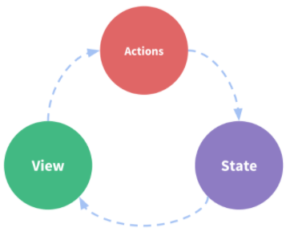

# 一、概述

[Vuex >>](https://next.vuex.vuejs.org/zh/index.html) 是一个专为 Vue.js 应用程序开发的 **状态管理模式 + 库**。它采用 **集中式** 存储管理应用的所有组件的状态，并以相应的规则保证状态以一种可预测的方式发生变化。

## 1. 什么是状态管理?

让我们从一个简单的 Vue 计数应用开始：

```vue
<script setup lang="ts">
import { reactive } from 'vue';

const state = reactive({
  count: 0 /** 状态 */,
});

const increment = () => {
  state.count++; /** 操作 */
};
</script>

<!-- 视图 -->
<template>
  <div>{{ state.count }}</div>
</template>
```

这个状态自管理应用包含以下几个部分：

- **状态**，驱动应用的数据源（`state.count`）；
- **视图**，以声明方式将 **状态** 映射到视图（模板渲染）；
- **操作**，响应在 **视图** 上的用户输入导致的状态变化（点击按钮）。

以下是一个表示 “单向数据流” 理念的简单示意：



但是，当我们的应用遇到 **多个组件共享状态** 时，单向数据流的简洁性很容易被破坏：

- 多个视图依赖于同一状态。
- 来自不同视图的行为需要变更同一状态。

对于问题一，传参的方法对于多层嵌套的组件将会非常繁琐，并且对于兄弟组件间的状态传递无能为力。

对于问题二，我们经常会采用父子组件直接引用或者通过事件来变更和同步状态的多份拷贝。

以上的这些模式非常脆弱，通常会导致无法维护的代码。Vuex 的存在，就是为了解决类似问题，Vuex将组件的共享状态抽取出来，以一个全局 **单例模式** 管理，在这种模式下，我们的组件树构成了一个巨大的“视图”，不管在树的哪个位置，任何组件都能获取状态或者触发行为！


流程：`View` → `（Dispatch）Action`  → `（Comit）Mutations` → `（Mutate）State` → `View`

解读：当用户在视图层进行某种操作需要修改数据时，通过派发（Dispatch）一个 `Action`，然后再 Action 内部提交（Commit）一次 `Mutation`，并在 Mutation 中执行数据更改，最终重渲染到视图上。

> 注意：`Action` 不是必需品，如果有异步操做才可能用到 `Action`，否则可以不使用。

## 2. 什么情况下使用 Vuex?

Vuex 可以帮助我们管理共享状态，并附带了更多的概念和框架。这需要对短期和长期效益进行权衡。

如果您不打算开发大型单页应用，使用 Vuex 可能是繁琐冗余的。确实是如此——如果您的应用够简单，您最好不要使用 Vuex。一个简单的 store 模式就足够您所需了。但是，如果您需要构建一个中大型单页应用，您很可能会考虑如何更好地在组件外部管理状态，Vuex 将会成为自然而然的选择。引用 Redux 的作者 Dan Abramov 的话说就是：

> Flux 架构就像眼镜：您自会知道什么时候需要它。

# 二、准备工作

## 1. 创建文件

```shell
# Windows
$ mkdir -p src/store; cd > src/store/index.ts
# macOS
$ mkdir -p src/store; touch src/store/index.ts
```

> **基本结构**： `src/store/index.ts`

```typescript
import { InjectionKey } from 'vue';
import { createStore, Store, useStore as _useStore } from 'vuex';

// → 为 store state 声明类型
export interface IState {}

// → 定义 injection key
export const key: InjectionKey<Store<IState>> = Symbol();

// → 构造 store
export const store = createStore<IState>({
  state: {},
  getters: {},
  mutations: {},
  actions: {},
});

// → 自定义 useStore 钩子
export const useStore = () => {
  return _useStore(key);
};
```

## 2. 安装依赖

```shell
$ npm install vuex@next
```

## 3. 注入

> `src/main.ts`

```typescript
import { store, key } from './store';
const app = createApp(App);
// → 注入路由
app.use(store, key);
app.mount('#app');
```

# 三、核心概念

## 1. State *

### 1.1. 单一状态树

Vuex 使用 **单一状态树**（单例设计模式），用一个对象就包含了全部的应用层级状态。至此它便作为一个 **唯一数据源** 而存在。这也意味着，每个应用将仅仅包含一个 store 实例。单一状态树让我们能够直接地定位任一特定的状态片段，在调试的过程中也能轻易地取得整个当前应用状态的快照。

### 1.2. 定义状态属性

我们定义一个状态属性 `count`，如下所示：

```js
state: {
  count: 0
},
```

由于我们使用的是 TypeScript，所以别忘了声明 State 类型：

```typescript
// → 为 store state 声明类型
export interface IState {
  count: number;
}
```

> 提示：每当你新增一个状态属性，都应该在 `IState` 中为其添加相应的类型声明。

### 1.3. 在组件中访问状态属性

```vue
<script setup lang="ts">
// → 导入自定义钩子函数    
import { useStore } from '../store';
// → 获取 store 对象
const store = useStore();
</script>

<template>
  <!-- 访问 store 属性 -->
  <div>{{ store.state.count }}</div>
</template>
```

## 2. Getters

Vuex 允许我们在 store 中定义 Getter（可以认为是 store 的计算属性）。就像计算属性一样，Getter的返回值会根据它的依赖被缓存起来，且只有当它的依赖值发生了改变才会被重新计算。

现在，我们在 state 中新增一个属性 `idNo` 用于记录用户的身份证号。

```typescript
export interface IState {
  count: number;
  idNo: string; /** 记录用户身份号 */
}
```

然后在 state 中赋一个初始值：

```typescript
state: {
  count: 0,
  idNo: '51321198807168888',
}
```

接下来，我们在 `getters` 字段下定义一个方法 `birth`，该方法根据 `idNo` 计算出出生年月，如下所示：

```js
getters: {
  birth: (state) => {
    let idNo  = state.idNo;
    let year  = idNo.slice(6, 10);
    let month = idNo.slice(10, 12);
    let day   = idNo.slice(12, 14);
    return `出生年月：${year}-${month}-${day}`
  }
},
```

最后，在组建中访问 `Getters`：

```vue
<div>{{ store.getters.birth }}</div>
```

## 3. Mutations *

更改 Vuex 的 store 中的状态的 **唯一方法** 是提交 `mutation`。Vuex 中的 `mutation`  非常类似于事件：每个 `mutation` 都有一个字符串的 **事件类型（函数名）** 和一个 **回调函数** ，值得注意的是，该函数只能是 **同步函数**。这个回调函数就是我们实际进行状态更改的地方，并且它会接受 `state` 作为第一个参数：

```js
mutations: {
    // → 更新state
    updateCount(state, payload: number) {
        state.count = payload;
    },
    // → 更新idNo
    updateIdNo(state, payload: string) {
        state.idNo = payload;
    },
},
```

提交修改：

```js
<script setup lang="ts">
import { useStore } from '../store';
// → 获取 store 对象
const store = useStore();
// → 事件处理函数
const increment = () => {
  /** 通过 commit 提交 mutaion，触发 state 更新 */
  store.commit('updateCount', store.state.count + 1);
};
</script>

<template>
  <!-- 访问 store 属性 -->
  <div>{{ store.getters.birth }}</div>
  <div>{{ store.state.count }}</div>
  <!-- 点击按钮，使 count 自增 -->
  <button type="button" @click="increment">INCREMENT</button>
</template>
```

## 4. Actions *

`Action` 类似于 `Mutation`，不同在于：

- `Action` 提交的是 `mutation`，而不是直接变更状态。
- `Action` 可以包含任意异步操作。

```js
actions: {
    async action_name(context, payload) {
        // → 解构上下文
        const { state, commit, getters } = context;
        // → 执行异步操作
        const data = await fetch('');
        // → 提交修改
        commit('mutation_name', data);
    },
},
```

分发 Action：

```js
store.dispatch('action_name', 'xxx');
```

## 5. modules

由于使用单一状态树，应用的所有状态会集中到一个比较大的对象。当应用变得非常复杂时，store 对象就有可能变得相当臃肿。

为了解决以上问题，Vuex 允许我们将 store 分割成**模块（module）**。每个模块拥有自己的 state、mutation、action、getter、甚至是嵌套子模块——从上至下进行同样方式的分割：

```js
const moduleA = {
  state: { ... },
  mutations: { ... },
  actions: { ... },
  getters: { ... }
}

const moduleB = {
  state: { ... },
  mutations: { ... },
  actions: { ... },
  getters: { ... }
}

const store = new Vuex.Store({
  modules: {
    a: moduleA,
    b: moduleB
  }
})

store.state.a // -> moduleA 的状态
store.state.b // -> moduleB 的状态
```

### 5.1. 模块的局部状态

对于模块内部的 `mutation` 和 `getter`，接收的第一个参数是 **模块的局部状态对象**。

```js
const moduleA = {
  state: { count: 0 },
  mutations: {
    increment (state) {
      // 这里的 state 对象是模块的局部状态
      state.count++
    }
  },
  getters: {
    doubleCount (state) {
      return state.count * 2
    }
  }
}
```

同样，对于模块内部的 action，局部状态通过 `context.state` 暴露出来，根节点状态则为 `context.rootState`：

```js
const moduleA = {
  // ...
  actions: {
    incrementIfOddOnRootSum ({ state, commit, rootState }) {
      if ((state.count + rootState.count) % 2 === 1) {
        commit('increment')
      }
    }
  }
}
```

对于模块内部的 getter，根节点状态会作为第三个参数暴露出来：

```js
const moduleA = {
  // ...
  getters: {
    sumWithRootCount (state, getters, rootState) {
      return state.count + rootState.count
    }
  }
}
```

### 5.2. 命名空间

[参考这里 >>](https://next.vuex.vuejs.org/zh/guide/modules.html#%E5%B8%A6%E5%91%BD%E5%90%8D%E7%A9%BA%E9%97%B4%E7%9A%84%E7%BB%91%E5%AE%9A%E5%87%BD%E6%95%B0)

# 四、拓展

vuex会遇到一个尴尬的问题，就是当用户手动刷新页面之后状态会被清空，我们可以在页面刷新的时候将状态存本地，每次加载的时候再读取就是了，具体操作如下：

```js
// → main.js
// → 页面进入：合并状态
const localState = localStorage.getItem('LOCAL_STATE');
if (localState) {
  console.log('合并Store...');
  store.replaceState(Object.assign(store.state, JSON.parse(localState)));
}
// → 页面刷新：存储状态
window.addEventListener('beforeunload', () => {
  console.log('缓存Store...');
  localStorage.setItem('LOCAL_STATE', JSON.stringify(store.state));
});
```