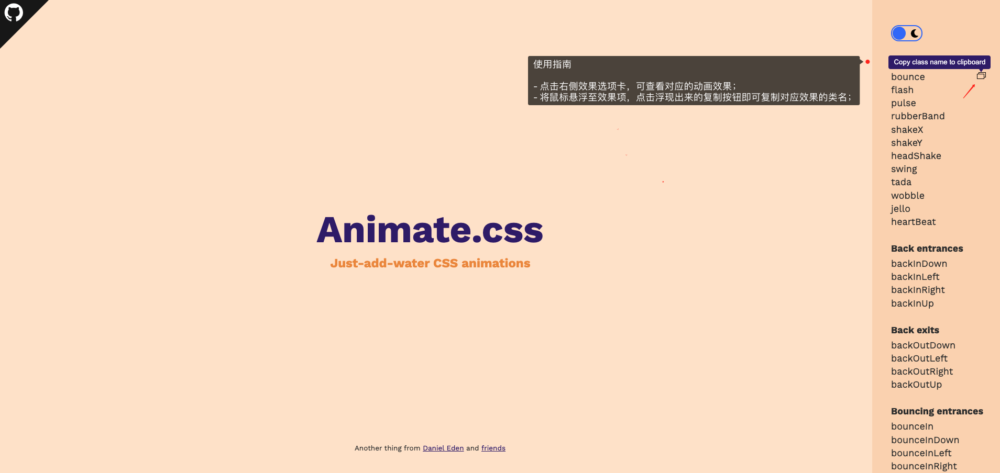
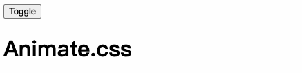
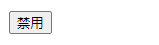
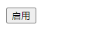
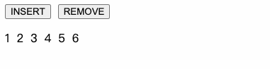
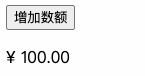

# 一、概述

先来看两个概念，了解过渡与动画：

> 过渡（Transition）：
>
> - 过渡是指在元素状态发生改变时，从一个状态过渡到另一个状态的过程。
> - 在 CSS 中，可以使用过渡效果来定义元素在不同状态之间的平滑过渡。
> - 过渡可以控制元素的属性（如位置、大小、颜色等）在不同状态之间的渐变变化。
> - 过渡通常由两个主要的属性组成：`transition-property`（指定要过渡的属性）和 `transition-duration`（指定过渡的持续时间）

> 动画（Animation）：
>
> - 动画是指元素从一个状态到另一个状态的平滑变化，带有一定的时间间隔和连续的帧。
> - 在 CSS 中，可以使用关键帧动画（Keyframe Animation）来定义元素的动画效果。
> - 动画可以通过指定关键帧（即动画的每个阶段）和关键帧之间的过渡方式来描述元素的运动和变化。
> - 动画通常由多个关键帧和一些属性组成，如 `animation-name`（指定动画的名称）、`animation-duration`（指定动画的持续时间）和 `animation-timing-function`（指定动画的过渡方式）等

二者都会让你的页面元素动起来，区别在于：

**过渡（Transition）**

- 需要事件触发，比如 `hover`、`click` 等；
- 一次性的；
- 只能定义开始和结束状态，不能定义中间状态；

**动画（Animation）**

- 不需要事件触发；
- 显示地随着时间的流逝，周期性的改变元素的 CSS 属性值，区别于一次性。
- 通过百分比来定义过程中的不同形态，可以很细腻。

# 二、忆往昔

我们先来简单回顾一下在CSS中如何实现过渡与动画效果。

## 1. Transition in CSS

```vue
<script setup lang="ts">
// -- imports
import { ref } from 'vue';

// -- refs
const transition = ref(false);
</script>

<template>
  <div class="box" :class="{ transition }"></div>
  <button type="button" @click="transition = !transition">Toggle</button>
</template>

<style scoped>
.box {
  width: 100px;
  height: 100px;
  margin-bottom: 16px;
  background-color: red;
  transition: 0.5s background-color linear;
}
.transition {
  background-color: blue;
}
</style>
```

演示效果：


## 2. Animation in CSS

```vue
<script setup lang="ts">
// -- imports
import { ref } from 'vue';
// -- refs
const ani = ref(false);
</script>
<template>
  <div class="box" :class="{ ani }"></div>
  <button type="button" @click="ani = !ani">启用动画</button>
</template>

<style scoped>
@keyframes ani {
  to {
    transform: translateX(300px);
    background-color: blue;
  }
}
.box {
  width: 100px;
  height: 100px;
  margin-bottom: 16px;
  background-color: red;
}
.ani {
  animation: ani 2s linear 1 forwards;
}
</style>
```

演示效果：


# 三、过渡 & 动画

接下来，我们一起了解在 Vue 中，如何使用过渡与动画。

## 1. 基本使用

内置组件 `<transition />` 在下面情况中，可以给任何元素和组件添加进入和离开动画。

- 由 `v-if` 所触发的切换
- 由 `v-show` 所触发的切换
- 由特殊元素 `<component>` 切换的动态组件
- 改变特殊的 `key` 属性

> 提示：`<Transition>` 仅支持单个元素或组件作为其插槽内容。如果内容是一个组件，这个组件必须仅有一个根元素。

当一个 `<Transition>` 组件中的元素被插入或移除时，会发生下面这些事情：

1. Vue 会自动检测目标元素是否应用了 CSS 过渡或动画。如果是，则一些 [CSS 过渡 class](https://cn.vuejs.org/guide/built-ins/transition.html#transition-classes) 会在适当的时机被添加和移除。
2. 如果有作为监听器的 [JavaScript 钩子](https://cn.vuejs.org/guide/built-ins/transition.html#javascript-hooks)，这些钩子函数会在适当时机被调用。
3. 如果没有探测到 CSS 过渡或动画、也没有提供 JavaScript 钩子，那么 DOM 的插入、删除操作将在浏览器的下一个动画帧后执行。

## 2. 过渡类名

在进入/离开的过渡中，会有 6 个 class 切换。


1. `v-enter-from`：进入动画的起始状态。在元素插入之前添加，在元素插入完成后的下一帧移除。
2. `v-enter-active`：进入动画的生效状态。应用于整个进入动画阶段。在元素被插入之前添加，在过渡或动画完成之后移除。这个 class 可以被用来定义进入动画的持续时间、延迟与速度曲线类型。
3. `v-enter-to`：进入动画的结束状态。在元素插入完成后的下一帧被添加 (也就是 `v-enter-from` 被移除的同时)，在过渡或动画完成之后移除。
4. `v-leave-from`：离开动画的起始状态。在离开过渡效果被触发时立即添加，在一帧后被移除。
5. `v-leave-active`：离开动画的生效状态。应用于整个离开动画阶段。在离开过渡效果被触发时立即添加，在过渡或动画完成之后移除。这个 class 可以被用来定义离开动画的持续时间、延迟与速度曲线类型。
6. `v-leave-to`：离开动画的结束状态。在一个离开动画被触发后的下一帧被添加 (也就是 `v-leave-from` 被移除的同时)，在过渡或动画完成之后移除。

注意：假设 `transition` 设有 `name`  属性，class 名将 `v-` 替换为 `name 属性值-`。

比如：`<transition name="fade >"`，那么 `v-enter-from` 将被替换为 `fade-enter-from`，以此类推。

## 3. 单元素/组件过渡

### 3.1. CSS 过渡

CSS 过渡是最常用的过渡类型之一，举例：

```vue
<script setup lang="ts">
import { ref } from 'vue';
const visible = ref(true);
</script>

<template>
  <button type="button" @click="visible = !visible">Toggle</button>
  <transition name="slide-fade">
    <div v-show="visible" class="box"></div>
  </transition>
</template>

<style scoped>
.box {
  width: 100px;
  height: 100px;
  margin-top: 16px;
  background-color: red;
}
/* 可以为进入和离开动画设置不同的持续时间和动画函数 */
.slide-fade-enter-active {
  transition: all 0.75s ease-out;
}

.slide-fade-leave-active {
  transition: all 1s cubic-bezier(1, 0.5, 0.8, 1);
}

.slide-fade-enter-from,
.slide-fade-leave-to {
  transform: translateX(300px);
  opacity: 0;
}
</style>
```

效果演示：


上述示例，点击 `Toggle` 按钮，切换元素显示状态，使得元素向右位移 300 像素，透明逐渐为0隐藏元素，呈现元素效果相反。

### 3.2. CSS 动画

CSS 动画用法同 CSS 过渡，区别是在动画中 `v-enter-from` 类在节点插入 DOM 后不会立即移除，而是在 `animationend` 事件触发时移除。

```vue
<script setup lang="ts">
import { ref } from 'vue';
const visible = ref(true);
</script>

<template>
  <button type="button" @click="visible = !visible">Toggle</button>
  <transition name="bounce">
    <div v-show="visible" class="box"></div>
  </transition>
</template>

<style scoped>
.box {
  width: 100px;
  height: 100px;
  margin-top: 16px;
  background-color: red;
}
.bounce-enter-active {
  animation: bounce-in 0.5s;
}
.bounce-leave-active {
  animation: bounce-in 0.5s reverse;
}
@keyframes bounce-in {
  0% {
    transform: scale(0);
  }
  50% {
    transform: scale(1.25);
  }
  100% {
    transform: scale(1);
  }
}
</style>

```

> 代码解读：
>
> 1）上述示例中，通过 `@keyframes` 定义 `bounce-in` 动画，该动画从0开始缩放到1.25倍再调整到1倍，所以有会一种从无到有，先放大再缩回原始尺寸的效果。
>
> 2）隐藏元素时同样使用 `bounce-in` 动画，不过增加了 `reverse` 关键字，该关键字的作用和显示的动画刚好相反，让预定义动画反向执行。

效果演示：


### 3.3. 自定义类名 & animate.css

我们可以通过以下属性来自定义过渡类名：

- `enter-from-class`
- `enter-active-class`
- `enter-to-class`
- `leave-from-class`
- `leave-active-class`
- `leave-to-class`

它们的优先级高于普通的类名，当你希望将其它第三方 CSS 动画库与 Vue 的过度系统相结合时十分有用，比如 [Animate.css](https://daneden.github.io/animate.css/)。

接下来我们尝试使用 Animate.css：

**Steps 1：安装 animate.css**

```shell
$ npm install animate.css
```

**Steps 2：导入**

```js
import 'animate.css'
```

**Steps 3：打开 [Animate.css >>](https://animate.style/) 官网，选择效果并复制效果类名（class name)**



应用示例：

```html
<h1 class="animate__animated animate__bounce">An animated element</h1>
```

> 提示：`animate__animated` 这个 className **一定要** 加上，**不能省略**。

**Steps 4： 编写代码，粘贴效果类名（class name)**


```html
<script setup lang="ts">
import { ref } from 'vue';
const visible = ref(true);
</script>

<template>
  <button type="button" @click="visible = !visible">Toggle</button>
  <transition
    enter-active-class="animate__animated animate__bounceIn"
    leave-active-class="animate__animated animate__slideOutRight"
  >
    <h1 v-show="visible">Animate.css</h1>
  </transition>
</template>
```

效果演示：



### 3.4. 同时使用过渡和动画

Vue 为了知道过渡何时完成，必须设置相应的事件监听器。它可以是 `@transitionend` 或 `@animationend`，这取决于给元素应用的 CSS 规则。如果你只使用了其中一种，Vue 能自动识别其正确类型。

但是，在一些场景中，你需要给同一个元素同时设置两种过渡动效，比如有一个通过 Vue 触发的 CSS 动画，并且在悬停时结合一个 CSS 过渡。在这种情况中，你就需要使用 `type` 属性并设置 `animation` 或 `transition` 来显式声明你需要 Vue 监听的类型。

### 3.5. 显性的过渡持续时间

Vue 在 `<transition>` 组件上提供 `duration` 属性显式指定过渡持续时间 (以毫秒计)：

```vue
<transition :duration="1000">...</transition>
```

你也可以分别指定进入和离开的持续时间：

```vue
<transition :duration="{ enter: 500, leave: 800 }">...</transition>
```

### 3.6. JavaScript 钩子函数

可以在 属性 中声明 JavaScript 钩子：

```vue
<transition
  @before-enter="beforeEnter"
  @enter="enter"
  @after-enter="afterEnter"
  @enter-cancelled="enterCancelled"
  @before-leave="beforeLeave"
  @leave="leave"
  @after-leave="afterLeave"
  @leave-cancelled="leaveCancelled"
  :css="false"
>
  <!-- ... -->
</transition>
```

- 和之前在 CSS 中的类名类似，这些钩子函数会在过渡到了对应阶段调用；
- `cancelled` 是在过程中撤销操作，才会回调;
- `enter` 和 `leave` 对应的钩子函数有两个参数：
  - `el`：参与动画的元素；
  - `done`：过渡过程是否完成；
- `css:false`：使元素设置的动画 CSS 失效；

## 4. 初始渲染的过渡

可以通过 `appear` 属性设置节点在 **初始渲染**（即页面在初始化的时候就执行一次动画） 的过渡：

```vue
<transition appear>
  <!-- ... -->
</transition>
```

## 5、多元素过渡

对于原生标签可以使用 `v-if`/`v-else` 。最常见的多标签过渡是一个列表和描述这个列表为空消息的元素：

```html
<transition>
  <table v-if="items.length > 0">
    <!-- ... -->
  </table>
  <p v-else>Sorry, no items found.</p>
</transition>
```

实际上，通过使用 `v-if`/`v-else-if`/`v-else` 或将单个元素绑定到一个动态属性，可以在任意数量的元素之间进行过渡。例如：

```html
<transition>
  <button v-if="docState === 'saved'" key="saved">Edit</button>
  <button v-else-if="docState === 'edited'" key="edited">Save</button>
  <button v-else-if="docState === 'editing'" key="editing">Cancel</button>
</transition>
```

可以重写为：

```vue
<script setup lang="ts">
import { ref, computed } from 'vue';

const docState = ref('saved');

const buttonMessage = computed(() => {
  switch (docState.value) {
    case 'saved':return 'Edit';
    case 'edited':return 'Save';
    case 'editing': return 'Cancel';
  }
});
</script>

<template>
  <transition>
    <button :key="docState">{{buttonMessage}}</button>
  </transition>
</template>
```

### @过渡模式

`<transition>` 的默认行为 - 进入和离开同时发生，即 **上一个组件还在消失的过程中，但下一个组件已经在出现过程中**。我们看看一组示例：

```vue
<script setup lang="ts">
import { ref, computed } from 'vue';

// -- 定义 buttonState 形状（TS语法）
type ButtonStateType = 'disable' | 'enable';
// -- 定义 buttonState 变量，其类型为 ButtonStateType
const buttonState = ref<ButtonStateType>('disable');
</script>

<template>
  <transition>
    <button type="button" v-if="buttonState === 'enable'" @click="buttonState = 'disable'">禁用</button>
    <button type="button" v-else @click="buttonState = 'enable'">启用</button>
  </transition>
</template>

<style scoped>

@keyframes move-in {
  from {
    transform: translateX(100px);
    opacity: 0;
  }
  to {
    transform: translateX(0);
    opacity: 1;
  }
}

button {
  /* 为了方便查看效果，使用绝对定位使其重叠在一起 */
  position: absolute;
}
.v-enter-active {
  animation: move-in 1s linear;
}
.v-leave-active {
  animation: move-in 1s linear reverse;
}
</style>
```

示例效果：


可以看到，在多组件切换时，进入和离开是同时发生的。同时生效的进入和离开的过渡不能满足所有要求，所以 Vue 提供了 **过渡模式**

- `in-out`：新元素先进行进入过渡，完成之后当前元素过渡离开。

- `out-in`：当前元素先进行离开过渡，完成之后新元素过渡进入。

语法形式如下：

```vue
<transition mode="in-out">
  <!-- ... the buttons ... -->
</transition>
```

接下来，我们切换两种模式查看效果：

> **`in-out`**



> **`out-in`**



不难发现，`in-out` 和 `out-in` 模式刚好相反。

# 四、列表过渡

目前为止，关于过渡我们已经讲到：

- 单个节点
- 多个节点，每次只渲染一个

那么怎么同时渲染整个列表，比如使用 `v-for`？在这种场景下，我们会使用 `<transition-group>` 组件。在我们深入例子之前，先了解关于这个组件的几个特点：

- 默认情况下，它不会渲染一个包裹元素，但是你可以通过 `tag` 属性 指定渲染一个元素。
- 过渡模式不可用，因为我们不再相互切换特有的元素。
- 内部元素 **总是需要** 提供唯一的 `key` 属性值。
- CSS 过渡的类将会应用在内部的元素中，而不是这个组/容器本身。

## 1. 列表的进入& 离开过渡

现在让我们由一个简单的例子深入，进入和离开的过渡使用之前一样的 CSS 类名。

```vue
<script setup lang="ts">
import { reactive } from 'vue';

const state = reactive({
  list: [1, 2, 3, 4, 5, 6],
  nextNum: 7,
});

// methods
const randomIndex = () => Math.floor(Math.random() * state.list.length);
// events
const onInsert = () => {
  state.list.splice(randomIndex(), 0, ++state.nextNum);
};
const onRemove = () => {
  state.list.splice(randomIndex(), 1);
};
</script>

<template>
  <!-- 按钮 -->
  <button type="button" @click="onInsert">INSERT</button>
  <button type="button" @click="onRemove">REMOVE</button>
  <!-- 列表渲染 -->
  <transition-group name="list" tag="div" class="list">
    <div class="item" v-for="item in state.list" :key="item">
      {{ item }}
    </div>
  </transition-group>
</template>

<style scoped>
button {
  margin-right: 10px;
  margin-bottom: 16px;
  cursor: pointer;
}
.item {
  display: inline-block;
  margin-right: 10px;
}

.list-enter-active,
.list-leave-active {
  transition: all 1s ease;
}
.list-enter-from,
.list-leave-to {
  opacity: 0;
  transform: translateY(30px);
}
</style>
```

示例效果：



这个例子有一个问题，当添加和移除元素的时候，周围的元素会 **瞬间移动** 到它们的新布局的位置，而不是平滑的过渡，我们下面会解决这个问题。

## 2. 列表的移动过渡

为了解决上述示例在添加元素时瞬间移动的问题，可以使用新增的 **`v-move`** 类，它会应用在元素改变定位的过程中。像之前的类名一样，它的前缀可以通过 `name` 属性来自定义，也可以通过 `move-class` 属性手动设置。

`v-move` 对于设置过渡的切换时机和过渡曲线非常有用，继续上述的例子，我们通过 [Lodash >>](https://www.lodashjs.com/)  打乱集合顺序。

首先安装 loadash：

```shell
$ npm install lodash
$ npm install @types/lodash --save-dev
```

修改示例代码：

```vue
<script setup lang="ts">
// +++
import _ from 'lodash';
// +++

import { reactive } from 'vue';

const state = reactive({
  list: [1, 2, 3, 4, 5, 6],
  nextNum: 7
});

// methods
const randomIndex = () => Math.floor(Math.random() * state.list.length);
// events
// +++
const onShuffle = () => {
  // 打乱集合顺序
  state.list = _.shuffle(state.list);
};
// +++
const onInsert = () => {
  state.list.splice(randomIndex(), 0, ++state.nextNum);
};
const onRemove = () => {
  state.list.splice(randomIndex(), 1);
};
</script>

<template>
  <!-- +++ -->
  <button type="button" @click="onShuffle">SHUFFLE</button>
  <!-- +++ -->
  <button type="button" @click="onInsert">INSERT</button>
  <button type="button" @click="onRemove">REMOVE</button>
  <transition-group name="list" tag="div" class="list">
    <div class="item" v-for="item in state.list" :key="item">
      {{ item }}
    </div>
  </transition-group>
</template>

<style scoped>
button {
  margin-right: 10px;
  margin-bottom: 16px;
  cursor: pointer;
}
.item {
  display: inline-block;
  margin-right: 10px;
}

/* +++ */
.list-move {
  transition: transform 1s;
}
/* +++ */

.list-enter-active,
.list-leave-active {
  transition: all 1s ease;
}
.list-enter-from,
.list-leave-to {
  opacity: 0;
  transform: translateY(30px);
}
</style>
```

> 提示：代码中的 `+++` 表示新增代码。

演示效果：


这个看起来很神奇，其实 Vue 内部使用了一个叫 [FLIP](https://aerotwist.com/blog/flip-your-animations/) 的动画技术，它使用 transform 将元素从之前的位置平滑过渡到新的位置。

> 提示：需要注意的是使用 FLIP 过渡的元素不能设置为 `display: inline`。作为替代方案，可以设置为 `display: inline-block` 或者将元素放置于 flex 布局中。

## 3. 列表的交错过渡

通过 data 属性与 JavaScript 通信，就可以实现列表的交错过渡：

```vue
<script setup lang="ts">
import { reactive } from 'vue';
import gsap from 'gsap';

interface StateProps {
  list: number[] | null;
}
const state = reactive<StateProps>({
  list: null,
});

// -- 模拟请求数据
setTimeout(() => {
  state.list = [1, 2, 3, 4, 5];
}, 1000);

const beforeEnter = (el: Element) => {
  const dom = el as HTMLDivElement;
  dom.style.cssText = 'opacity: 0; transform: translateY(30px)';
};
const enter = (el: Element, done: () => void) => {
  const dom = el as HTMLDivElement;
  const dataset = dom.dataset;
  const index = dataset.index || ''; /** 获取data-index，用于设置延迟以达到列表交错效果 */
  gsap.to(dom, {
    duration: 1,
    opacity: 1,
    translateY: 0,
    delay: +index * 0.25,
    onComplete: done,
  });
};
</script>

<template>
  <transition-group
    tag="div"
    :css="false"
    @before-enter="beforeEnter"
    @enter="enter"
  >
    <div
      class="item"
      v-for="(item, index) in state.list"
      :key="item"
      :data-index="index"
    >
      <div class="avatar"></div>
      <div class="info">
        <div class="title"></div>
        <div class="desc"></div>
      </div>
    </div>
  </transition-group>
</template>

<style scoped>
.item {
  width: 90%;
  padding: 10px;
  border-radius: 6px;
  box-shadow: 0 0 10px 1px #eeeeee;
  margin: 0 auto 16px;
  display: flex;
  align-items: center;
}
.avatar {
  width: 60px;
  height: 60px;
  background: #6bb6fc;
  border-radius: 12px;
  margin-right: 16px;
}
.title {
  width: 160px;
  height: 20px;
  border-radius: 20px;
  background: #6bb6fc;
  margin-bottom: 10px;
}
.desc {
  width: 80px;
  height: 20px;
  border-radius: 20px;
  background: #9ed0f8;
}
</style>
```

演示效果：


# 五、状态过渡

Vue 的过渡系统提供了非常多简单的方法来设置进入、离开和列表的动效，那么对于数据元素本身的动效呢？比如：

- 数字和运算
- 颜色的显示
- SVG 节点的位置
- 元素的大小和其他的属性

这些数据要么本身就以数值形式存储，要么可以转换为数值。有了这些数值后，我们就可以结合 Vue 的响应性和组件系统，使用 **第三方库** 来实现切换元素的过渡状态。

## @GSAP

GSAP是 GreenSock 提供的一个制作动画的 JavaScript 库：

- [英文官网 >>](https://greensock.com/)

- [中文网地址 >>](https://www.tweenmax.com.cn/index.html)

接下来，我们通过 GSAP 结合 Vue 实现数字滚动的效果。

首先，安装 gsap：

```shell
$ npm install gsap
```

然后直接上示例代码：

```vue
<script setup lang="ts">
import { reactive } from 'vue';
import gsap from 'gsap';

const state = reactive({
  count: 100,
});

const onPlus = () => {
  gsap.to(state, {
    duration: 0.75 /** 持续时间 */,
    count: state.count + Math.random() * 100 /** 变更key-value */,
    ease: 'sine' /** 速度曲线 */,
  });
};
</script>

<template>
  <button type="button" style="cursor: pointer" @click="onPlus">增加数额</button>
  <p>&yen;&nbsp;{{ state.count.toFixed(2) }}</p>
</template>
```

演示效果：



# 六、Examples

## 👉 位移动画@v-move-active

列表的进入 & 离开过渡，对列表直接操作（增、删）的元素，封装 **\<transition-group>** 并按常规的 CSS 或 JS 过渡即可；但在操作这些元素的位置变化时，由于DOM文档流的变化，会同时引起其它（邻近）节点元素的位置变化，例如在列表插入一个\<li>，插入点原本的\<li>会下移，删除一个\<li>，下面的\<li>会上移补充占据这个位置。 

对于这些 “被动” 移动的元素来说，也可以实现过渡，这就用到了 `v-move` 特性，其中 `v` 和过渡属性类似，依赖于 `name` 属性的设定，假设设置 **\<transition-group name="list">**，则设置过渡属性的类名为：`.list-move`。

实现效果：


实现代码：

```vue

<script setup lang="ts">
import { reactive } from 'vue';

interface StateProps {
  list: Array<number>;
  next: number;
}
// -- state
const state = reactive<StateProps>({
  list: [1, 2, 3, 4],
  next: 4,
});

// -- methods
const randomIndex = () => Math.floor(Math.random() * state.list.length);

// -- events
const onInsert = () => {
  state.list.splice(randomIndex(), 0, ++state.next);
};
const onRemove = () => {
  state.list.splice(randomIndex(), 1);
};
</script>

<template>
  <div class="page">
    <transition-group class="list" tag="ul" name="list">
      <!-- key 值不能使用下标index，否则动画无效 -->
      <div v-for="item in state.list" :key="item" class="item">
        {{ item }}
      </div>
    </transition-group>
    <div class="actions">
      <button @click="onInsert">INSERT</button>
      <button @click="onRemove">REMOVE</button>
    </div>
  </div>
</template>

<style lang="less">
.page {
  display: flex;
  flex-direction: column;
  align-items: center;
}

.list-enter-from {
  opacity: (0);
  transform: translateY(-50px);
}
.list-enter-to {
  opacity: (1);
  transform: translateY(0);
}
.list-leave-from {
  opacity: (1);
}
.list-leave-to {
  opacity: (0);
}
.list-move,
.list-enter-active,
.list-leave-active {
  transition: all 0.5s ease;
}
// -- Tips：要让删除的元素脱离文档流，后面的元素才会过渡过来
.list-leave-active {
  position: absolute;
}

.list {
  margin: 50px auto;
  white-space: nowrap;
  .item {
    display: inline-block;
    width: 120px;
    line-height: 160px;
    text-align: center;
    background: linear-gradient(to bottom, #000 10%, red);
    font-size: 36px;
    color: #ffffff;
    font-family: 'Times New Roman', Times, serif;
    &:not(:last-child) {
      margin-right: 2px;
    }
  }
}

.actions {
  button {
    cursor: pointer;
    &:not(:last-child) {
      margin-right: 10px;
    }
  }
}
</style>

```

## 👉 无限滚动

在实际开发中，首页可能会循环播放一些假数据以实现实时播报的功能，如如下效果：


实现代码：

```vue
<script setup lang="ts">
import { onMounted, onBeforeUnmount, reactive, nextTick } from 'vue';


interface StateProps {
  colors: Array<{ label: string; color: string }>;
  timer: any;
}
  
// -- state
const state = reactive<StateProps>({
  colors: [
    { label: 'A', color: '#4b69ff' },
    { label: 'B', color: '#e4ae39' },
    { label: 'C', color: '#8847ff' },
    { label: 'D', color: '#d32ce6' },
    { label: 'E', color: '#eb4b4b' },
  ],
  timer: null,
});

// -- life circles
onMounted(() => {
  state.timer = setInterval(() => {
    const color = state.colors.pop();
    if (color) {
      nextTick(() => {
        state.colors.unshift(color);
      });
    }
  }, 2000);
});
onBeforeUnmount(() => {
  clearInterval(state.timer);
});

// -- methods
const getBgColor = (colorStop: string) => {
  return `linear-gradient(to bottom, #000 10%, ${colorStop} 100%)`;
};
</script>

<template>
  <div class="page">
    <transition-group class="list" tag="ul" name="list">
      <!-- key 值不能使用下标index，否则动画无效 -->
      <div
        v-for="item in state.colors"
        :key="item.label"
        class="item"
        :style="{ background: getBgColor(item.color) }"
      >
        {{ item.label }}
      </div>
    </transition-group>
  </div>
</template>

<style lang="less">
  
.list-enter-from,
.list-leave-to {
  opacity: 0;
  transform: translateY(-30px);
}
.list-enter-to,
.list-leave-from {
  opacity: 1;
  transform: translateY(0);
}
.list-move,
.list-enter-active,
.list-leave-active {
  transition: all 1.5s ease;
}
  
.list {
  width: calc(120px * 4);
  margin: 50px auto;
  white-space: nowrap;
  overflow-x: hidden;
  .item {
    display: inline-block;
    width: 120px;
    line-height: 160px;
    text-align: center;
    background-color: red;
    font-size: 36px;
    color: #ffffff;
    font-family: 'Times New Roman', Times, serif;
  }
}
</style>
```


