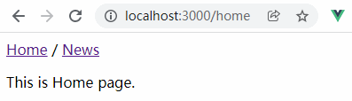

官网链接：<https://router.vuejs.org/zh/>

# 一、概述

Vue Router 是 [Vue.js](http://cn.vuejs.org/) 官方的路由管理器。它和 Vue.js 的核心深度集成，让构建单页面应用变得易如反掌。包含的功能有：

- 嵌套的路由/视图表
- 模块化的、基于组件的路由配置
- 路由参数、查询、通配符
- 基于 Vue.js 过渡系统的视图过渡效果
- 细粒度的导航控制
- 带有自动激活的 CSS class 的链接
- HTML5 历史模式或 hash 模式，在 IE9 中自动降级
- 自定义的滚动条行为

用 Vue.js + Vue Router 创建单页应用，是非常简单的。使用 Vue.js ，我们已经可以通过组合组件来组成应用程序，当你要把 Vue Router 添加进来，我们需要做的是，将组件 (components) 映射到路由 (routes)，然后告诉 Vue Router 在哪里渲染它们。

# 二、安装

```shell
# NPM
$ npm install vue-router
# YARN
$ yarn add vue-router
```

# 三、初探

使用路由的基本流程：

1. 下载 vue-router
2. 导入路由 import Router from "vue-router"
3. 导入页面组件
4. Use路由 Vue.use(Router)
5. 创建路由实例 new Router({ routes: []})
6. 将组件渲染在路由中(配置路由)
7. 在Vue的实例配置对象中注入路由

我们以一个实例了解路由（router）基本使用，基本的布局结构参考路径设置，本例以模块封装实现路由配置

-> ./src/router/index.js

```js
import Vue from 'vue'
import VueRouter from 'vue-router'
import Home from '../views/Home.vue'

Vue.use(VueRouter)

const routes = [
  {
    path: '/',			 // => 设置路径		
    name: 'home',		 // => 命名路由
    component: Home
  },
  {
    path: '/about',
    name: 'about',
    // route level code-splitting
    // this generates a separate chunk (about.[hash].js) for this route
    // which is lazy-loaded when the route is visited.
    component: () => import(/* webpackChunkName: "about" */ '../views/About.vue')
  }
]

const router = new VueRouter({
  mode: 'history',
  routes
})

export default router
```

-> ./src/main.js

```js
import Vue from 'vue'
import App from './App.vue'
import router from './router'

Vue.config.productionTip = false

new Vue({
  router,
  render: h => h(App)
}).$mount('#app')
```

-> ./src/App.vue

```vue
<template>
  <div id="app">
    <div id="nav">
      <router-link to="/">Home</router-link> |
      <router-link to="/about">About</router-link>
    </div>
    <router-view/>
  </div>
</template>

<style lang="less">
#app {
  font-family: 'Avenir', Helvetica, Arial, sans-serif;
  -webkit-font-smoothing: antialiased;
  -moz-osx-font-smoothing: grayscale;
  text-align: center;
  color: #2c3e50;
}

#nav {
  padding: 30px;

  a {
    font-weight: bold;
    color: #2c3e50;

    &.router-link-active {
      color: #42b983;
    }
  }
}
</style>
```

示例效果：



> 注意：
>
> 1. 路由实例创建后需在vue实例中注册路由。
> 2. 通过 \<router-link> 实现路由动态切换，最终会被渲染成超链接。
> 3. 通过 \<router-view> 呈现路由切换后显示的组件内容。

# 四、基础

## 1. 路由嵌套 *

实际生活中的应用界面，通常由多层嵌套的组件组合而成。同样地，URL 中各段动态路径也按某种结构对应嵌套的各层组件，例如：

```
/web/html
/web/css
/web/javascript
```

```js
{
  path: '/web',
  name: 'web',
  component: Web,
  // 重定向
  redirect: '/web/html',
  // 配置子路由
  children: [
    {path: 'html', name: 'html', component: Html},
    {path: 'css', name: 'css', component: Css},
    {path: 'javascript', name: 'javascript', component: JavaScript},
  ]
},
```

**注意事项：**

- 配置路由时通过指定 **children** 属性来配置当前路由的子路由。
- 子路由属于谁，\<router-view /> 就写在谁下面。 *
- 默认重定向，使用 **redirect** 属性。
- 如果子路由在主页中，设置path属性时，直接 `/子路由路径` 即可。

## 2. 编程式的导航 

除了使用 `<router-link>` 创建 a 标签来定义导航链接，我们还可以借助 router 的实例方法，通过编写代码来实现。

### 2.1. router.push() *

语法如下：

```js
router.push(location, onComplete?, onAbort?)
```

> 注意：在 Vue 实例内部，你可以通过 \$router 访问路由实例。因此你可以调用 this.$router.push。

想要导航到不同的 URL，则使用 *router.push* 方法。这个方法会向 history 栈添加一个新的记录，所以，当用户点击浏览器后退按钮时，则回到之前的 URL。

当你点击 *\<router-link>* 时，这个方法会在内部调用，所以说，点击 *\<router-link :to="…">*  等同于调用 *router.push(…)*。

| 声明式                   | 编程式         |
| ------------------------ | -------------- |
| \<router-link :to="..."> | router.push(…) |

该方法的参数可以是一个字符串路径，或者一个描述地址的对象。例如：

```js
// 字符串
router.push('home')

// 对象
router.push({ path: 'home' })

// 命名的路由
router.push({ name: 'user', params: { userId: '123' }})

// 带查询参数，变成 /register?plan=private
router.push({ path: 'register', query: { plan: 'private' }})
```

> 注意：如果提供了 path，params 会被忽略，上述例子中的 query 并不属于这种情况。取而代之的是下面例子的做法，你需要提供路由的 name 或手写完整的带有参数的 path。

```js
const userId = 123
router.push({ name: '/home', params: { userId }}) // -> /user/123
router.push({ path: `/home/${userId}` }) // -> /user/123
// 这里的 params 不生效
router.push({ path: '/user', params: { userId }}) // -> /user
```

同样的规则也适用于 \<router-link\>  组件的 `to` 属性。

在 2.2.0+，可选的在 *router.push* 或 *router.replace* 中提供 `onComplete` 和 `onAbort` 回调作为第二个和第三个参数。这些回调将会在导航成功完成 (在所有的异步钩子被解析之后) 或终止 (导航到相同的路由、或在当前导航完成之前导航到另一个不同的路由) 的时候进行相应的调用。

> 注意：
>
> 如果目的地和当前路由相同，只有参数发生了改变 (比如从一个用户资料到另一个 `/users/1`-> `/users/2`)，你需要使用 [`beforeRouteUpdate`](https://router.vuejs.org/zh/guide/essentials/dynamic-matching.html#%E5%93%8D%E5%BA%94%E8%B7%AF%E7%94%B1%E5%8F%82%E6%95%B0%E7%9A%84%E5%8F%98%E5%8C%96) 来响应这个变化 (比如抓取用户信息)。

### 2.2. router.replace()

语法如下：

```
router.replace(location, onComplete?, onAbort?)
```

跟 *router.push* 很像，唯一的不同就是，它不会向 history 添加新记录，而是跟它的方法名一样 —— 替换掉当前的 history 记录。

| 声明式                            | 编程式              |
| --------------------------------- | ------------------- |
| \<router-link :to="..."  replace> | router.replace(...) |

### 2.3. router.go()

这个方法的参数是一个整数，意思是在 history 记录中向前或者后退多少步，类似 `window.history.go(n)`。

```js
// 在浏览器记录中前进一步，等同于 history.forward()
router.go(1)

// 后退一步记录，等同于 history.back()
router.go(-1)

// 前进 3 步记录
router.go(3)

// 如果 history 记录不够用，那就默默地失败呗
router.go(-100)
router.go(100)
```

## 3. 命名路由

有时候，通过一个名称来标识一个路由显得更方便一些，特别是在链接一个路由，或者是执行一些跳转的时候。你可以在创建 Router 实例的时候，在 `routes` 配置中给某个路由设置名称。

```js
{
  path: '/commodities/:kind',
  name: 'commodities',
  component: Commodities
}
```

要链接到一个命名路由，可以给 `router-link` 的 `to` 属性传一个对象：

```html
<router-link :to="{name:'commodities',params:{ kind:'phone'}}">Commodities</router-link>
```

这跟代码调用 `router.push()` 是一回事：

```js
router.push({ name:'commodities',params:{kind:'phone'}})
```

这两种方式都会把路由导航到 `/commodities/phone` 路径。

## 4. 命名视图

有时候想同时 (同级) 展示多个视图，而不是嵌套展示，例如创建一个布局，有 `sidebar` (侧导航) 和 `main` (主内容) 两个视图，这个时候命名视图就派上用场了。你可以在界面中拥有多个单独命名的视图，而不是只有一个单独的出口。如果 `router-view` 没有设置名字，那么默认为 `default`。

```html
<router-view />
<router-view name="a" />
<router-view name="b" />
```

一个视图使用一个组件渲染，因此对于同个路由，多个视图就需要多个组件。确保正确使用 `components` 配置 (带上 s)：

```js
export default new Router({
  routes: [
    {
      path: '/',
      name: 'home',
      components: {
        default: Home,
        a: componentA,
        b: componentB
      }
    }
  ]
})
```

## 5. 路由高亮效果

在路由链接选中时，会自动添加 “**.router-link-active**” 类名，你可以在 App.vue 中全局设置高亮时的颜色，但是我们会发现一个问题，那就是如果点击多个路由链接，全部都变成了class中指定的高亮颜色，此时我们可以为一级路由默认显示跳转链接添加一个 **exact** 属性，如下所示：

```vue
<li><router-link exact :to="/">主页</router-link></li>
```

你可能会发现 “.router-link-active” 类名太复杂，我们可以在设置路由的页面中（./src/router/index.js） 添加一个字段，来为当前活跃状态下的路由链接指定一个自定义的class，如下所示：

```javascript
{
  // 指定自定义class
  linkActiveClass: 'active',
  routes: [...]
}
```

## 6. 重定向/取别名

### 6.1. 重定向

重定向也是通过 `routes` 配置来完成，下面例子是从 `/a` 重定向到 `/b`：

```js
{ path: '/a', redirect: '/b' }
```

重定向的目标也可以是一个命名的路由：

```js
{ path: '/a', redirect: { name: 'foo' }}
```

甚至是一个方法，动态返回重定向目标：

```js
{ path: '/a', redirect: to => {
  // => 方法接收 目标路由 作为参数
  // => return 重定向的 字符串路径/路径对象
}}
```

> 注意[导航守卫](https://router.vuejs.org/zh/guide/advanced/navigation-guards.html)并没有应用在跳转路由上，而仅仅应用在其目标上。

### 6.2. 取别名 

“重定向”的意思是，当用户访问 `/a`时，URL 将会被替换成 `/b`，然后匹配路由为 `/b`，那么“别名”又是什么呢？

/a 的别名是 /b，意味着，当用户访问 /b 时，URL 会保持为 /b，但是路由匹配则为 /a，就像用户访问 /a 一样。

上面对应的路由配置为：

```js
{ path: '/a', component: A, alias: '/b' }
```

“别名”的功能让你可以自由地将 UI 结构映射到任意的 URL，而不是受限于配置的嵌套路由结构。

## 7. 路由参数 *

设置路由跳转时，可以进行参数传递，如下所示：

### 7.1. 参数以 ‘/’ 传递

**\> 指定传递参数：**

```javascript
{
  // 动态路径参数 以冒号开头
  // name、course 为传递数据
  path: '/teacher/:name/:course',
  name: 'teacher',
  component: Teacher
}
```

**\> 设置传递数据：**

```html
// => 方法1
<router-link to="/teacher/lihy/web">About</router-link> 
// => 方法2
<router-link :to="{name:'teacher', params:{name:'lihy', course:'web'}}">About</router-link>
// => 
```

**\> 获取传递数据：**

```vue
<p>{{$route.params.name}} - {{$route.params.course}}</p>
```

> 注意：是 `$route.params` 而不是 `$router.params`。

形式如：http://localhost:8080/#/teacher/lihy/web，比如[知乎](https://www.zhihu.com/)也是以这种形式进行参数传递的。

### 7.2. 参数以 ‘?’ 传递

我们常见的参数传递是通过 location.search 传递的，即在 url 中将参数 以‘?’隔开进行传递，vue中要使用此方式传递设置如下：

**\> 指定参数传递：**

使用query传参，路由配置的时候path不用带参数

**\> 设置传递参数：**

```vue
<router-link to="/teacher?name=lihy&course=web">师资</router-link>
<router-link :to="{path:'/teacher', query:{name:'lihy', course:'web'">}}">
  师资
</router-link>
```

**\> 获取传递数据：**

```vue
<p>{{$route.query.name}} - {{$route.query.course}}</p>
```

形式如：http://localhost:8080/#/teachers?name=lihy&course=web

### 7.3. 路由传参比较

| 类型 | 路由配置文件                                                 | 传递        | 访问               |
| ---- | ------------------------------------------------------------ | ----------- | ------------------ |
| /    | 通过 `/:参数名`  添加参数                                    | name/params | $route.params.参数 |
| ?    | 路由配置中添加 `props: (route) => ({ query: route.query.q })` | path/query  | $route.query.参数  |

## 8. HTML5 History 模式

vue-router 默认 hash 模式 —— 使用 URL 的 hash 来模拟一个完整的 URL，于是当 URL 改变时，页面不会重新加载。如果不想要很丑的 hash，我们可以用路由的 **history 模式**，这种模式充分利用 `history.pushState` API 来完成 URL 跳转而无须重新加载页面。

```js
const router = new VueRouter({
  mode: 'history',
  routes: [...]
})
```

当你使用 history 模式时，URL 就像正常的 url，例如 `http://yoursite.com/user/id`，也好看!

# 五、进阶

## 1. 过渡动效 

\<router-view> 是基本的动态组件，所以我们可以用\<transition> 组件给它添加一些过渡效果：

```html
<transition>
  <router-view />
</transition>
```

### 1.1. 单个路由的过渡

上面的用法会给所有路由设置一样的过渡效果，如果你想让每个路由组件有各自的过渡效果，可以在各路由组件内使用 \<transition> 并设置不同的 name。

```js
const Foo = {
  template: `
    <transition name="slide">
      <div class="foo">...</div>
    </transition>`
}

const Bar = {
  template: `
    <transition name="fade">
      <div class="bar">...</div>
    </transition>`
}
```

### 1.2. 基于路由的动态过渡

还可以基于当前路由与目标路由的变化关系，动态设置过渡效果：

```html
<!-- 使用动态的 transition name -->
<transition :name="transitionName">
  <router-view></router-view>
</transition>
```

```js
// 接着在父组件内
// watch $route 决定使用哪种过渡
watch: {
  '$route' (to, from) {
    const toDepth   = to.path.split('/').length
    const fromDepth = from.path.split('/').length
    this.transitionName = toDepth < fromDepth ? 'slide-right' : 'slide-left'
  }
}
```

## 2. 导航守卫 

导航 => 表示路由正在发生改变。

正如其名，vue-router 提供的导航守卫主要用来通过跳转或取消的方式守卫导航。有多种机会植入路由导航过程中：全局的, 单个路由独享的, 或者组件级的。

记住参数或查询的改变并不会触发进入/离开的导航守卫。你可以通过观察 $route 对象来应对这些变化，或使用 beforeRouteUpdate 的组件内守卫。

```js
watch: {
    $route(to, from){
    	...
    }
}
```

### 2.1. 全局守卫

#### # 前置守卫 *

你可以使用 `router.beforeEach` 注册一个全局前置守卫：

```js
const router = new VueRouter({ ... })

router.beforeEach((to, from, next) => {
  // ...
})
```

当一个导航触发时，全局前置守卫按照创建顺序调用。守卫是异步解析执行，此时导航在所有守卫 resolve 完之前一直处于 **等待中**。

每个守卫方法接收三个参数：

- `to: Route`： 即将要进入的目标路由对象
- `from: Route`：当前导航正要离开的路由
- `next: Function`：一定要调用该方法来 resolve 这个钩子。执行效果依赖 next 方法的调用参数。
  - **next()**: 进行管道中的下一个钩子。如果全部钩子执行完了，则导航的状态就是 **confirmed** (确认的)。
  - **next(false)**: 中断当前的导航。如果浏览器的 URL 改变了 (可能是用户手动或者浏览器后退按钮)，那么 URL 地址会重置到 `from` 路由对应的地址。
  - **next('/') 或者 next({ path: '/' })**: 跳转到一个不同的地址。当前的导航被中断，然后进行一个新的导航。你可以向 `next` 传递任意位置对象，且允许设置诸如 `replace: true`、`name: 'home'` 之类的选项以及任何用在 [`router-link` 的 `to` prop](https://router.vuejs.org/zh/api/#to) 或 [`router.push`](https://router.vuejs.org/zh/api/#router-push) 中的选项。
  - **next(error)**: (2.4.0+) 如果传入 `next` 的参数是一个 `Error` 实例，则导航会被终止且该错误会被传递给 [`router.onError()`](https://router.vuejs.org/zh/api/#router-onerror) 注册过的回调。

> 注意：确保要调用 next 方法，否则钩子就不会被 resolved。

#### # 解析守卫

在 2.5.0+ 你可以用 router.beforeResolve 注册一个全局守卫。这和 router.beforeEach 类似，区别是在导航被确认之前，同时在所有组件内守卫和异步路由组件被解析之后，解析守卫就被调用。

#### # 全局后置钩子

你也可以注册全局后置钩子，然而和守卫不同的是，这些钩子不会接受 `next` 函数也不会改变导航本身：

```js
router.afterEach((to, from) => {})
```

### 2.2. 路由独享守卫

你可以在路由配置上直接定义 `beforeEnter` 守卫：

```js
const router = new VueRouter({
  routes: [
    {
      path: '/foo',
      component: Foo,
      beforeEnter: (to, from, next) => {
        // ...
      }
    }
  ]
})
```

### 2.3. 组件内守卫  *

最后，你可以在路由组件内直接定义以下路由导航守卫：

- beforeRouteEnter
- beforeRouteUpdate (2.2 新增)
- beforeRouteLeave

```js
const Foo = {
  template: '...',
  beforeRouteEnter (to, from, next) {
    // 在渲染该组件的对应路由被 confirm 前调用
    // 不！能！获取组件实例 this
    // 因为当守卫执行前，组件实例还没被创建
  },
  beforeRouteUpdate (to, from, next) {
    // 在当前路由改变，但是该组件被复用时调用
    // 举例来说，对于一个带有动态参数的路径 /foo/:id，在 /foo/1 和 /foo/2 之间跳转的时候，
    // 由于会渲染同样的 Foo 组件，因此组件实例会被复用。而这个钩子就会在这个情况下被调用。
    // 可以访问组件实例 this
  },
  beforeRouteLeave (to, from, next) {
    // 导航离开该组件的对应路由时调用
    // 可以访问组件实例 this
  }
}
```

beforeRouteEnter 守卫 不能 访问 this，因为守卫在导航确认前被调用,因此即将登场的新组件还没被创建。

不过，你可以通过传一个回调给 next来访问组件实例。在导航被确认的时候执行回调，并且把组件实例作为回调方法的参数。

```js
beforeRouteEnter (to, from, next) {
  next(vm => {
    // 通过 vm 访问组件实例
  })
}
```

> 注意：
>
> beforeRouteEnter 是支持给 next 传递回调的唯一守卫。对于 beforeRouteUpdate 和 beforeRouteLeave 来说，this 已经可用了，所以不支持传递回调，因为没有必要了。

```js
beforeRouteUpdate (to, from, next) {
  // just use `this`
  this.name = to.params.name
  next()
}
```

这个离开守卫通常用来禁止用户在还未保存修改前突然离开。该导航可以通过 next(false) 来取消。

```js
beforeRouteLeave (to, from , next) {
  const answer = window.confirm('Do you really want to leave? you have unsaved changes!')
  if (answer) {
    next()
  } else {
    next(false)
  }
}
```

### 2.4. 完整的导航解析流程

-> 导航被触发。

-> 在失活的组件里调用离开守卫。

-> 调用全局的 `beforeEach` 守卫。

-> 在重用的组件里调用 `beforeRouteUpdate` 守卫 (2.2+)。

-> 在路由配置里调用 `beforeEnter`。

-> 解析异步路由组件。

-> 在被激活的组件里调用 `beforeRouteEnter`。

-> 调用全局的 `beforeResolve` 守卫 (2.5+)。

-> 导航被确认。

-> 调用全局的 `afterEach` 钩子。

-> 触发 DOM 更新。

-> 用创建好的实例调用 `beforeRouteEnter` 守卫中传给 `next` 的回调函数。

## 3. 路由元信息 

定义路由的时候可以配置 `meta` 字段：

```js
{
	path: "",
	name: ""
	component: {},
	meta: {}
}
```

那么如何访问这个 `meta` 字段呢？

## 4. 数据获取  *

有时候，进入某个路由后，需要从服务器获取数据。例如，在渲染用户信息时，你需要从服务器获取用户的数据。我们可以通过两种方式来实现：

- **导航完成之后获取**：先完成导航，然后在接下来的组件生命周期钩子中获取数据。在数据获取期间显示“加载中”之类的指示。
- **导航完成之前获取**：导航完成前，在路由进入的守卫中获取数据，在数据获取成功后执行导航。

从技术角度讲，两种方式都不错 —— 就看你想要的用户体验是哪种。

### 4.1. 导航完成之后获取  

```js
created() {
  // => 显示加载中，提升用户体验
  // => ajax
}
```

### 4.2. 导航完成之前获取

```js
beforeRouteEnter() {
  // => ajax
}
```

## 5. 滚动行为

使用前端路由，当切换到新路由时，想要页面滚到顶部，或者是保持原先的滚动位置，就像重新加载页面那样。 vue-router 能做到，而且更好，它让你可以自定义路由切换时页面如何滚动。

> 注意: 这个功能只在支持 history.pushState 的浏览器中可用。

当创建一个 Router 实例，你可以提供一个 scrollBehavior 方法：

```js
const router = new VueRouter({
  routes: [...],
  scrollBehavior (to, from, savedPosition) {
    return 期望滚动到哪个的位置;
  }
});
```

scrollBehavior 方法接收 to 和 from 路由对象。第三个参数 savedPosition 当且仅当 popstate 导航 (通过浏览器的 前进/后退 按钮触发) 时才可用。

这个方法返回滚动位置的对象信息，长这样：

- `{ x: number, y: number }`
- `{ selector: string, offset? : { x: number, y: number }}` (offset 只在 2.6.0+ 支持)

如果返回一个 falsy (译者注：falsy 不是 false，参考这里)的值，或者是一个空对象，那么不会发生滚动。

```js
scrollBehavior (to, from, savedPosition) {
  return { x: 0, y: 0 }
}
```

对于所有路由导航，简单地让页面滚动到顶部。

返回 `savedPosition`，在按下 后退/前进 按钮时，就会像浏览器的原生表现那样：

```js
scrollBehavior (to, from, savedPosition) {
  if (savedPosition) {
    return savedPosition
  } else {
    return { x: 0, y: 0 }
  }
}
```

如果你要模拟“滚动到锚点”的行为：

```js
scrollBehavior (to, from, savedPosition) {
  if (to.hash) {
    return {
      selector: to.hash
    }
  }
}
```